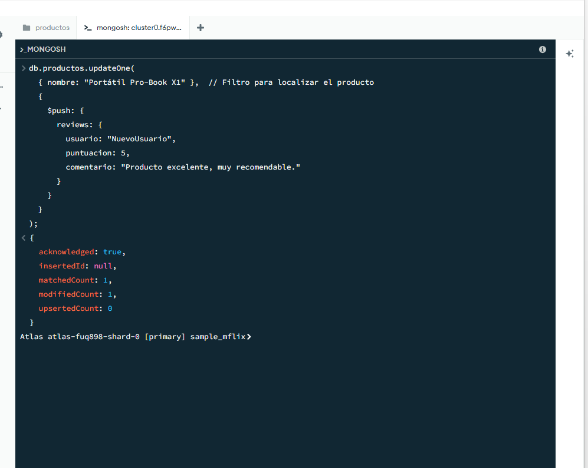

# Práctica 1: Gestión de un Catálogo de Productos con MongoDB_AdrianBuenavida

## ACTIVIDADES OBLIGATORIAS


## EJERCICIO 1: Encontrar portátiles de una marca con más de 8GB de RAM


### Objetivo del 1er ejercicio

Vamos a obtener todos los productos cuya categoría sea **"Portátiles"**, que pertenezcan a la marca **TecnoÁgora Devices** y cuya memoria RAM sea superior a 8GB.


### Consulta

```js
db.productos.find({
  categoria: "Portátiles",
  marca: "TecnoÁgora Devices",
  "especificaciones.ram": { $gt: 8 }
})
```


### Captura de pantalla de comprobación


<br><br>

## EJERCICIO 2: Buscar productos con la etiqueta “oferta”

### Objetivo del 2º ejercicio

Encontraremos todos los productos que contengan la palabra **"oferta"** dentro del campo **tags**.

### Consulta

```js
db.productos.find({ tags: "oferta" });

```


### Captura de pantalla de comprobación


<br><br>

## EJERCICIO 3: Incrementar el stock de un producto en 10 unidades

### Objetivo del 3er ejercicio

Vamos a actualizar el stock del producto **"Portátil Pro-Book X1"** incrementándolo en 10 unidades. Para ello, utilizamos el operador `$inc` de MongoDB que permite aumentar (o disminuir) el valor numérico de un campo.


### Consulta

```js
db.productos.updateOne(
  { nombre: "Portátil Pro-Book X1" },  
  { $inc: { stock: 10 } }              
);
```


### Captura de pantalla de comprobación


<br><br>


## EJERCICIO 4: Añadir una nueva reseña (review) a un producto


### Objetivo del 4º ejercicio

Agregaremos una nueva reseña a un producto existente (por ejemplo, **"Portátil Pro-Book X1"**). La reseña debe contener el nombre del usuario, una puntuación y un comentario.


### Consulta

```js
db.productos.updateOne(
  { nombre: "Portátil Pro-Book X1" },  
  {
    $push: {
      reviews: {
        usuario: "NuevoUsuario",
        puntuacion: 5,
        comentario: "Producto excelente, muy recomendable."
      }
    }
  }
);
```


### Captura de pantalla de comprobación

<br>


<br><br><br><br>


## ACTIVIDADES OPCIONALES

## Punto 1: Mostrar productos con bajo stock

### Objetivo del 1er apartado

En este primer punto, tenemos que visualizar todos los productos que tengan menos de 5 uds disponibles en stock, utilizando el operador `$lt` (less than) .

### Creación de la colección `productos`

Primero, tenemos que crear la colección `productos` con documentos que contienen información de distintos productos, incluyendo el campo `stock` que indica la cantidad disponible. Aquí mostramos un ejemplo de la estructura de un documento que hem,os insertado:

```json 
{
  "_id": "SKU-001",
  "nombre": "Portátil Pro-Book X1",
  "marca": "TecnoÁgora Devices",
  "categoria": "Portátiles",
  "precio": 1199.99,
  "stock": 25,
  "especificaciones": {
    "cpu": "Intel Core i7-12700H",
    "ram": 16,
    "pantalla": "15.6 pulgadas Full HD"
  },

  "tags": ["gaming", "16GB RAM", "oferta"],

  "reviews": [
    {
      "usuario": "LauraG",
      "puntuacion": 5,
      "comentario": "Excelente rendimiento, muy rápido."
    },
    {
      "usuario": "CarlosM",
      "puntuacion": 4,
      "comentario": "Buen portátil, aunque algo pesado."
    }
  ]
}

```


### Captura de pantalla de comprobación


<br><br>

## Punto 2: Proyección de campos específicos

### Objetivo 2º apartado

Necesitamos mostrar únicamente el **nombre** y el **precio** de todos los productos, excluyendo el campo `_id`

### Consulta

Para obtener solo los campos `nombre` y `precio`, y exclui/quitar el campo `_id`, hemos utilizado:

```javascript
db.productos.find({}, { nombre: 1, precio: 1, _id: 0 })
```

### Captura de pantalla de comprobación


<br><br>


## Punto 3: Eliminar un producto por su identificador

### Objetivo del 3er apartado

Eliminamos un producto específico de la colección `productos`, en este caso el producto con `_id: "SKU-001"`.

### Consulta

Para eliminar el documento con el id especificado, ejecutamos:

```javascript
db.productos.deleteOne({ _id: "SKU-001" })
```


### Captura de pantalla de comprobación


