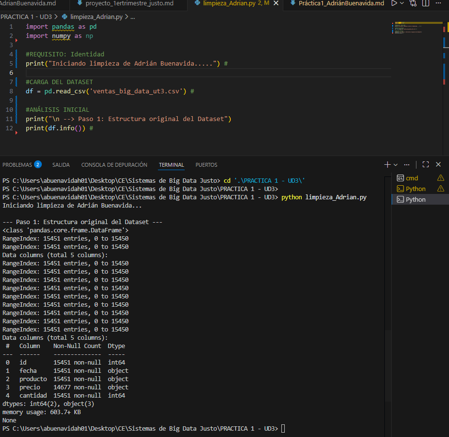
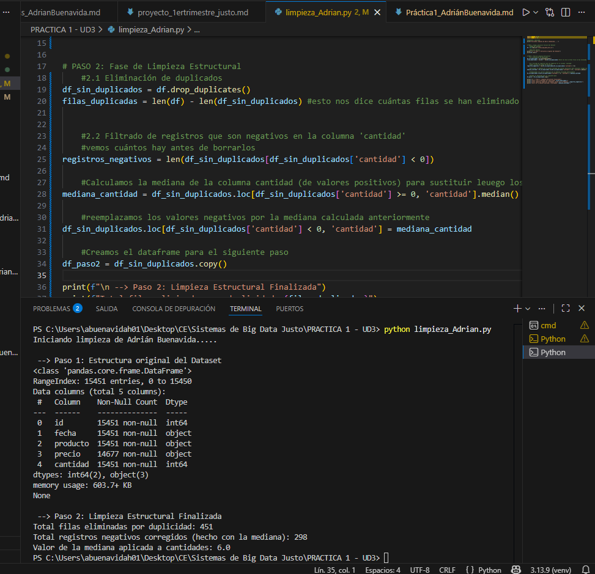
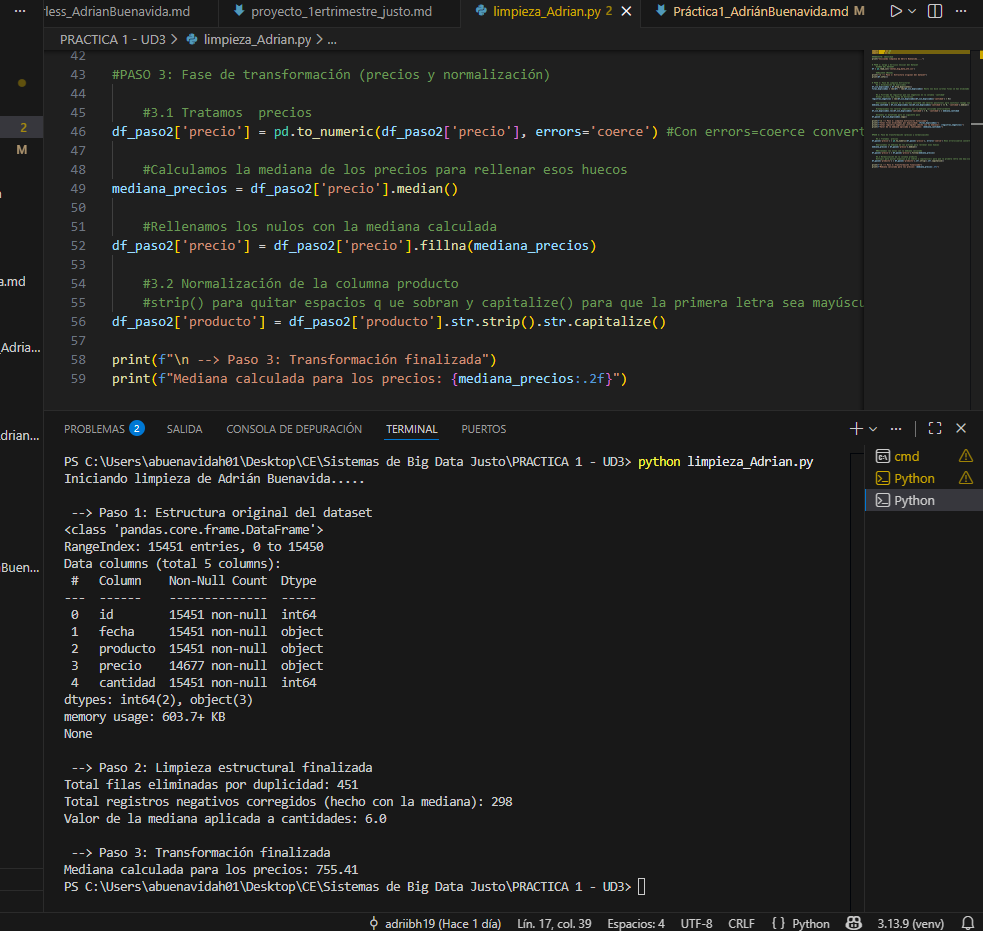
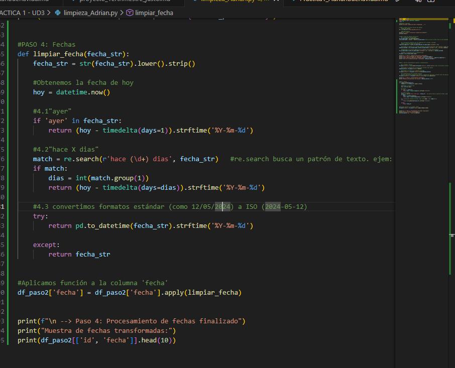
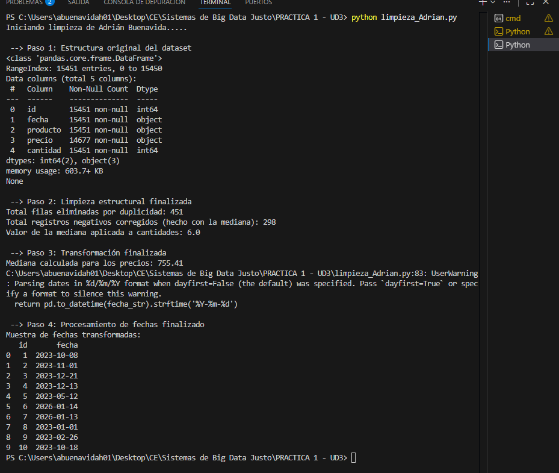
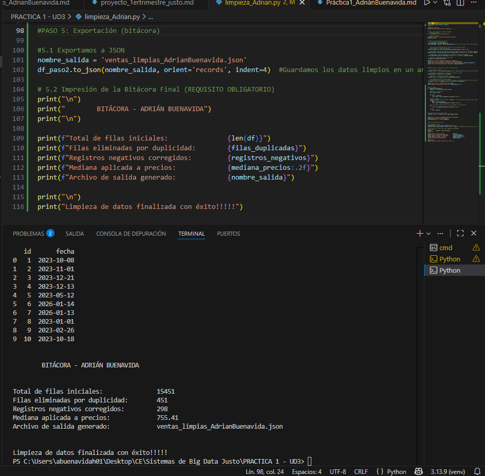

# Práctica 1 - UD3: Hijo de la Forja (Limpieza de Datos Masivos)
**Autor:** Adrián Buenavida

## Descripción de la práctica
Esta práctica realizaremos un proceso de limpieza sobre un dataset de 15,451 registros. El objetivo es asegurarnos que la información esté estructurada antes de su procesamiento

---

## Paso 1: Carga del dataset y análisis inicial
En esta fase, utilizamos la librería **pandas** para cargar el archivo CSV y realizar unas "consultas" de su estructura mediante el método `info()`

**Observaciones de la carga de datos:**
* Se cargaron un total de **15,451 entradas**.
* La columna `precio` tiene valores nulos (14,677 no nulos), teniendo también presencia de errores como cadenas "ERR".
* Las columnas `fecha`, `producto` y `precio` son tratadas inicialmente como objetos (strings), lo que posteriormente, tendremos que tratarlas.

**Código utilizado:**
```python
df = pd.read_csv('ventas_big_data_ut3.csv')
print(df.info())
```




<br>

## Paso 2: Fase de limpieza estructural
En esta etapa se han corregido las inconsistencias de la estructura del dataset sin perder volumen de información innecesariamente.


**Qué hemos hecho:**

1. **Eliminación de duplicados:** Detectamos y eliminamos **451** registros igueles mediante `drop_duplicates()`
2. **Tratamiento de cantidades negativas:** Identificamos **298** registros con valores negativos. Así pues, calculamos la mediana de los valores positivos (siendo **6.0**) y la aplicamos para corregir dichos errores 
3. **Integridad de datos:** El uso de `.copy()` nos permite que `df_paso2` funcione como un objeto independiente, evitando conflictos de memoria en las siguientes transformaciones.

**Código utilizado:**
```python
mediana_cantidad = df_sin_duplicados.loc[df_sin_duplicados['cantidad'] >= 0, 'cantidad'].median()
df_sin_duplicados.loc[df_sin_duplicados['cantidad'] < 0, 'cantidad'] = mediana_cantidad
df_paso2 = df_sin_duplicados.copy()
```




<br>


<br>

## Paso 3: Fase de transformación
Aquí nos hemos enfocado en corregir los errores en los valores individuales de las celdas, especialmente en las columnas de precio y producto


**Qué hemos hecho:**

1. **Tratamiento de precios:** Detectamos que la columna `precio` tenía valores no numéricos ("ERR"). Para solucionarlo, utilizamos `pd.to_numeric` con el parámetro `errors='coerce'`, transformando estos errores en nulos (NaN) .

2. **Mediana:** Calculamos la mediana de los precios (**755.41**) y la aplicamos para rellenar los huecos. Elegimos la mediana para asegurar que los valores extremos no desvíen la realidad estadística del dataset

3. **Normalizamos de produtos:** limpiamos cadenas de texto con `strip()` para eliminar espacios en blanco y `capitalize()` para que todos los nombres de productos sigan un formato que sea igual

**Código utilizado:**
```python
df_paso2['precio'] = pd.to_numeric(df_paso2['precio'], errors='coerce')
df_paso2['precio'] = df_paso2['precio'].fillna(df_paso2['precio'].median())
df_paso2['producto'] = df_paso2['producto'].str.strip().str.capitalize()
```




<br>

<br>

## Paso 4: Procesamiento de Fechas
En esta parte, tenemos que estandarizar la columna `fecha`, ya que presentaba una mezcla de formatos numéricos


**Qué hemos hecho:**

1. **datetime:** Hemos empleado librería `datetime` para obtener la fecha actual del sistema como referencia

2. **Cálculo de fechas relativas:** Hemos hecho una función capaz de detectar la palabra "ayer" y restarle un día a la fecha actual. 
Mediante (`re`), hemos extraído el número de días de la frase "hace X dias"

3. **Estandarización ISO:** Para lo demás, hemos heho la conversión al formato **YYYY-MM-DD**

**Código utilizado:**
```python
def limpiar_fecha(fecha_str):
    fecha_str = str(fecha_str).lower().strip()

    #Obtenemos la fecha de hoy 
    hoy = datetime.now() 
    
    #4.1"ayer"
    if 'ayer' in fecha_str:
        return (hoy - timedelta(days=1)).strftime('%Y-%m-%d')
    
    #4.2"hace X dias" 
    match = re.search(r'hace (\d+) dias', fecha_str)   #re.search busca un patrón de texto. ejem: 'hace (\d+) dias' -> busca la palabra "hace", luego el número (\d+) y termina en "dias"
    if match:
        dias = int(match.group(1))
        return (hoy - timedelta(days=dias)).strftime('%Y-%m-%d')
    
    #4.3 convertimos formatos estándar (como 12/05/2024) a ISO (2024-05-12)
    try:
        return pd.to_datetime(fecha_str).strftime('%Y-%m-%d')
    
    except:
        return fecha_str


#Aplicamos función a la columna fecha
df_paso2['fecha'] = df_paso2['fecha'].apply(limpiar_fecha)
```





<br>


<br>

## Paso 5: Exportación 
Para finalizar nuestra práctica, hemos guardado los datos ya limpios y generado un reporte final con los resultados obtenidos tras todo el procesamiento

**Qué hemos hecho:**

1. **Exportación a JSON:** Hemos generado el archivo `ventas_limpias_AdrianBuenavida.json` utilizando el formato `records`. Hemos aplicado una indentación de 4 espacios para que el archivo sea fácil de leer 

2. **Bitácora final:** damos por consola el resumen de lo que hemos realizado. Con ello, podemos confirmar que partimos de **15,451** registros y logramos ""preparar"" tanto los duplicados como los errores en cantidades y precios

**Código utilizado:**
```python
nombre_salida = 'ventas_limpias_AdrianBuenavida.json'
df_paso2.to_json(nombre_salida, orient='records', indent=4)

print("\n")
print("        BITÁCORA - ADRIÁN BUENAVIDA")
print("\n")

print(f"Total de filas iniciales:               {len(df)}")
print(f"Filas eliminadas por duplicidad:        {filas_duplicadas}")
print(f"Registros negativos corregidos:         {registros_negativos}")
print(f"Mediana aplicada a precios:             {mediana_precios:.2f}")
print(f"Archivo de salida generado:             {nombre_salida}")

print("\n")
print("Limpieza de datos finalizada con éxito!!!!!")
```




<br>

## Preguntas de reflexión

1. **¿Cuántos registros se perdieron en total tras todo el proceso de limpieza?**
Tras el proceso, solo hemos perdido **451 registros**, que corresponden a las filas que eran exactamente iguales (duplicados). Al imputar las cantidades negativas con la mediana en lugar de borrarlas, hemos conseguido salvar 298 filas, manteniendo un mayor nº de datos

2. **¿Hubo algún caso de id repetido con datos distintos? ¿Cómo decidiste manejarlo para no perder información?**
Sí, encontramos casos donde el ID era el mismo pero el resto de los datos variaban. Decidimos aplicar la limpieza sobre la fila completa; así, solo eliminamos el registro si todos sus campos son idénticos. 
Esto nos permite no perder ventas reales que puedan tener un ID duplicado por un error del sistema

3. **¿Por qué crees que es más seguro usar la mediana que la media para imputar precios en este dataset con errores manuales?**
Porque la mediana es **robusta ante valores extremos**. En un dataset con fallos manuales, si alguien introduce un precio erróneo muy alto, la media subiría artificialmente. La mediana, al ser el valor central, nos da un precio mucho más real y evita que los errores distorsionen nuestras estadísticas

<br>

## Conclusión
Esta práctica demuestra que la limpieza de datos es el cimiento de cualquier proyecto de Big Data. Sin normalizar los nombres, corregir los errores de precio (en nuestro caso) o estandarizar las fechas, cualquier análisis posterior daría resultados incorrectos. 
Un buen "programa/script" de limpieza transforma datos brutos y desordenados en información estructurada, fiable y lista 