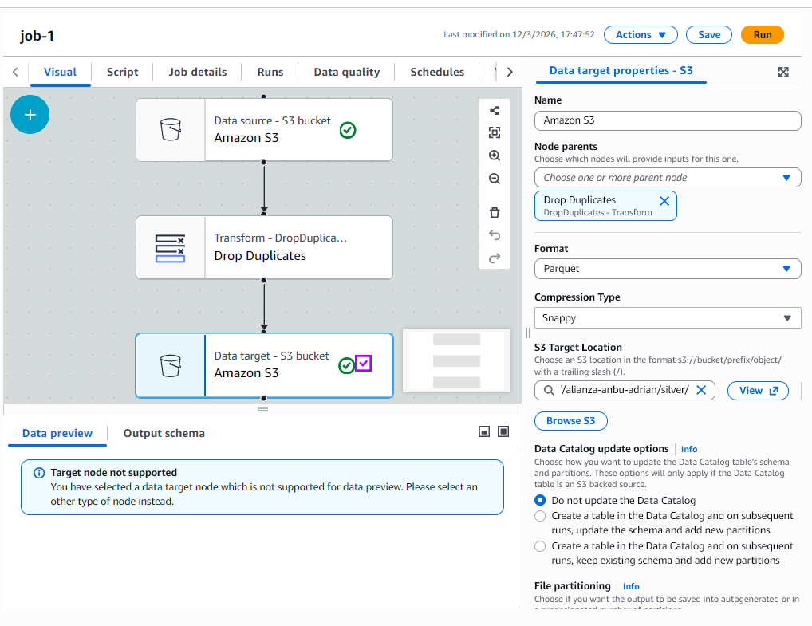
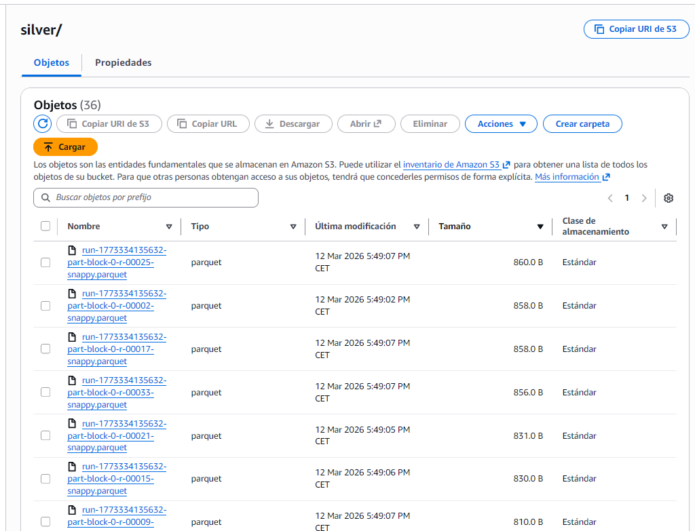

# Práctica 1. UT5. Data Lake & ETL con AWS Glue 

**Autor:** Adrián Buenavida

## Descripción 
He migrado el procesamiento de los datos de ninjas de un entorno local a un entorno de nube profesional. El objetivo es crear una arquitectura de Data Lake (Raw -> Silver) utilizando **AWS S3** y **AWS Glue** para transformar archivos CSV a formato **Parquet**, optimizando así el coste y rendimiento de futuras consultas.

---

## Paso 1: acceso
He validado mediante un script local que mi entorno tiene permisos de lectura sobre el bucket de S3, asegurando que las credenciales de AWS están correctamente configuradas.

---

## Paso 2: Configuración del Crawler
He configurado un Crawler en AWS Glue que rastrea el bucket `/raw` automáticamente.

1. **Ruta:** `s3://anbu-data-lake-adrianb/raw/`
2. **Resultado:** Se ha creado dos tablas (raw y silver)en el *Data Catalog* de Glue que describe mis datos

---

## Paso 3: Job ETL (Transformación a Parquet)
He diseñado un Job de tipo "Visual ETL" para automatizar la transformación.

* **Source:** Tabla creada por el Crawler.
* **Transform:** Cambio de tipos de datos si fuera necesario y limpieza de registros nulos.
* **Target:** Bucket S3, carpeta `/silver`, formato **Parquet**.

---

## Paso 4: Optimización y Conclusión
Tras la ejecución del Job, he verificado la carpeta `/silver` en S3.

**Comparativa de rendimiento:**
| Archivo | Tamaño original (CSV) | Tamaño optimizado (Parquet) |
| :--- | :--- | :--- |
| `aptitudes_ninja` | ~100 KB KB | ~27 KB |

**Reflexión:** El paso a **Parquet** es fundamental en este entorno . Al ser un formato de columnas, permite que servicios como Amazon Athena lean solo las columnas necesarias, reduciendo mucho el costo por consulta comparado con leer archivos CSV planos. Esta arquitectura es escalable y profesional, ideal para manejar grandes volúmenes de datos