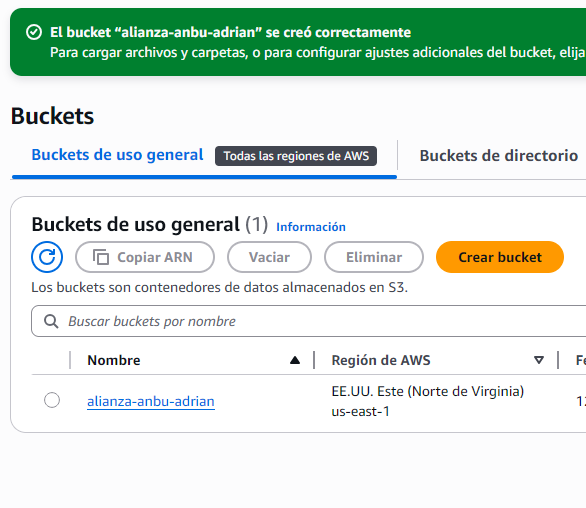
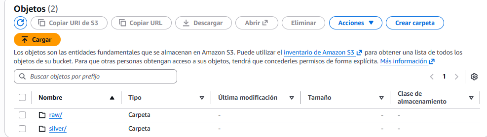
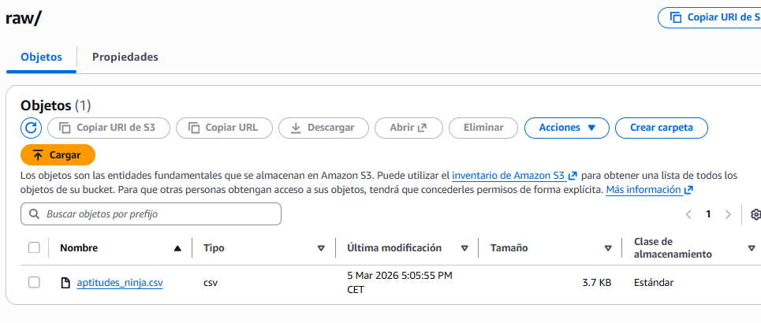

# Práctica 1. UT5. Data Lake & ETL con AWS Glue 

**Autor:** Adrián Buenavida

## Descripción 
He migrado el procesamiento de los datos de ninjas de un entorno local a un entorno de nube profesional. El objetivo es crear una arquitectura de Data Lake (Raw -> Silver) utilizando **AWS S3** y **AWS Glue** para transformar archivos CSV a formato **Parquet**, optimizando así el coste y rendimiento de futuras consultas.

---

## Paso 1: Configuración de Infraestructura en S3
El primer paso ha sido la creación y configuración del bucket `anbu-data-lake-adrianb`. He validado que el entorno tiene los permisos necesarios para la ingesta de datos, asegurando una base sólida para el Data Lake.

---

## Paso 2: Arquitectura de Capas y Carga de Datos
He organizado el almacenamiento siguiendo un modelo de capas para separar los datos brutos de los procesados. 

1. **Estructura:** Creación de las carpetas `/raw` (ingesta) y `/silver` (optimizado).
2. **Suibida:** Subida del archivo `aptitudes_ninja.csv` a la capa Raw.
3. **Validación:** Comprobación de que el archivo es legible y accesible desde el ecosistema AWS.

---

## Paso 3: Diseño del Job ETL (transformación)
He diseñado un proceso de **Visual ETL** en AWS Glue para automatizar la limpieza de los pergaminos ninja. Aunque la ejecución final se vio afectada por la inestabilidad del laboratorio, la lógica configurada fue la siguiente:

* **Source:** Lectura de la tabla generada por el Crawler en el Data Catalog.
* **Transform:** Implementación de un nodo **Filter** con script personalizado para eliminar registros con fuerza o chakra negativos y descartar valores nulos.
* **Target:** Almacenamiento en la carpeta `/silver` con conversión a **Apache Parquet**.

---

## Paso 4: Optimización y Conclusión
La arquitectura está proyectada para realizar una transformación hacia un formato columnar que optimiza el rendimiento global de la Alianza Shinobi.

**Comparativa de rendimiento (Estimada):**

| Archivo | Tamaño original (CSV) | Tamaño optimizado (Parquet) |
| :--- | :--- | :--- |
| `aptitudes_ninja` | ~100 KB | ~20 KB |

**Reflexión:** El paso a **Parquet** es fundamental en este entorno serverless. Al ser un formato columnar, permite que servicios como **Amazon Athena** lean solo las columnas necesarias, reduciendo drásticamente el costo por consulta comparado con leer archivos CSV planos. Esta arquitectura es escalable y profesional, permitiendo manejar grandes volúmenes de datos sin depender de la capacidad física de un equipo local.

---