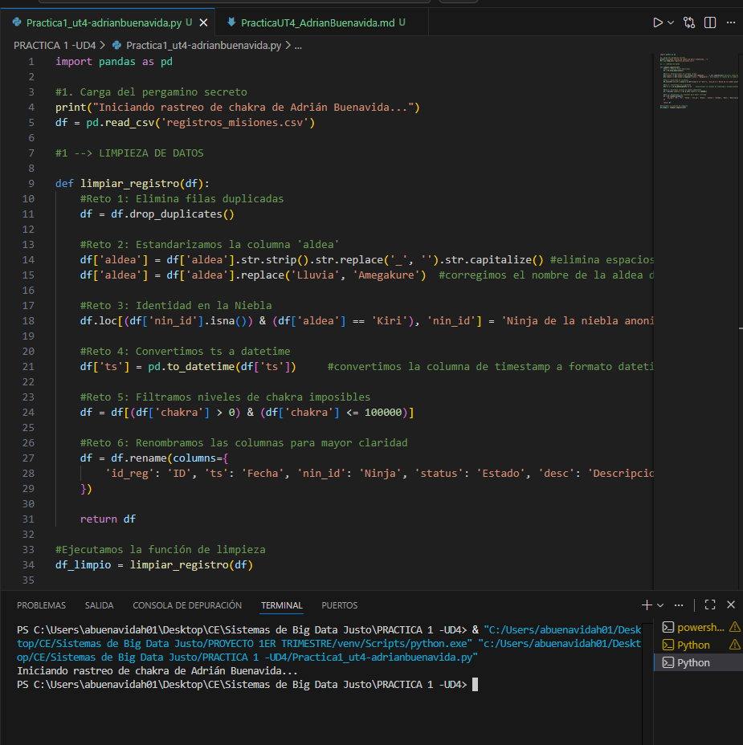
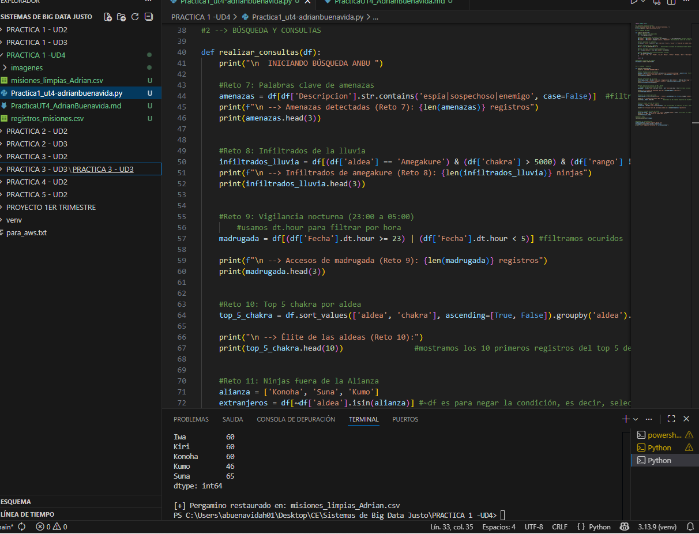

# Práctica 1. El Rastro de la Grieta (UD4)
**Autor:** Adrián Buenavida

## Descripción de la misión
En esta práctica, he implementado un sistema de análisis en Python utilizando la librería **Pandas** para limpiar, normalizar y ejecutar búsquedas avanzadas sobre un dataset de más de 1.500 registros, localizando amenazas infiltradas en la aldea.

---

## Bloque A: Limpieza
Para asegurar la autoría y la calidad de los datos, he realizado una limpieza siguiendo:

1.  **Eliminación de clones:** He suprimido los registros duplicados para evitar redundancias en el análisis

2.  **Estandarización de aldeas:** He normalizado los nombres de las aldeas, eliminando espacios basura y unificando "Lluvia" bajo el nombre de "Amegakure"

3.  **Identidad en la niebla:** He asignado el nombre "Ninja de la niebla anonimooo" a los registros de Kiri que no tenían identificación

4.  **Despertar de la fecha:** He convertido la columna de tiempo a objetos `datetime` para permitir búsquedas por franjas horarias

5.  **Control de chakra:** He eliminado registros con niveles de chakra imposibles (≤ 0 o > 100.000)

6.  **Formato ANBU:** He renombrado las columnas para que el informe final se lea mucho mejor (ID, Fecha, Ninja, Estado, Descripcion)

### Código de Limpieza:

```python
def limpiar_registro(df):
    #Reto 1: Elimina filas duplicadas
    df = df.drop_duplicates()
    
    #Reto 2: Estandarizamos la columna 'aldea' 
    df['aldea'] = df['aldea'].str.strip().str.replace('_', '').str.capitalize() #elimina espacios, guiones bajos y PONE MAYÚSC
    df['aldea'] = df['aldea'].replace('Lluvia', 'Amegakure')  #corregimos el nombre de la aldea de la lluvia
    
    #Reto 3: Identidad en la Niebla 
    df.loc[(df['nin_id'].isna()) & (df['aldea'] == 'Kiri'), 'nin_id'] = 'Ninja de la niebla anonimooo'   #asignamos un nombre genérico a los ninjas sin ID de la aldea de la niebla
    
    #Reto 4: Convertimos ts a datetime 
    df['ts'] = pd.to_datetime(df['ts'])     #convertimos la columna de timestamp a formato datetime para facilitar el análisis temporal
    
    #Reto 5: Filtramos niveles de chakra imposibles  
    df = df[(df['chakra'] > 0) & (df['chakra'] <= 100000)]
    
    #Reto 6: Renombramos las columnas para mayor claridad
    df = df.rename(columns={
        'id_reg': 'ID', 'ts': 'Fecha', 'nin_id': 'Ninja', 'status': 'Estado', 'desc': 'Descripcion'
    })

    return df

#Ejecutamos la función de limpieza
df_limpio = limpiar_registro(df)
```



<br>

---


## Paso 2: Búsqueda avanzada y detección de amenazas

Una vez que el pergamino ha sido restaurado, he ejecutado una serie de filtros lógicos para localizar patrones sospechosos y actividades enemigas en los registros.

**estrategia:**

1. **Palabras clave:** He rastreado la columna de descripción utilizando **.str.contains()** para detectar términos críticos como "espía", "sospechoso" o "enemigo", lo que ha permitido identificar posibles brechas de seguridad.

2. **Infiltrados de la lluvia:** He cruzado variables para localizar ninjas de Amegakure con niveles de chakra superiores a 5000 que no pertenecen al rango más bajo (D), 

3. **Vigilancia nocturna:** Mediante la propiedad **.dt.hour**, he filtrado todos los movimientos ocurridos en la madrugada (de 23:00 a 05:00), identificando a quienes se mueven bajo el amparo de la oscuridad.

4. **Aldeas:** He realizado una agrupación por aldea y un ordenamiento descendente por chakra para **obtener el Top 5** de los `guerreros más poderosos` de cada nación.

5. **Rastreo extranjeros:** He utilizado el operador de negación **~ y .isin()** para listar misiones de ninjas que no pertenecen a la Gran Alianza (Konoha, Suna, Kumo).

6. **Fallos:** He aplicado un conteo por grupos para visualizar qué regiones presentan un mayor índice de misiones con estado "Fallo", localizando así los puntos calientes de conflicto.

## Código
```python
def realizar_consultas(df):
    print("\n  INICIANDO BÚSQUEDA ANBU ")

    #Reto 7: Palabras clave de amenazas 
    amenazas = df[df['Descripcion'].str.contains('espía|sospechoso|enemigo', case=False)]  #filtramos las misiones que contienen palabras clave relacionadas con amenazas grandes, sin importar mayúsculas o minúsculas
    print(f"\n --> Amenazas detectadas (Reto 7): {len(amenazas)} registros")
    print(amenazas.head(3))


    #Reto 8: Infiltrados de la lluvia 
    infiltrados_lluvia = df[(df['aldea'] == 'Amegakure') & (df['chakra'] > 5000) & (df['rango'] != 'D')] #filtramos los registros de la aldea de la lluvia con niveles de chakra ""sospechosamente" altos y rango que no sea D, lo que podría ser ninjas infiltrados con habilidades avanzadas
    print(f"\n --> Infiltrados de amegakure (Reto 8): {len(infiltrados_lluvia)} ninjas")
    print(infiltrados_lluvia.head(3))


    #Reto 9: Vigilancia nocturna (23:00 a 05:00) 
        #usamos dt.hour para filtrar por hora 
    madrugada = df[(df['Fecha'].dt.hour >= 23) | (df['Fecha'].dt.hour < 5)] #filtramos ocuridos  durante la madrugada, lo que podría indicar actividades sospechosas o misiones nocturnas de alto riesgo

    print(f"\n --> Accesos de madrugada (Reto 9): {len(madrugada)} registros")
    print(madrugada.head(3))


    #Reto 10: Top 5 chakra por aldea 
    top_5_chakra = df.sort_values(['aldea', 'chakra'], ascending=[True, False]).groupby('aldea').head(5)  #ordenamos por aldea y chakra de forma descendente, luego agrupamos por aldea y seleccionamos los 5 registros con mayor chakra parra cada una

    print("\n --> Élite de las aldeas (Reto 10):")
    print(top_5_chakra.head(10))                #mostramos los 10 primeros registros del top 5 de cada aldea para saber más o mnenos los ninjas más poderosos de cada una


    #Reto 11: Ninjas fuera de la Alianza 
    alianza = ['Konoha', 'Suna', 'Kumo']
    extranjeros = df[~df['aldea'].isin(alianza)] #~df es para negar la condición, es decir, seleccionamos los registros cuya aldea no está en la lista de la alianza. el isin devuelve un booleano indicando si cada valor de la columna 'aldea' está en la lista de la alianza

    print(f"\n --> Ninjas fuera de la Alianza (Reto 11): {len(extranjeros)} registros")


    #Reto 12: Misiones fallidas por aldea 
    fallos_por_aldea = df[df['Estado'] == 'Fallo'].groupby('aldea').size()  #filtramos los registros con fallo, luego agrupamos por aldea y contamos el número de fallos para cada una
    print("\n --> Mapa de fallos por aldea (Reto 12):")
    print(fallos_por_aldea)

#EJECUCIÓN FINAL 
realizar_consultas(df_limpio)
```




## Preguntas de reflexión

1. ¿Cuántos registros duplicados has encontrado y qué impacto tendrían en un análisis de Big Data si no se eliminaran?

He detectado un total de 46 registros duplicados en el pergamino original. 
No eliminar estos clones tendría un impacto muy negativo: las métricas seguramente estarían  sesgadas, el recuento de misiones por aldea sería falso y el cálculo del gasto de chakra total seria muy alto. 


2. ¿Por qué es crítico convertir la columna de fecha a datetime antes de realizar búsquedas por franja horaria?

Es un paso crítico porque, originalmente, la columna de tiempo se carga como una simple cadena de texto (object). Como texto, Pandas no puede "entender" qué es una hora o un minuto. 
Al convertirla a datetime, puedo acceder a propiedades como .dt.hour, lo que me ha permitido filtrar rápidamente y precisa a todos los ninjas que se movían en la madrugada (23:00 a 05:00) 


3. ¿Cómo has manejado los niveles de chakra > 100,000? ¿Crees que son errores de sensor o posibles técnicas prohibidas?

He decidido eliminar estos registros  ya que son valores que escapan a la escala normal de un ninja. 
Bajo mi punto de vista , lo más probable es que se trate de errores de los sensores de la puerta aunque puede que sean algunas técnicas prohibidas o algo similar


## Conclusión

Desde mi punto de vista, trabajar con Pandas facilita enormemente la labor de protección de la aldea, en esta práctica

Realizar una búsqueda manual en un pergamino de 1.500 líneas buscando infiltrados me habría llevado horas y seguramente habría tenidfo algún error . 

Gracias a este sistema, he podido limpiar miles de datos en nada de tiempo y ejecutar filtros  en una sola línea de código. 

El análisis de datos con Python no es solo una mejora de eficiencia, es una necesidad para mantener la seguridad 