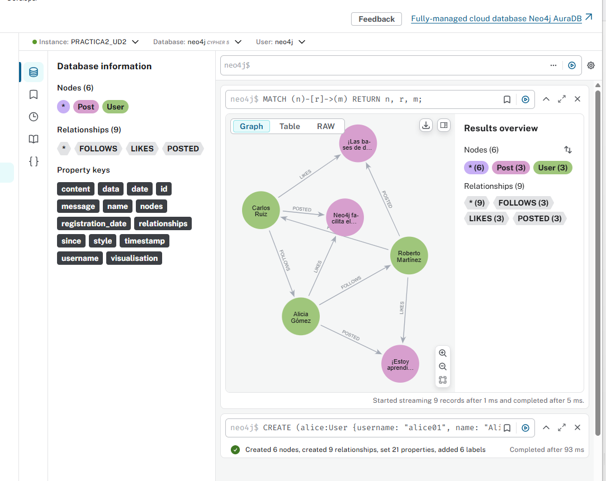
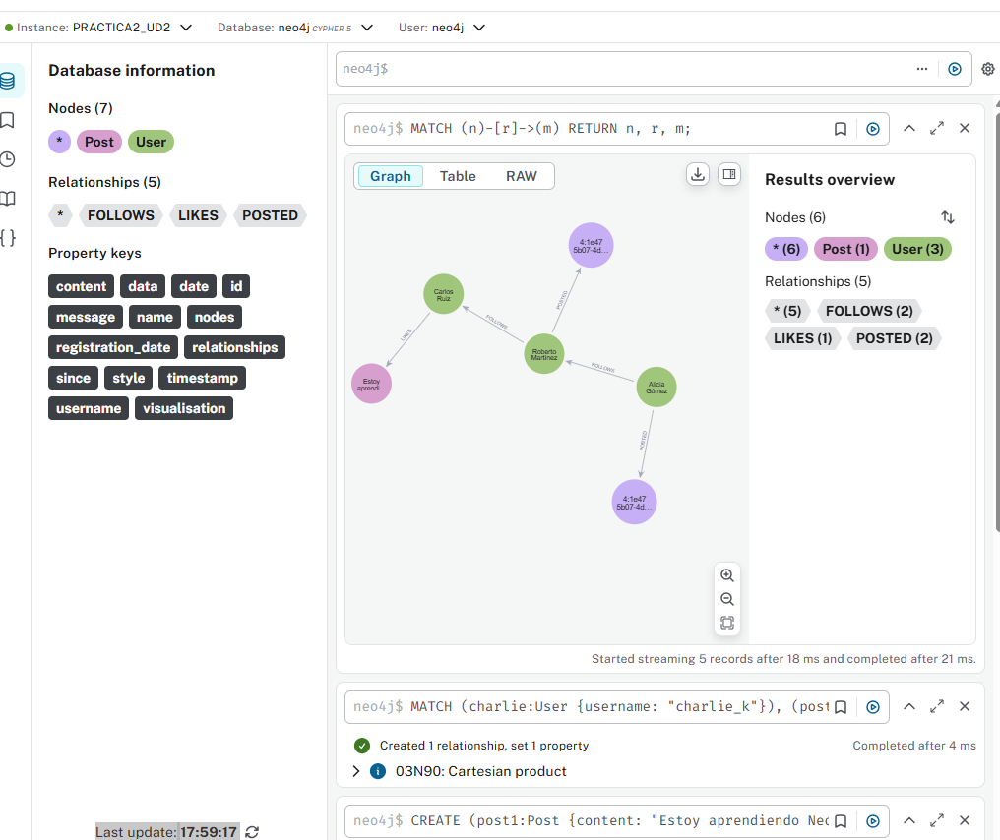
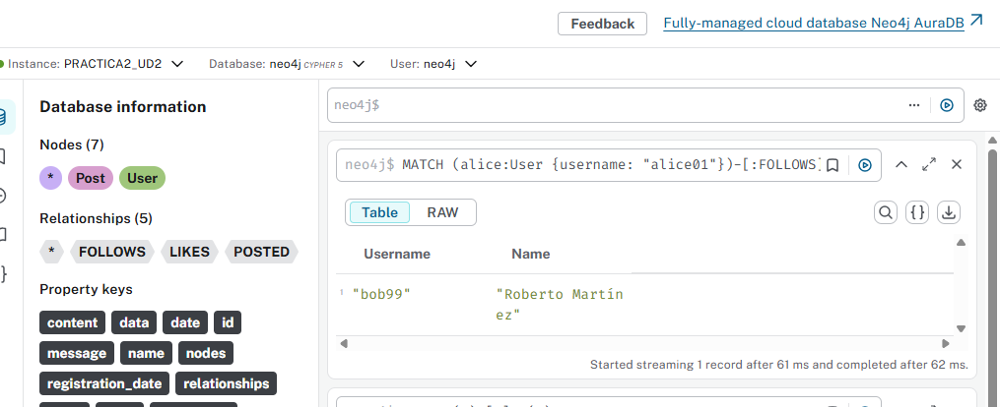
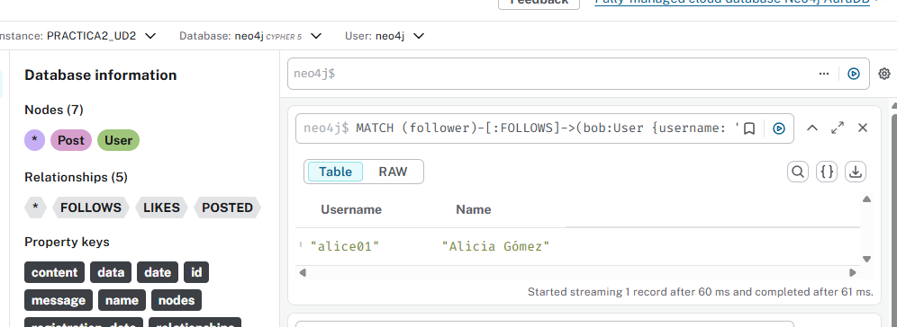
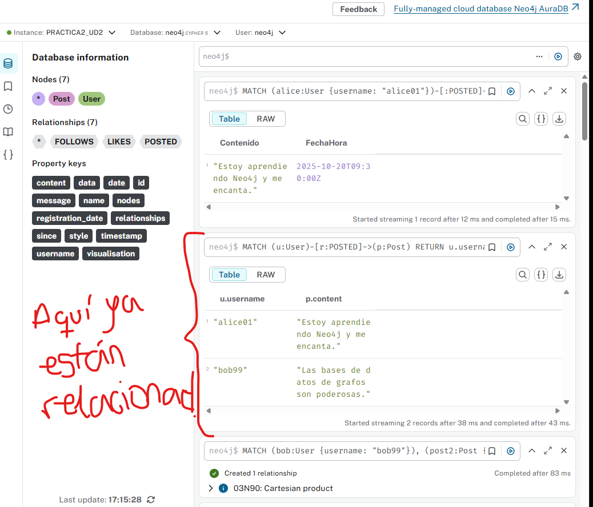
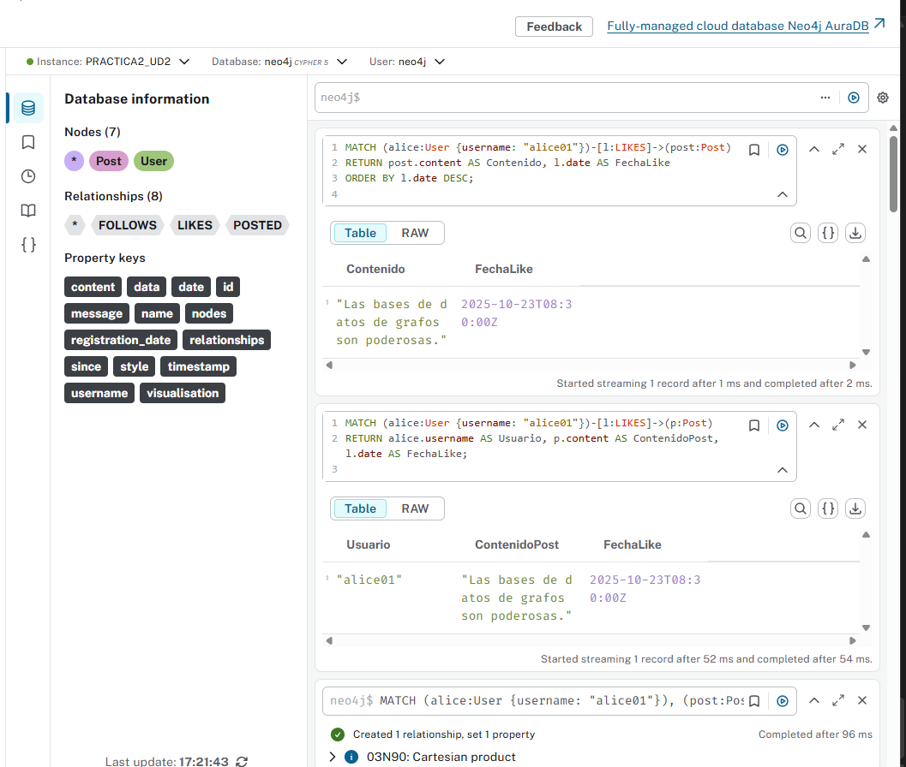
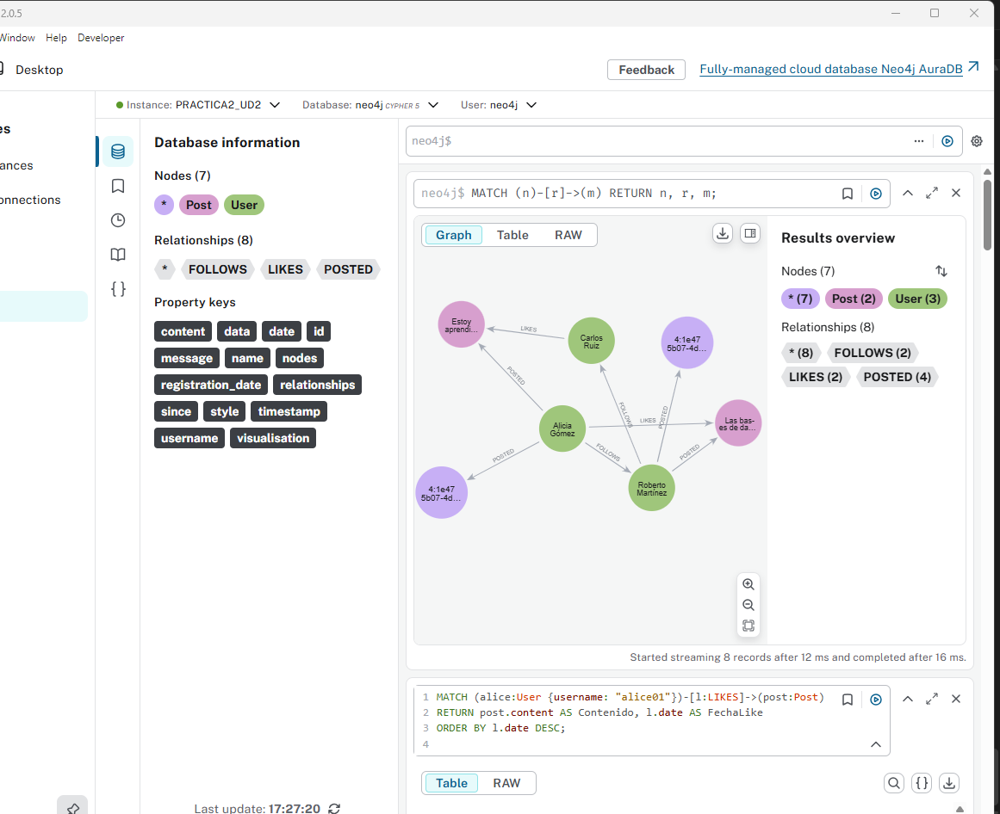
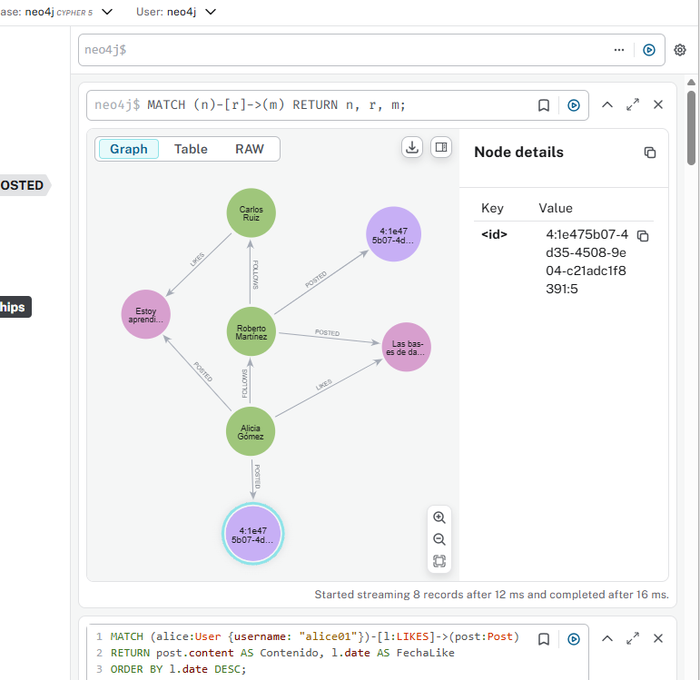

# Práctica 2: Introducción a Neo4j y Modelado de Redes Sociales_AdrianBuenavida


## EJERCICIO 1: Diseño del Modelo de Datos de la Red Social

### Objetivo del 1er ejercicio

En este primer ejercicio buscamos **diseñar un modelo de datos de grafo** que represente a los usuarios y sus interacciones dentro de una red social.  
Para mi gusto, voy a crear ya algunos nodos (aunque no haga falta aquí) y tal para poder ver la comprobación gráfica al final del ej.


## Descripción del modelo

Con el modelo propuesto representamos una red social en la que los **usuarios** pueden crear publicaciones, seguir a otros usuarios y dar “me gusta” a publicaciones.


## Nodos


### *User*
Representa a los usuarios de la red social.

| Propiedad | Tipo | Descripción |
|------------|------|-------------|
| `username` | STRING | Identificador único del usuario |
| `name` | STRING | Nombre completo o visible |
| `registration_date` | DATE | Fecha de registro en la red social |


### *Post*
Da las publicaciones creadas por los usuarios.

| Propiedad | Tipo | Descripción |
|------------|------|-------------|
| `content` | STRING | Contenido del post |
| `timestamp` | DATETIME | Fecha y hora de publicación |


## Relaciones

### *FOLLOWS*
Relación entre dos usuarios. Indica que un usuario sigue a otro.

(:User)-[:FOLLOWS {since: DATE}]->(:User)


| Propiedad | Tipo | Descripción |
|------------|------|-------------|
| `since` | DATE | Fecha desde la que el usuario comenzó a seguir al otro |

---

### **POSTED**
Relación entre un usuario y una publicación. Indica que el usuario ha creado ese post.

(:User)-[:POSTED]->(:Post)


---

### **LIKES**
Relación entre un usuario y una publicación, es decir, que un usuario ha dado “me gusta” a un post.


(:User)-[:LIKES {date: DATETIME}]->(:Post)


| Propiedad | Tipo | Descripción |
|------------|------|-------------|
| `date` | DATETIME | Fecha y hora en la que el usuario dio “me gusta” |

---

## Esquema del Grafo (como un "dibuyjo")

(:User)-[:FOLLOWS]->(:User)
|
+--[:POSTED]->(:Post)
^
|
[:LIKES]
|
(:User)


---

## Consultas usadas con CYPHER que es del ej 2
```cypher
CREATE
  (alice:User {username: "alice01", name: "Alicia Gómez", registration_date: date("2022-05-10")}),
  (bob:User {username: "bob99", name: "Roberto Martínez", registration_date: date("2023-01-15")}),
  (charlie:User {username: "charlie_k", name: "Carlos Ruiz", registration_date: date("2023-07-22")}),
  
  (postA:Post {content: "¡Estoy aprendiendo Neo4j!", timestamp: datetime("2025-10-20T09:30:00")}),
  (postB:Post {content: "¡Las bases de datos gráficas son geniales!", timestamp: datetime("2025-10-21T14:45:00")}),
  (postC:Post {content: "Neo4j facilita el modelado de redes sociales.", timestamp: datetime("2025-10-22T18:15:00")}),

  (alice)-[:POSTED]->(postA),
  (bob)-[:POSTED]->(postB),
  (charlie)-[:POSTED]->(postC),

  (alice)-[:FOLLOWS {since: date("2023-06-01")}]->(bob),
  (bob)-[:FOLLOWS {since: date("2023-08-10")}]->(charlie),
  (charlie)-[:FOLLOWS {since: date("2023-09-15")}]->(alice),

  (bob)-[:LIKES {date: datetime("2025-10-21T15:00:00")}]->(postA),
  (charlie)-[:LIKES {date: datetime("2025-10-22T19:00:00")}]->(postB),
  (alice)-[:LIKES {date: datetime("2025-10-23T08:30:00")}]->(postC);
```


## Esquema (captura de pantalla)
Usamos la siguiente consulta y vemos el gráfico:

MATCH (n)-[r]->(m)
RETURN n, r, m;




<br><br>


## EJERCICIO 2: Creación de Nodos y Relaciones Iniciales

### Objetivo del 2º ejercicio

En este ejercicio tendemos que crear nodos y relaciones iniciales en la base de datos utilizando Cypher (que ya lo he usadoa nteriormente sin tenmerlo que hacer) 

Se trata de representar usuarios, sus publicaciones y las interacciones básicas como seguir a otros usuarios y dar “me gusta” a publicaciones.

---


## Creación de más nodos y relaciones

### Crear nodos --> User

Creamos tres usuarios con propiedades `username` (único), `name` y `registration_date`:

```cypher
CREATE
  (alice:User {username: "alice01", name: "Alicia Gómez", registration_date: date("2022-05-10")}),
  (bob:User {username: "bob99", name: "Roberto Martínez", registration_date: date("2023-01-15")}),
  (charlie:User {username: "charlie_k", name: "Carlos Ruiz", registration_date: date("2023-07-22")});
```

## Crear relaciones --> FOLLOWS

Usuarios siguen a otros usuarios:

MATCH
  (alice:User {username: "alice01"}),
  (bob:User {username: "bob99"}),
  (charlie:User {username: "charlie_k"})
CREATE
  (alice)-[:FOLLOWS {since: date("2023-06-01")}]->(bob),
  (bob)-[:FOLLOWS {since: date("2023-08-10")}]->(charlie);


## Crear posts y relaciones --> POSTED

Creamos dos posts y se relacionan con sus autores:

CREATE
  (post1:Post {content: "Estoy aprendiendo Neo4j y me encanta.", timestamp: datetime("2025-10-20T09:30:00")}),
  (post2:Post {content: "Las bases de datos de grafos son poderosas.", timestamp: datetime("2025-10-21T14:45:00")});

MATCH
  (alice:User {username: "alice01"}),
  (bob:User {username: "bob99"})
CREATE
  (alice)-[:POSTED]->(post1),
  (bob)-[:POSTED]->(post2);


## Crear relaciones --> LIKES

Un usuario da “me gusta” a un post de otro usuario:

MATCH
  (charlie:User {username: "charlie_k"}),
  (post1:Post {content: "Estoy aprendiendo Neo4j y me encanta."})
CREATE
  (charlie)-[:LIKES {date: datetime("2025-10-22T11:00:00")}]->(post1);


## Esquema (captura de pantalla)
Lo que he hecho, ha sido eliminar el grafo del ej 1 el cual no había que hacer y solo he dejado este del ej 2, para que se vea mejor.

MATCH (n)
DETACH DELETE n;


Usamos la siguiente consulta y vemos el gráfico:

MATCH (n)-[r]->(m)
RETURN n, r, m;




<br><br>


## EJERCICIO 3: Encontrar Amigos y Seguidores

### Objetivo del 3er ejercicio

Realizamos consultas Cypher para identificar las relaciones de seguimiento entre usuarios en la red social.  
buscamos extraer:  
- Todos los usuarios que un usuario específico sigue.  
- Todos los usuarios que siguen a un usuario específico.

---

## Consultas Cypher

#### Usuarios que sigue un usuario específico

Consulta para obtener todos los usuarios que sigue `Alice` (username: "alice01"):

```cypher
MATCH (alice:User {username: "alice01"})-[:FOLLOWS]->(followed)
RETURN followed.username AS Username, followed.name AS Name;
```
#### capt de comprobación



<br>
Consulta para obtener todos los usuarios que siguen a Bob (username: "bob99"):

```cypher
MATCH (follower)-[:FOLLOWS]->(bob:User {username: "bob99"})
RETURN follower.username AS Username, follower.name AS Name;
```

#### capt de comprobación



---

## EJERCICIO 4: Analizando Posts e Interacciones

### Objetivo del 4º ejercicio

En este ejercicio buscamos analizar las publicaciones e interacciones de los usuarios dentro de la red social.
El objetivo es practicar consultas Cypher que nos permitan visualizar tanto las publicaciones creadas por un usuario como aquellas en las que ha interactuado mediante “likes”

### Consultas Cypher

#### Posts creados por un *usuario específico*
En esta primera consulta obtenemos todas las publicaciones creadas por Alice (username: "alice01"), mostrando el contenido y la fecha/hora de publicación:

```cypher
MATCH (alice:User {username: "alice01"})-[:POSTED]->(post:Post)
RETURN post.content AS Contenido, post.timestamp AS FechaHora
ORDER BY post.timestamp DESC;
```


El probelma es que teneoms los nodos creados correctamente (User y Post)
pero no existen relaciones entre ellos — es decir, nadie ha hecho (:User)-[:POSTED]->(:Post) . Por ello , no me salía nada al ejecutar. Vamos a solucionarlo

#### a: Relacionamos a Alice con su primer post
MATCH (alice:User {username: "alice01"}),
      (post1:Post {content: "Estoy aprendiendo Neo4j y me encanta."})
CREATE (alice)-[:POSTED]->(post1);


#### b. Relacionamos a Bob con el segundo post
MATCH (bob:User {username: "bob99"}),
      (post2:Post {content: "Las bases de datos de grafos son poderosas."})
CREATE (bob)-[:POSTED]->(post2);


#### capt1 de comprobación



#### Encontrar los posts que un usuario ha dado “Like”
```cypher
MATCH (alice:User {username: "alice01"})-[l:LIKES]->(post:Post)
RETURN post.content AS Contenido, l.date AS FechaLike
ORDER BY l.date DESC;
```

Para este segundo apartado, nos pasa lo mismo, Alice debe tener al menos 1 like para que nos salga algo al ejecutar la consulta. Hasta ahora no nos salía nada. Vamos a solucionarlo

#### a) Por ej, hacemos que Alice le dé “Like” al post de Bob
```cypher
MATCH (alice:User {username: "alice01"}),
      (post:Post {content: "Las bases de datos de grafos son poderosas."})
CREATE (alice)-[:LIKES {date: datetime("2025-10-23T08:30:00")}]->(post);
```


#### capt2 de comprobación



---


## EJERCICIO 5: Explorando el Grafo Visualmente

### Objetivo del 5º ejercicio

En este ejercicio exploramos y visualizamos nuestro grafo en Neo4j Browser para comprender mejor las relaciones entre usuarios y publicaciones, básicamente solo explorafr el gráfico

### Consultas Cypher
```cypher
MATCH (n)-[r]->(m)
RETURN n, r, m;
```

#### capt de comprobación



#### otra capt de comprobación
Aquí ordenamos un poco el gráfico
