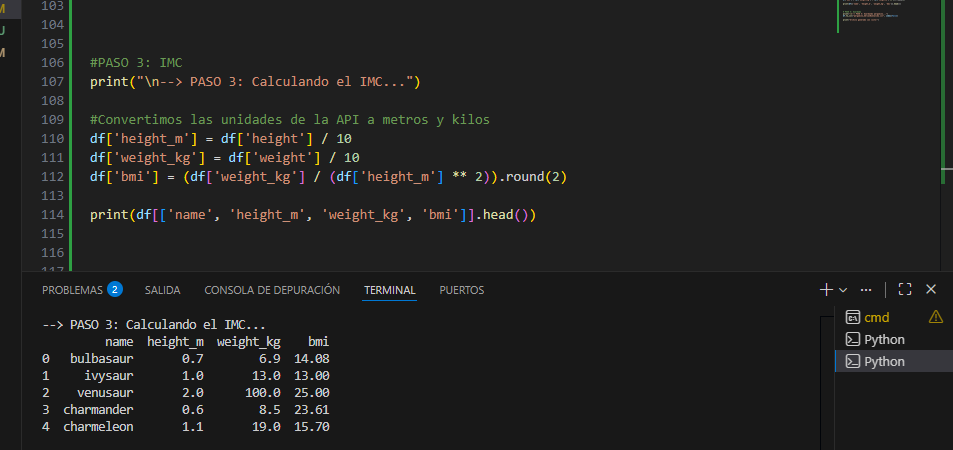
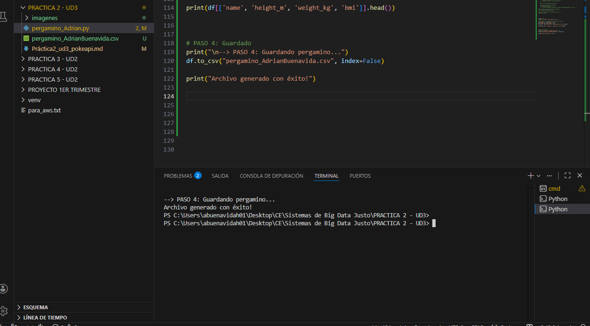

# Práctica 2: El Pergamino Infinito (Consumo de APIs)
**Autor:** Adrián Buenavida

## Descripción de la práctica
En esta misión nos adentramos en la PokéAPI para realizar una extracción de datos. 
El objetivo es recolectar información sobre todos los Pokémon registrados, transformarla y almacenarla en nuestro pc.

---

## Paso 1: Invocación y Paginación
Dado que la API no entrega toda la información en una sola petición, hemos implementado un sistema de navegación mediante paginación.


**estrategia:**
1. **Bucle while:** Hemos configurado un bucle que se mantiene activo mientras la clave `next` de la respuesta JSON contenga una URL válida.

2. **Recolección de URLs:** En cada iteración, guardamos el nombre y la URL de detalle de cada Pokémon en una lista global utilizando el método `extend()`.

3. **Respeto de tiempos:** Hemos incluido una pausa mínima (`time.sleep`) entre peticiones para garantizar la estabilidad de la conexión y no saturar el servidor de la PokéAPI.


**Código utilizado:**
```python
while url_actual:
    respuesta = requests.get(url_actual)
    datos = respuesta.json()
    lista_pokemon_basica.extend(datos['results'])
    url_actual = datos['next']
```


<br>

## Paso 2: Aplanado de Datos (Flattening)
Una vez obtenida la lista de nombres y direcciones, hemos prealizado una segunda fase de extracción para obtener los atributos específicos de cada elemento.


**estrategia:**

1. **Peticiones individuales:** Hemos iterado sobre la lista de URLs obtenidas previamente para consultar el "detalle" de cada registro.

2. **Filtrado de campos:** Dado que el JSON original de la API es muy extenso, hemos realizado un filtrado manual para extraer únicamente cuatro campos: `name`, `height`, `weight` y `base_experience`

3. **Conversión a estructura tabular:** Finalmente, hemos volcado toda la información en un **df de pandas** para facilitar las transformaciones posteriores

**Código utilizado:**
```python
for pokemon in lista_pokemon_basica:
    res_detalle = requests.get(pokemon['url'])
    d = res_detalle.json()
    datos_finales.append({
        'name': d['name'],
        'height': d['height'],
        'weight': d['weight'],
        'base_experience': d['base_experience']
    })
df = pd.DataFrame(datos_finales)
```


<br>

## Paso 3: Fase de Transformación (Cálculo del IMC)
En esta etapa hemos convertido los datos en información estadística mediante lo que conocemos como ingeniería de características

**estrategia:**
1. **Normalización de unidades:** Dado que la API usa decímetros y hectogramos, hemos transformado los valores a **metros** y **kilogramos** 

2. **Cálculo del IMC:** Hemos aplicado la fórmula matemática del BMI (consultada en internet), generando una nueva columna que nos permite analizar cada elemento de forma automática

3. **Limpieza visual:** Hemos redondeado el resultado a dos decimales para que el "pergamino" final se lea mucho mejor

**Código utilizado:**
```python
#Convertimos unidades y calculamos el IMC
df['height_m'] = df['height'] / 10
df['weight_kg'] = df['weight'] / 10
df['bmi'] = (df['weight_kg'] / (df['height_m'] ** 2)).round(2)
```



<br>

## Paso 4: Guardado del pergamino
Para finalizar , hemos procedido a volcar toda la información procesada en un archivo local

**Qué hemos hecho:**
1. **Generación del entregable:** Hemos exportado el df final a un archivo llamado `pergamino_AdrianBuenavida.csv`.

2. **Independencia de datos:** Al almacenar los datos localmente, aseguramos que podamos consultarlos sin necesidad de realizar nuevas peticiones a la PokéAPI, asegurando la disponibilidad de la información que ya hemos transformado

**Código utilizado:**
```python
#Guard archivo final en CSV
df.to_csv("pergamino_AdrianBuenavida.csv", index=False)
```




<br>

## Preguntas de reflexión

1. **¿Por qué es importante actualizar la URL con el enlace next en lugar de simplemente incrementar un número de página manualmente?**
Porque no todas las APIs usan números de página correlativos. Al usar el enlace `next` que nos da el servidor, nos aseguramos de seguir la ruta original y oficiaal, evitando errores si cambia la estructura de los datos o el tamaño de las páginas

2. **¿Qué ventaja tiene normalizar las unidades dentro del propio proceso ETL en lugar de hacerlo después en una hoja de cálculo?**
Garantiza que los datos lleguen ya listos para usar y permite automatizar el cálculo para miles de registros de forma muy rápida, evitando errores manuales 

3. **Si la API tuviera un límite de 1000 registros por página, ¿cómo afectaría esto al rendimiento de tu script?**
El rendimiento mejoraría notablemente en la fase de paginación (nuestro paso 1), ya que tendríamos que realizar menos peticiones para obtener la lista completa, ahorrando tiempo

<br>

## Conclusión
Automatizar la extracción mediante APIs es clave en Big Data para obtener datos actualizados en tiempo real y procesar grandes volúmenes de información sin intervención humana. Este proceso transforma datos en activos fiables y estructurados para el análisis