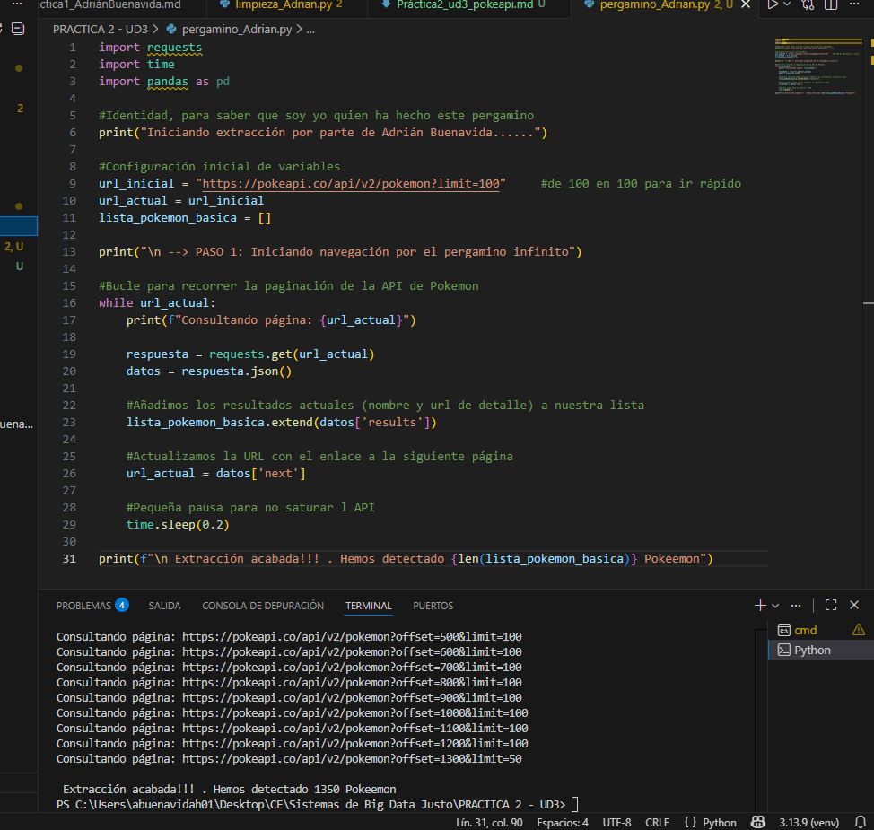
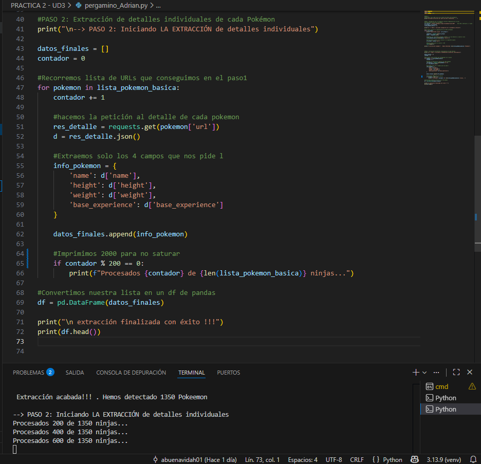

# Práctica 2: El Pergamino Infinito (Consumo de APIs)
**Autor:** Adrián Buenavida

## Descripción de la práctica
En esta misión nos adentramos en la PokéAPI para realizar una extracción de datos. 
El objetivo es recolectar información sobre todos los Pokémon registrados, transformarla y almacenarla en nuestro pc.

---

## Paso 1: Invocación y Paginación
Dado que la API no entrega toda la información en una sola petición, hemos implementado un sistema de navegación mediante paginación.


**estrategia:**
1. **Bucle while:** Hemos configurado un bucle que se mantiene activo mientras la clave `next` de la respuesta JSON contenga una URL válida.

2. **Recolección de URLs:** En cada iteración, guardamos el nombre y la URL de detalle de cada Pokémon en una lista global utilizando el método `extend()`.

3. **Respeto de tiempos:** Hemos incluido una pausa mínima (`time.sleep`) entre peticiones para garantizar la estabilidad de la conexión y no saturar el servidor de la PokéAPI.


**Código utilizado:**
```python
while url_actual:
    respuesta = requests.get(url_actual)
    datos = respuesta.json()
    lista_pokemon_basica.extend(datos['results'])
    url_actual = datos['next']
```



<br>

## Paso 2: Aplanado de Datos (Flattening)
Una vez obtenida la lista de nombres y direcciones, hemos prealizado una segunda fase de extracción para obtener los atributos específicos de cada elemento.


**estrategia:**

1. **Peticiones individuales:** Hemos iterado sobre la lista de URLs obtenidas previamente para consultar el "detalle" de cada registro.

2. **Filtrado de campos:** Dado que el JSON original de la API es muy extenso, hemos realizado un filtrado manual para extraer únicamente cuatro campos: `name`, `height`, `weight` y `base_experience`

3. **Conversión a estructura tabular:** Finalmente, hemos volcado toda la información en un **df de pandas** para facilitar las transformaciones posteriores

**Código utilizado:**
```python
for pokemon in lista_pokemon_basica:
    res_detalle = requests.get(pokemon['url'])
    d = res_detalle.json()
    datos_finales.append({
        'name': d['name'],
        'height': d['height'],
        'weight': d['weight'],
        'base_experience': d['base_experience']
    })
df = pd.DataFrame(datos_finales)
```

