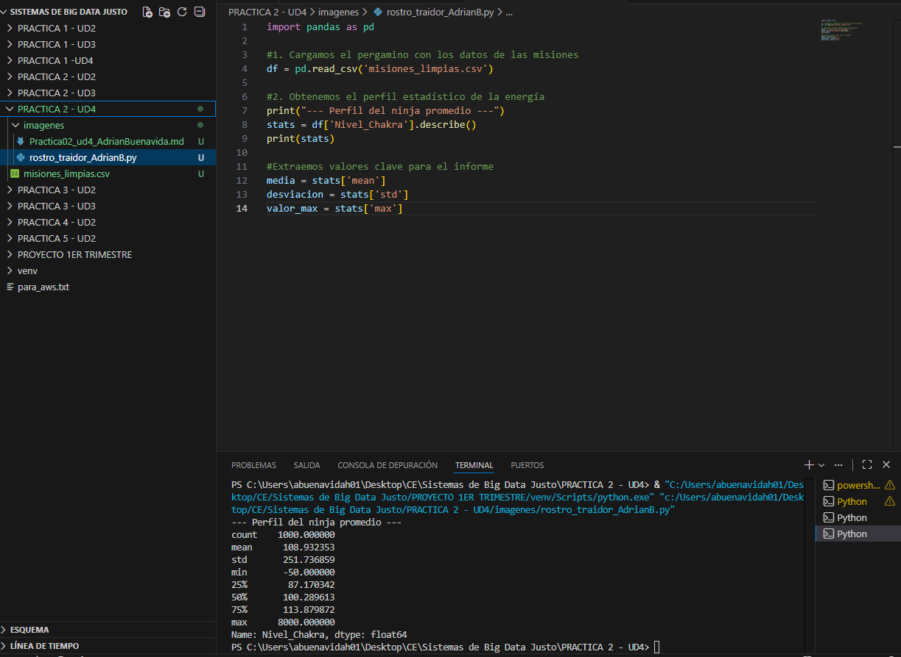
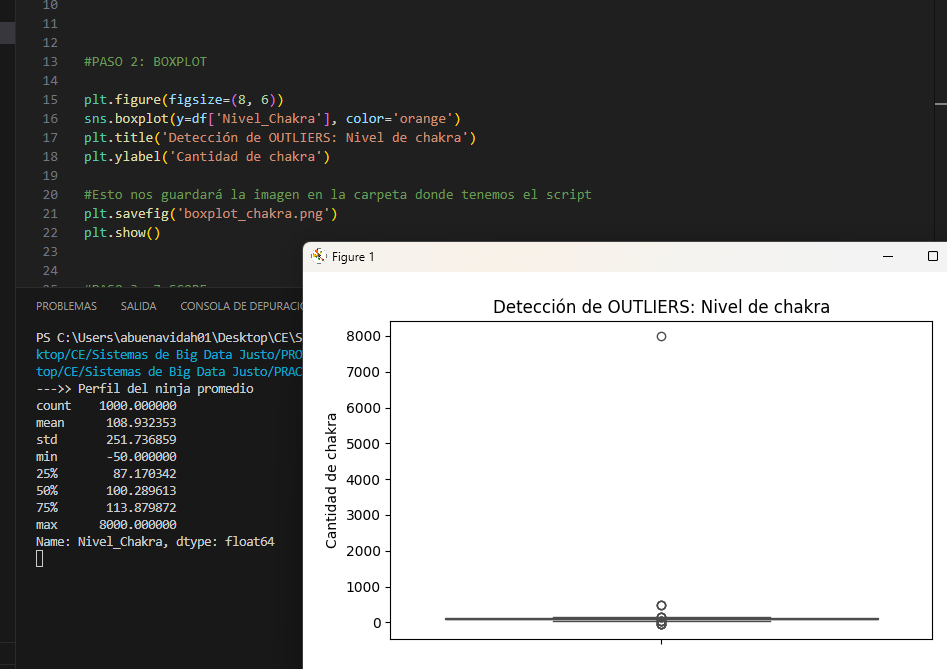
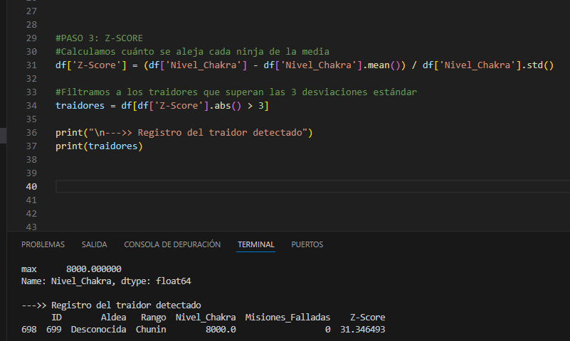
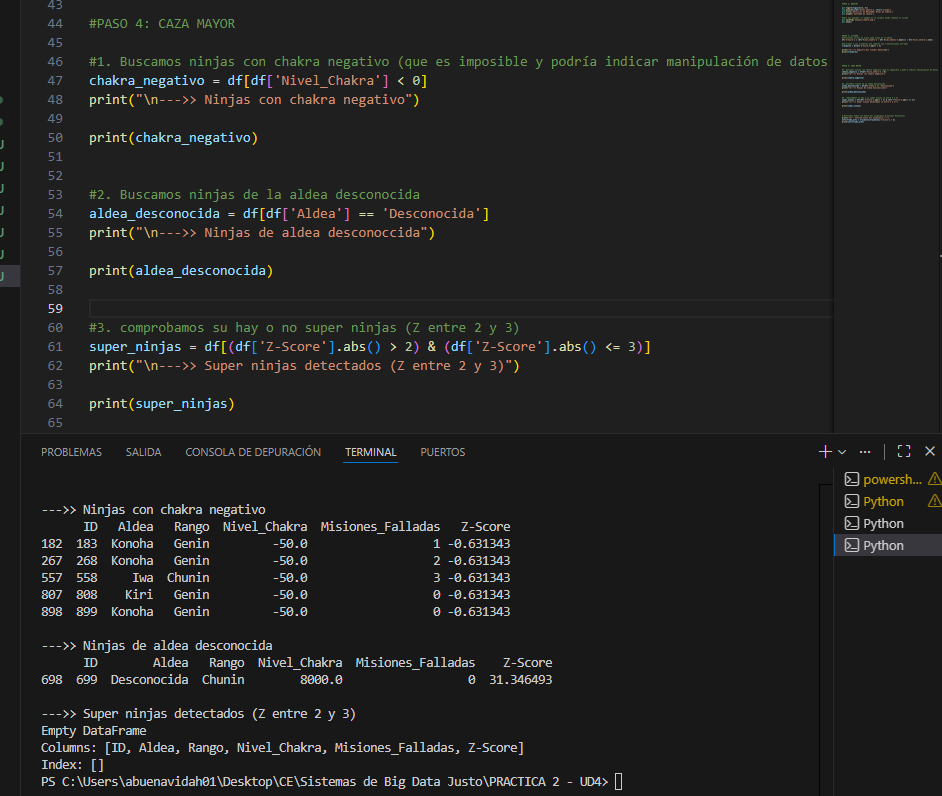
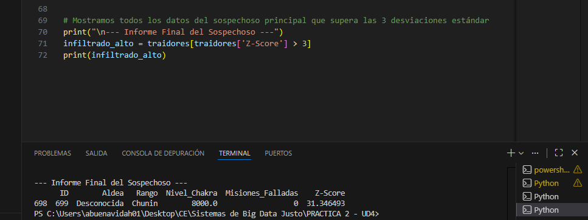

# Práctica 2. El rostro del traidor (Detección de anomalías)
**Autor:** Adrián Buenavida

## Descripción de la misión
Tras limpiar el pergamino en la misión anterior, he detectado que algunos registros muestran comportamientos extraños 

En esta práctica, mi objetivo es aplicar técnicas de análisis estadístico como el **Z-Score** y visualizaciones de **Boxplots** para identificar outliers y localizar al espía que se oculta en el datasett

---

## Paso 1: El Ojo de la verdad 
El primer paso ha sido cargar el dataset `misiones_limpias.csv` y ver un análisis estadístico para entender cómo es un "ninja promedio" y detectar valores que se salgan de lo normal.

**estrategia:**

1. **Carga de datos:** He importado el archivo con los 1.000 registros de actividad ninja procesados previamente para esta misión.

2. **Perfilado estadístico:** He utilizado el método **.describe()** sobre la columna `Nivel_Chakra` para obtener la media ($\mu$), la desviación estándar ($\sigma$) y los valores extremos

3. **Identificación de sospechosos:** He analizado la diferencia entre el percentil 75% y el valor máximo para confirmar si existen anomalías graves


**Código utilizado:**
```python
import pandas as pd

#1. Cargamos el pergamino con los datos de las misiones 
df = pd.read_csv('misiones_limpias.csv')

#2. Obtenemos el perfil estadístico de la energía 
print("--->> Perfil del ninja promedio")
stats = df['Nivel_Chakra'].describe()
print(stats)

#Extraemos valores important para el informe 
media = stats['mean']
desviacion = stats['std']
valor_max = stats['max']
```




<br>


---

## Paso 2: Jutsu de visualización (Boxplot)
Para ver quién se sale de la media, he generado un **Boxplot** . Esta herramienta es perfecta para detectar "puntos extremos" que representan a los infiltrados

**estrategia:**

1. **Librerías de visualización:** He utilizado **Seaborn** y **Matplotlib** para crear un gráfico

2. **Representación de energía:** He configurado el gráfico para que analice la columna `Nivel_Chakra`.

3. **Identificación de la anomalía:** En el gráfico se observa una caja pequeña (donde está la mayoría de ninjas) y un punto extremadamente alejado en la parte superior, que confirma la presencia del espía con 8.000 de chakra.


**Código utilizado:**
```python
import seaborn as sns
import matplotlib.pyplot as plt

# 1. Configuramos el tamaño y estilo del gráfico #taltaltal
plt.figure(figsize=(8, 6))
sns.boxplot(y=df['Nivel_Chakra'], color='orange')

# 2. Añadimos títulos descriptivos para el informe #taltaltal
plt.title('Detección de OUTLIERS: Nivel de Chakra')
plt.ylabel('Cantidad de Chakra')

# 3. Guardamos la evidencia visual #taltaltal
plt.savefig('boxplot_chakra.png')
plt.show()
```




---

## Paso 3: Z-Score
Aunque el gráfico nos indica que hay un infiltrado, el **Z-Score** nos permite identificarlo con precisión matemática

**estrategia:**

1. **Cálculo:** He aplicado la fórmula $Z = (X - \mu) / \sigma$ para saber cuántas desviaciones estándar se aleja cada dato de la media.

2. **Filtrado:** He marcado como "traidores" a aquellos cuyo Z-Score absoluto es mayor a 3 (eventos con menos del 0.3% de probabilidad)

**Código utilizado:**
```python
#PASO 3: Z-SCORE 
#Calculamos cuánto se aleja cada ninja de la media
df['Z-Score'] = (df['Nivel_Chakra'] - df['Nivel_Chakra'].mean()) / df['Nivel_Chakra'].std()

#Filtramos a los traidores que superan las 3 desviaciones estándar
traidores = df[df['Z-Score'].abs() > 3]

print("\n--->> Registro del traidor detectado")
print(traidores)
```



<br>

---

## Paso 4: Caza Mayor 
El capitán Yamato sospechaba que podría haber más anomalías, así que he ampliado el rango de búsqueda

**estrategia:**

1. **Chakra negativo:** He localizado 5 registros con chakra de -50.0

2. **Aldea desconocida:** He filtrado por origen y he confirmado que el ninja de la aldea "Desconocida" es el mismo que tiene el Z-Score de 31

3. **Super ninjas:** He buscado ninjas con un Z-Score entre 2 y 3 (muy fuertes). 
No he encontadio registros en este rango

**Código utilizado:**
```python
#PASO 4: CAZA MAYOR 

#1. Buscamos ninjas con Chakra Negativo (que es imposible y podría indicar manipulación de datos o traición)
chakra_negativo = df[df['Nivel_Chakra'] < 0]
print("\n--->> Ninjas con chakra negativo")
print(chakra_negativo)

#2. Buscamos ninjas de la aldea "Desconocida"
aldea_desconocida = df[df['Aldea'] == 'Desconocida']
print("\n--->> Ninjas de aldea desconocida")
print(aldea_desconocida)

#3. Super Ninjas (Fuertes: Z entre 2 y 3)
super_ninjas = df[(df['Z-Score'].abs() > 2) & (df['Z-Score'].abs() <= 3)]   
print("\n--->> Super ninjas detectados (Z entre 2 y 3)")
print(super_ninjas)
```



<br>


---

## Paso 5: Interrogatorio Final
Tras aislar los datos, he procedido a realizar un aálisis de información para confirmar las sospechas sobre la identidad del infiltrado

**estrategia:**

1. **Cruce de identidades:** He comparado el registro del ninja con chakra más alto con el registro de la aldea "Desconocida"

2. **Confirmación:** Los datos coinciden. El **ID 699** es el espía que era anónimo y niveles de energía altísimos

**Código utilizado:**
```python
#Mostramos todos los datos del sospechoso principal 
print("\n---> Informe Final del Sospechoso")
infiltrado_alto = traidores[traidores['Z-Score'] > 3]
print(infiltrado_alto)
```




---

## Preguntas de reflexión

### 1. ¿Por qué un outlier puede ser un error del sensor y no necesariamente un ataque? Pon un ejemplo que hayas encontrado en el dataset.
Un outlier es un dato que se sale de la norma. 

En mi análisis he detectado **5 registros con un nivel de chakra de -50.0**. Dado que el chakra es "energía vital" y no puede ser negativo, es evidente que estos casos (como los IDs 183 o 558) son **errores de los sensores** de la puerta y no una amenaza real o un ataque ninja.


### 2. Si eliminas los outliers, ¿cómo cambia la media del dataset? ¿Sube o baja?
Si elimino los outliers, especialmente el del infiltrado con 8.000 de chakra, **la media bajaría significativamente**. 

Actualmente, la media está en 108.93 porque ese valor tan alto "tira" de la media hacia arriba. Al quitarlo, la media se situaría mucho más cerca de la mediana (100.28), lo que el poder de la aldeasería más real y equilibrado

### 3. ¿Sería justo castigar a los “Super Ninjas” (Z-Score > 2 pero < 3) solo por ser fuertes? Justifica tu respuesta estadística.
Desde un punto de vista estadístico, creo que **no sería justo**. Un Z-Score de entre 2 y 3 significa que el ninja es excepcionalmente fuerte, pero sigue estando dentro de la probabilidad natural (es el "élite" del dataset). 

Castigarlos sería como castiagr el talento 

La diferencia es clara: mientras un "Super Ninja" tiene un Z-Score de 2.5, nuestro traidor tiene un **31.34**, lo cual es matemáticamente imposible de alcanzar

---

## Conclusión

Esta práctica me ha enseñado que la estadística es una herramienta de rastreo muy buena y potente. 

Gracias al **Boxplot**, pude ver visualmente que alguien estaba "rompiendo" la escala de la aldea, y con el **Z-Score** pude ponerle "identidfad" al espía de la aldea desconocida sin ninguna duda. 

Usar **Pandas** y **Seaborn** me ha permitido procesar 1.000 registros muy rápidamente, lo cual es mucho más rápido que haberlo hecho manualmnete