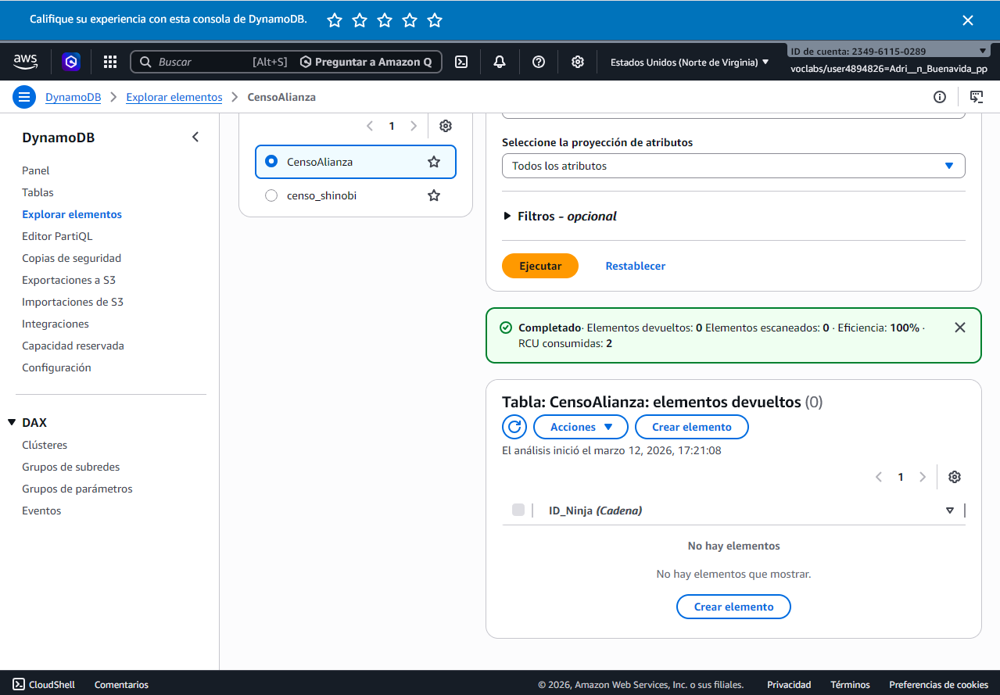
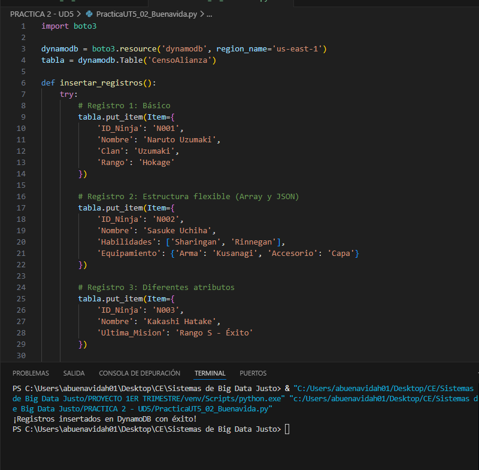
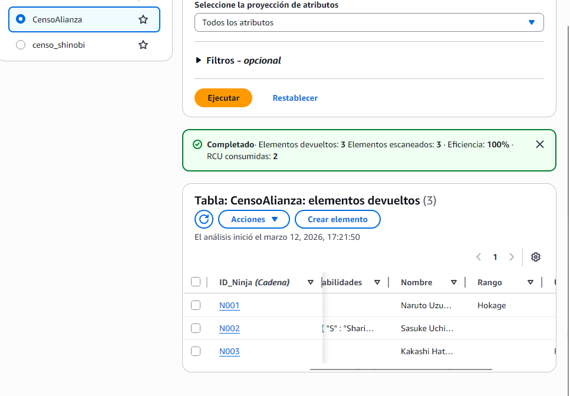
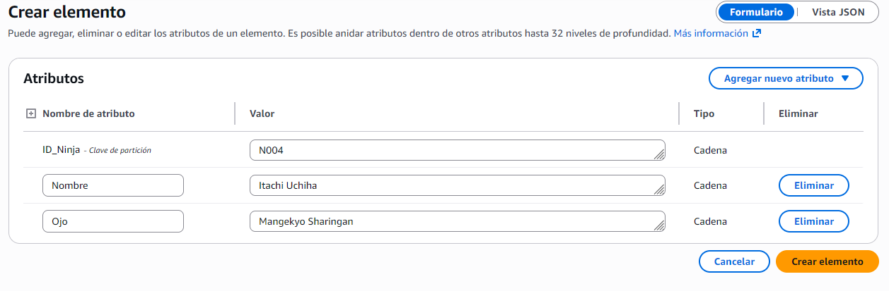
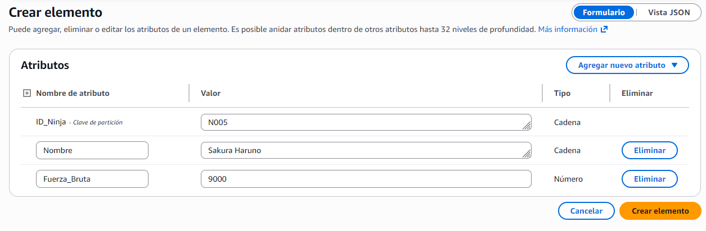
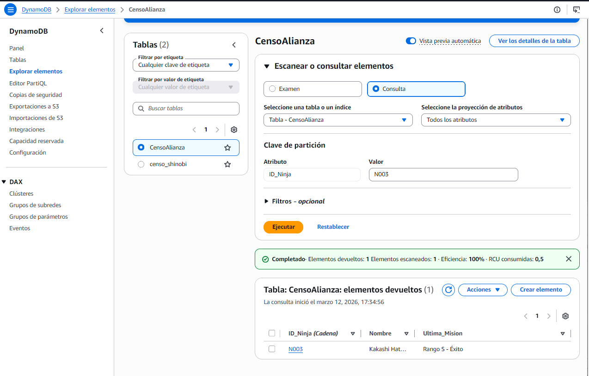
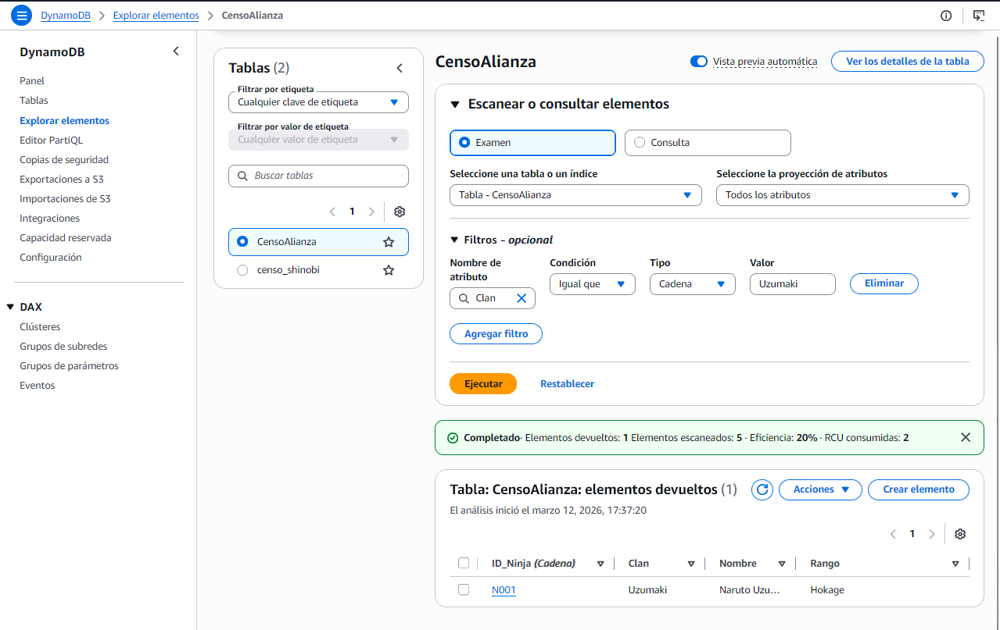
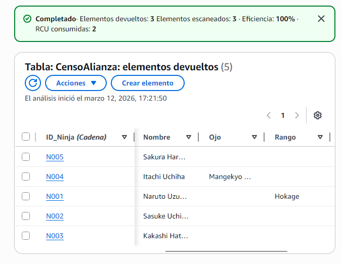

# Práctica 2. UT5. El Índice de las Sombras (NoSQL con DynamoDB)
**Autor:** Adrián Buenavida

## Descripción 
El objetivo de esta práctica es diseñar y gestionar una base de datos NoSQL utilizando **Amazon DynamoDB**. A diferencia de las bases de datos relacionales (SQL), aquí aprovechamos un esquema flexible para almacenar información heterogénea de los ninjas de la Alianza, optimizando el rendimiento mediante el uso de claves de partición.

---

## Datos y atributos
He creado la tabla `CensoAlianza` con la Partition Key `ID_Ninja` (String). A continuación, muestro la flexibilidad del esquema insertando registros con estructuras distintas:

1. **N001 (Naruto):** Registro básico con Clan y Rango.
2. **N002 (Sasuke):** Incluye atributos complejos como listas (`Habilidades`) y mapas (`Equipamiento`).
3. **N003 (Kakashi):** Foco en el estado de su última misión.
4. **N004 (Itachi):** Añadido atributo específico de técnica ocular (`Ojo`).
5. **N005 (Sakura):** Incluye un atributo numérico de potencia física (`Fuerza_Bruta`).

> **Reflexión:** DynamoDB permite que el Ninja 002 tenga una lista de herramientas mientras que el 001 no la tiene, sin necesidad de alterar la estructura de toda la tabla ni dejar huecos de "NULL" innecesarios

### Código script - insercc 3 elementos
```python
import boto3

dynamodb = boto3.resource('dynamodb', region_name='us-east-1')
tabla = dynamodb.Table('CensoAlianza')

def insertar_registros():
    try:
        #Registro 1: Básico
        tabla.put_item(Item={
            'ID_Ninja': 'N001',
            'Nombre': 'Naruto Uzumaki',
            'Clan': 'Uzumaki',
            'Rango': 'Hokage'
        })

        #Registro 2: Estructura flexible (Array y JSON)
        tabla.put_item(Item={
            'ID_Ninja': 'N002',
            'Nombre': 'Sasuke Uchiha',
            'Habilidades': ['Sharingan', 'Rinnegan'],
            'Equipamiento': {'Arma': 'Kusanagi', 'Accesorio': 'Capa'}
        })

        #Registro 3: Diferentes atributos
        tabla.put_item(Item={
            'ID_Ninja': 'N003',
            'Nombre': 'Kakashi Hatake',
            'Ultima_Mision': 'Rango S - Éxito'
        })

        print("¡Registros insertados en DynamoDB con éxito!")
    except Exception as e:
        print(f"Error al conectar con DynamoDB: {e}")

if __name__ == "__main__":
    insertar_registros()
```

### captura ANTES de insercción por script


### captura ejecución exitosa del script


### captura POSTERIOR a insercción por script


### captura insercción por AWS1


### captura insercción por AWS2


---

## Análisis: Query vs Scan

### 1. Rendimiento de Búsqueda
* **Query:** Es extremadamente rápida. Al buscar por `ID_Ninja`, DynamoDB va directamente a la partición física donde reside el dato. Es una operación de tiempo constante $O(1)$.
* **Scan:** Es mucho más lento y costoso. Obliga a DynamoDB a leer todos los ítems de la tabla para filtrar los resultados. En Big Data, un Scan consume muchos créditos de lectura (RCU) y puede impactar en el coste total.

### 2. Optimización por "Aldea" y Global Secondary Index (GSI)
Si necesitara buscar habitualmente por **Aldea** en lugar de por ID:
* **Problema:** Usar un Scan por Aldea sería ineficiente.
* **Solución:** Crearía un **Global Secondary Index (GSI)** con `Aldea` como nueva Partition Key. 
* **¿Qué es un GSI?:** Es una "copia" automática de la tabla que permite realizar consultas rápidas (Queries) por atributos que no son la clave principal original, manteniendo los datos sincronizados en tiempo real.


## Captura QUERY


## Captura SCAN


---

## Captura/Comprobación COMPLETA



---