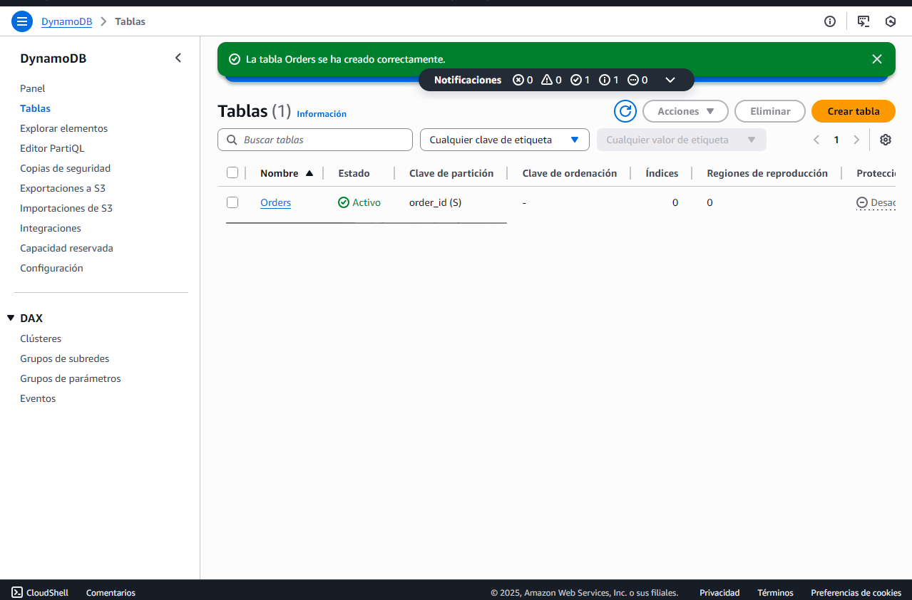

# Práctica 3: DynamoDB y el Poder de las Bases de Datos Serverless_AdrianBuenavida


## EJERCICIO 1: Creando nuestra primera tabla en la nube

### Objetivo del 1er ejercicio
Crearemos una tabla llamada **Orders** en DynamoDB, que servirá como base de datos para los pedidos del sistema de e-commerce.


### Observaciones
DynamoDB creó una tabla distribuida de forma automática, sin necesidad de servidores.  
La **clave de partición (`order_id`)** se utilizará para distribuir los datos y permitir búsquedas rápidas por ID de pedido.

### Comprobación



<br><br>


## Ejercicio 2 – Inserción de datos en DynamoDB

### Objetivo
Insertamos los primeros pedidos en la tabla **Orders** usando el formato JSON de DynamoDB, para que nos sea más fácil

### Pasos realizados
1. Accedimos a la tabla **Orders** y abrimos la opción **“Explore items”**.
2. Seleccionamos **“Create item”** y cambiamos a la vista **JSON** (desde aquí es más fácil añadir)
3. Y ahora, insertamos los siguientes pedidos:

   ```json
   {
     "order_id": { "S": "ORD1002" },
     "customer_name": { "S": "Carlos Soto" },
     "product": { "S": "Mouse Logitech" },
     "quantity": { "N": "1" },
     "order_date": { "S": "2025-11-04" },
     "status": { "S": "Shipped" }
   }
   ```

   ```json
   {
    "order_id": { "S": "ORD1003" },
    "customer_name": { "S": "Lucía Pérez" },
    "product": { "S": "Teclado mecánico" },
    "quantity": { "N": "2" },
    "order_date": { "S": "2025-11-05" },
    "status": { "S": "Pending" }
    }
    ```

    ```json
    {
    "order_id": { "S": "ORD1004" },
    "customer_name": { "S": "Javier Ruiz" },
    "product": { "S": "Monitor Samsung" },
    "quantity": { "N": "1" },
    "order_date": { "S": "2025-11-05" },
    "status": { "S": "Delivered" }
    }
    ```

    ```json
    {
    "order_id": { "S": "ORD1005" },
    "customer_name": { "S": "María Gómez" },
    "product": { "S": "Impresora HP" },
    "quantity": { "N": "1" },
    "order_date": { "S": "2025-11-06" },
    "status": { "S": "Pending" }
    }
    ```


### Comprobación
