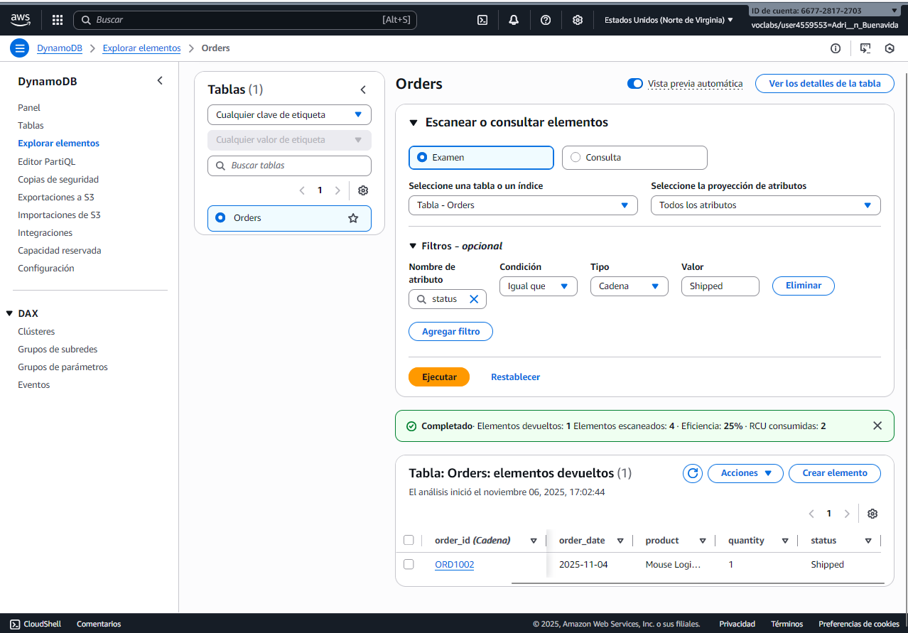
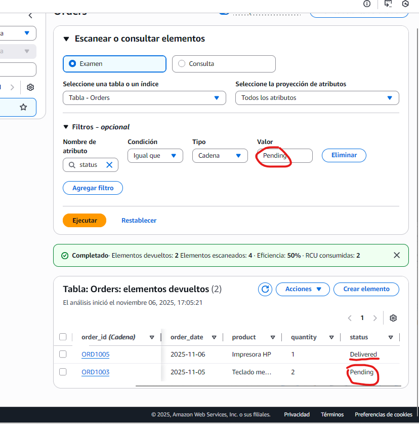
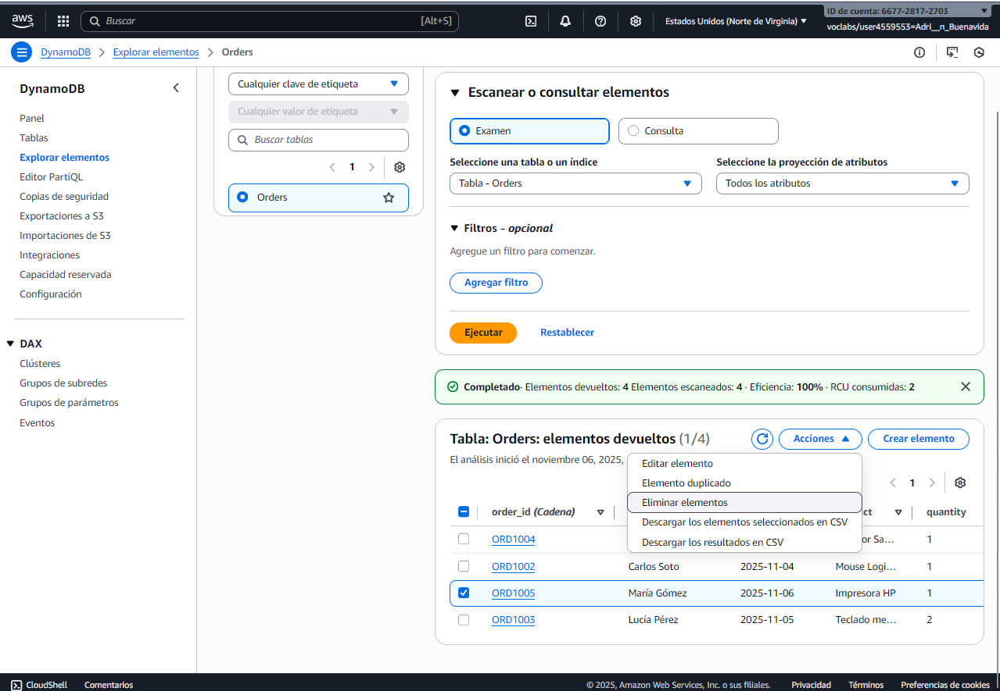
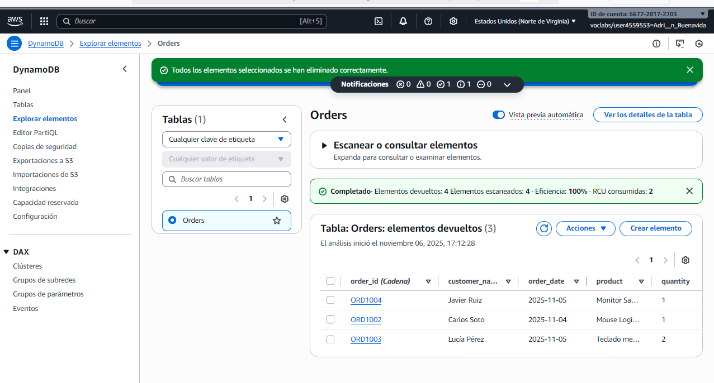

# Práctica 3: DynamoDB y el Poder de las Bases de Datos Serverless_AdrianBuenavida


## EJERCICIO 1: Creando nuestra primera tabla en la nube

### Objetivo del 1er ejercicio
Crearemos una tabla llamada **Orders** en DynamoDB, que servirá como base de datos para los pedidos del sistema de e-commerce.


### Observaciones
DynamoDB creó una tabla distribuida de forma automática, sin necesidad de servidores.  
La **clave de partición (`order_id`)** se utilizará para distribuir los datos y permitir búsquedas rápidas por ID de pedido.

### Comprobación


---
<br>


## Ejercicio 2 – Inserción de datos en DynamoDB

### Objetivo
Insertamos los primeros pedidos en la tabla **Orders** usando el formato JSON de DynamoDB, para que nos sea más fácil

### Pasos realizados
1. Accedimos a la tabla **Orders** y abrimos la opción **“Explore items”**.
2. Seleccionamos **“Create item”** y cambiamos a la vista **JSON** (desde aquí es más fácil añadir)
3. Y ahora, insertamos los siguientes pedidos:

   ```json
   {
     "order_id": { "S": "ORD1002" },
     "customer_name": { "S": "Carlos Soto" },
     "product": { "S": "Mouse Logitech" },
     "quantity": { "N": "1" },
     "order_date": { "S": "2025-11-04" },
     "status": { "S": "Shipped" }
   }
   ```

   ```json
   {
    "order_id": { "S": "ORD1003" },
    "customer_name": { "S": "Lucía Pérez" },
    "product": { "S": "Teclado mecánico" },
    "quantity": { "N": "2" },
    "order_date": { "S": "2025-11-05" },
    "status": { "S": "Pending" }
    }
    ```

    ```json
    {
    "order_id": { "S": "ORD1004" },
    "customer_name": { "S": "Javier Ruiz" },
    "product": { "S": "Monitor Samsung" },
    "quantity": { "N": "1" },
    "order_date": { "S": "2025-11-05" },
    "status": { "S": "Delivered" }
    }
    ```

    ```json
    {
    "order_id": { "S": "ORD1005" },
    "customer_name": { "S": "María Gómez" },
    "product": { "S": "Impresora HP" },
    "quantity": { "N": "1" },
    "order_date": { "S": "2025-11-06" },
    "status": { "S": "Pending" }
    }
    ```


### Comprobación


---

<br>


## Ejercicio 3: Explorando y modificando los datos

1. Aplicamos un filtro para ver todos los pedidos con estado **"Shipped"**
2. Luego editamos uno de los pedidos con estado **"Pending"** y lo actualizamos a **"Delivered"**

#### Captura 3A – Filtro aplicado (estado --> enviado)


#### Captura 3B – Pedido actualizado



---


## Ejercicio 4: Eliminando un pedido

**Objetivo:**  
Aprender a eliminar un ítem de una tabla en DynamoDB utilizando la consola de AWS.


### Pasos realizados

1. Accedemos a la parte de **“Explore items”** dentro de la tabla **Orders** 
2. Marcamos la casilla a la izquierda del ítem que queríamos eliminar (por ej, `ORD1005`)
3. En el menú **Actions**, seleccionamos **Delete item**
4. Confirmamos la eliminación cuando AWS lo solicitó 
5. Verificamos que se haya eliminado.


#### Captura 4




## Reflexión Final: DynamoDB en el Ecosistema NoSQL

Después de trabajar con DynamoDB, veo que es bastante diferente a MongoDB.  

DynamoDB usa un modelo **clave-valor**, ( cada "clave" es un identificador único que se utiliza para recuperar el "valor" asociado) , mientras que **MongoDB** es más flexible con documentos JSON y permite buscar por casi cualquier campo. 

En DynamoDB todo gira en torno a la **clave primaria**, lo que simplifica las consultas pero también las limita un poco.

Lo que más me llamó la atención es que **DynamoDB es serverless**: no tienes que preocuparte por servidores ni configuraciones, todo escala solo. Eso es genial para equipos pequeños o para proyectos que crecen rápido. 
La parte negativa es que dependemos de AWS --> Amazon web service , y puede ser más difícil de personalizar o mover a otro entorno.

De esta práctica, lo más fácil fue crear los ítems y verlos en la consola. 
Lo más confuso fue entender cómo funcionan las consultas y los filtros, porque creo quw no es tan intuitivo como en MongoDB. 
Aun así, me  ha parecido una buena forma de entender cómo funcionan las bases de datos NoSQL

