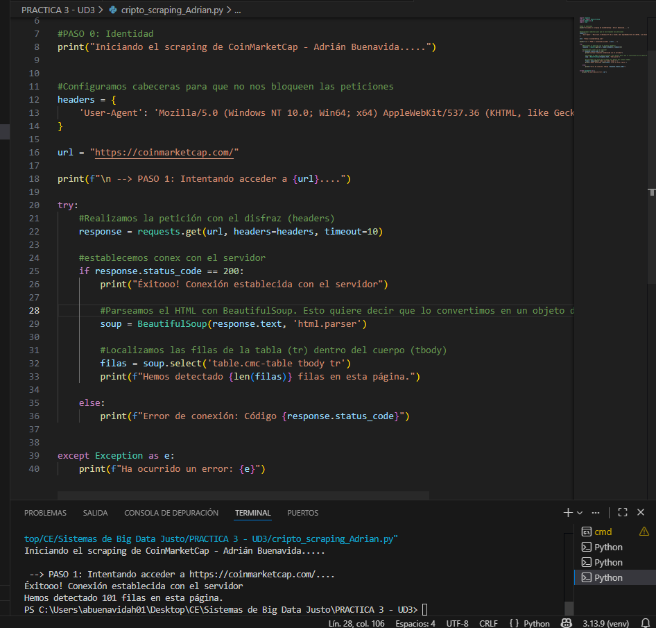

# Práctica 3: Extracción de datos en CoinMarketCap (Web Scraping)
**Autor:** Adrián Buenavida

## Descripción de la práctica
En esta práctica, vamos a realizar una extracción de datos en un entorno no estructurado. 

A diferencia de las APIs, aquí debemos navegar por el DOM (Document Object Model) de la web de CoinMarketCap para "leer" la información de las 500 principales criptomonedas y almacenarlas para su análisis

---

## Paso 1: Configuramos acceso y evasión de bloqueos
Dado que CoinMarketCap protege sus datos frente a accesos automatizados, hemos tenido que preparar nuestra petición para que " parezca humana"


**estrategia:**

1. **User-Agent:** Hemos incluido una cabecera (`headers`) en la que simulamso la navegación desde un navegador Chrome estándar, evitando que el servidor bloquee nuestra IP al detectarnos como un script de Python, que es lo que hemos hecho

2. **BeautifulSoup:** Una vez obtenida la respuesta del servidor, utilizamos el motor de `BeautifulSoup` para transformar el HTML crudo en un objeto navegable (he buscado inform en internet)

3. **Localización de las filas:** Hemos identificado que los datos residen en una tabla con la clase `cmc-table`. Mediante selectores CSS, localizamos todas las etiquetas `<tr>` que contienen la información de cada activo


**Código utilizado:**
```python
headers = {'User-Agent': 'Mozilla/5.0 ... Chrome/119.0.0.0 ...'}
response = requests.get(url, headers=headers)
soup = BeautifulSoup(response.text, 'html.parser')
filas = soup.select('table.cmc-table tbody tr')
```



<br>


## Paso 2: Analizamos el del DOM y extracción de atributos
Una vez establecida la conexión, nuestro objetivo ha sido identificar la ubicación exacta de los datos dentro de la estructura de la tabla.

**estrategia:**

1. **Filas:** Hemos recorrido cada etiqueta `<tr>` obtenida, descartando aquellas que no cumplen con el número mínimo de celdas para evitar filas que no nos sirven como las de publicidad 

2. **Localizamos índice:** Mediante `find_all('td')`, hemos accedido a las columnas específicas donde CoinMarketCap almacena el nombre, el precio actual, la capitalización de mercado y el volumen de transacciones

3. **Almacenamiento temporal:** Los datos se han estructurado en una lista de diccionarios, paso muy importyante para su posterior transformación y limpieza con la librería pandas

**Código utilizado:**
```python
for fila in filas:
    celdas = fila.find_all('td')
    if len(celdas) > 5:
        nombre = celdas[2].text.strip()
        precio = celdas[3].text.strip()
```


