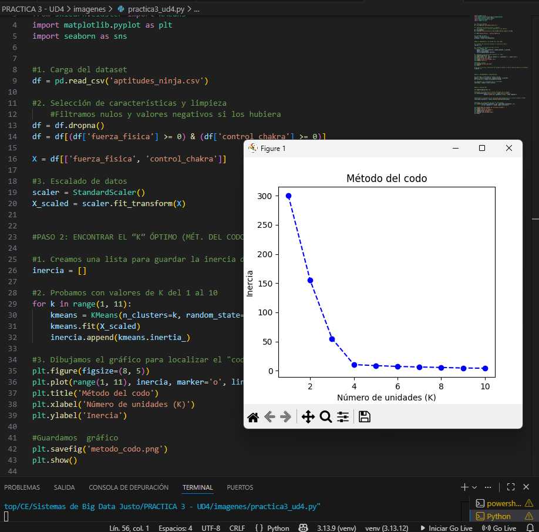
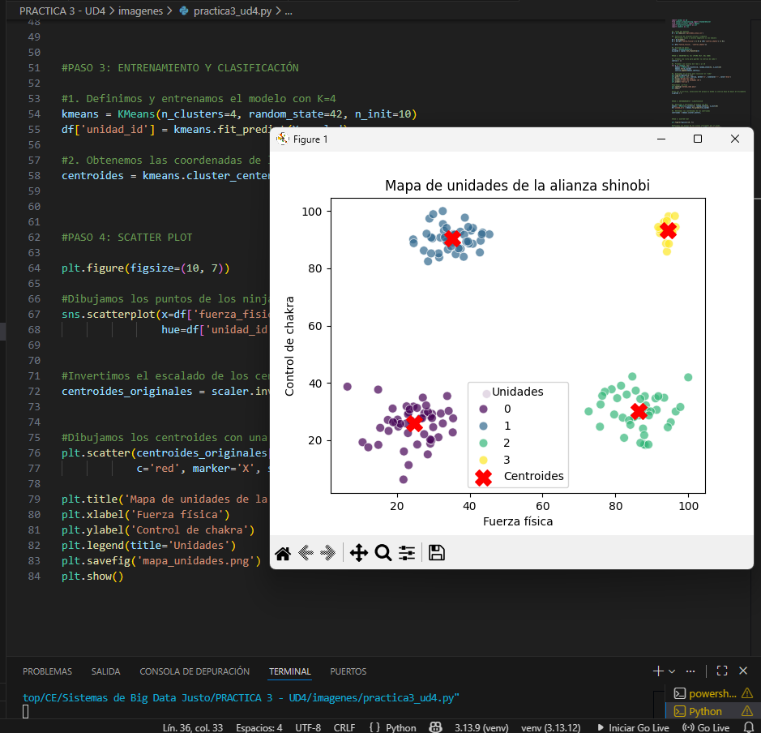

# Práctica 3. Selección para la Gran Alianza (K-Means Clustering)
**Autor:** Adrián Buenavida

## Descripción de la práctica
El objetivo de esta práctica es utilizar el aprendizaje no supervisado mediante el algoritmo **K-Means** para segmentar un dataset de shinobis
Se busca agrupar a los personajes en unidades especializadas basándose en sus aptitudes físicas y su control de energía

---

## Paso 1: Exploración y Limpieza de Datos
Antes de aplicar el modelo, es necesario preparar el dataset asegurando que no existan valores nulos y que las variables estén en la misma escala


**estrategia:**

1. **Carga y filtrado:** Se importa el CSV y se seleccionan únicamente las columnas numéricas relevantes: `fuerza_fisica` y `control_chakra`

2. **Saneamiento:** Se verifica la ausencia de valores nulos y se asegura que no existan valores incoherentes como registros negativos.

3. **Normalización:** Se utiliza **StandardScaler** para estandarizar los datos. Esto es fundamental en K-Means, ya que el algoritmo se basa en distancias euclidianas y requiere que todas las variables tengan el mismo peso.


**Código utilizado:**
```python
import pandas as pd
from sklearn.preprocessing import StandardScaler
from sklearn.cluster import KMeans
import matplotlib.pyplot as plt
import seaborn as sns


# 1. Carga del dataset
df = pd.read_csv('aptitudes_ninja.csv')

# 2. Selección de características y limpieza
# Filtramos nulos y valores negativos si los hubiera
df = df.dropna()
df = df[(df['fuerza_fisica'] >= 0) & (df['control_chakra'] >= 0)]

X = df[['fuerza_fisica', 'control_chakra']]

# 3. Escalado de datos
scaler = StandardScaler()
X_scaled = scaler.fit_transform(X)
```


<br>
---

## Paso 2: Encontrar el “K” óptimo 
Para determinar el número ideal de unidades especializadas, he aplicado un análisis que evalúa la inercia (la suma de las distancias al cuadrado dentro de cada clúster) para diferentes valores de K

**estrategia:**

1. **Iteración:** He ejecutado el algoritmo K-Means para valores de K del 1 al 10.
2. **Registro de Inercia:** He almacenado la inercia de cada modelo en una lista.
3. **Visualización:** He generado un gráfico de línea para identificar el "punto de codo", donde añadir más clústeres deja de reducir la inercia de forma significativa.

**Código utilizado:**
```python
inercia = []
for k in range(1, 11):
    kmeans = KMeans(n_clusters=k, random_state=42, n_init=10)
    kmeans.fit(X_scaled)
    inercia.append(kmeans.inertia_)

# Gráfico del codo
plt.figure(figsize=(8, 5))
plt.plot(range(1, 11), inercia, marker='o', linestyle='--')
plt.title('Método del Codo')
plt.xlabel('Número de Clústeres (K)')
plt.ylabel('Inercia')
plt.show()
```




<br>

---

## Paso 3: Entrenamiento y clasificación
Una vez seleccionado el valor óptimo de $K=4$, entreno el modelo definitivo para asignar a cada shinobi a su unidad correspondiente

**estrategia:**

1. **Ajuste del modelo:** He configurado el algoritmo **K-Means** con 4 clústeres.

2. **Asignación de etiquetas:** He utilizado `fit_predict` para entrenar el modelo y asignar una etiqueta numérica a cada ninja en una nueva columna llamada `unidad_id`.

3. **Cálculo de centroides:** He extraído los puntos medios de cada grupo, los cuales representarían el "perfil ideal" de cada unidad


**Código utilizado:**
```python
#1. Definimos y entrenamos el modelo con K=4 
kmeans = KMeans(n_clusters=4, random_state=42, n_init=10)
df['unidad_id'] = kmeans.fit_predict(X_scaled)

#2. Obtenemos las coordenadas de los centroides  
centroides = kmeans.cluster_centers_
```


<br>
---


## Paso 4: Scatter Plot
Para visualizar la segmentación de la Alianza, he generado un gráfico de dispersión que muestra la relación entre fuerza y chakra, destacando los centros de cada unidad

**estrategia:**

1. **Visualización de clústeres:** He utilizado **Seaborn** para colorear a los ninjas según su grupo asignado

2. **Representación de centroides:** He marcado con una **"X" roja** la posición central de cada clúster tras revertir la normalización de los datos para que sean legibles en la escala de 0 a 100

**Código utilizado:**
```python
plt.figure(figsize=(10, 7))

#Dibujamos los puntos de los ninjas coloreados por su grupo
sns.scatterplot(x=df['fuerza_fisica'], y=df['control_chakra'], 
                hue=df['unidad_id'], palette='viridis', s=60, alpha=0.7)


#Invertimos el escalado de los centroides para dibujarlos en la escala original (0-100)
centroides_originales = scaler.inverse_transform(centroides)


#Dibujamos los centroides con una "X" roja grande
plt.scatter(centroides_originales[:, 0], centroides_originales[:, 1], 
            c='red', marker='X', s=200, label='Centroides')

plt.title('Mapa de unidades de la alianza shinobi')
plt.xlabel('Fuerza física')
plt.ylabel('Control de chakra')
plt.legend(title='Unidades')
plt.savefig('mapa_unidades.png')
plt.show()
```




<br>


---

## Paso 5: Análisis de Perfiles
Tras ejecutar y observar las coordenadas de los centroides (las medias de cada grupo), he identificado la especialidad natural de cada una de las 4 unidades creadas:

| Unidad (ID) | Perfil / Chakra | Nombre de la unidad |
| :--- | :--- | :--- |
| **Grupo 0** | Fuerza baja / Chakra bajo | **Unidad de apoyo** |
| **Grupo 1** | Fuerza baja / Chakra alto | **Cuerpo médico** |
| **Grupo 2** | Fuerza alta / Chakra bajo | **Cuerpo de asalto (taijuutsu)** |
| **Grupo 3** | Fuerza alta / Chakra alto | **Élite** |

---

## Conclusión

**¿Por qué elegí K=4?**
Tras analizar el **Método del codo**, observé que la inercia cae hasta llegar al valor 4. 
A partir de ahí, la curva se suaviza. 
Elegir 4 grupos me permite separar de forma equilibrada a los ninjas según las cuatro combinaciones de sus habilidades (baja/baja, baja/alta, alta/baja,  alta/alta)

**¿Qué representan los grupos?**
El modelo ha dividido los grupos de forma eficiente. No solo ha identificado a los ninjas más poderosos (elite), sino que ha sabido diferenciar a los especialistas médicos de los de fuerza física. 
