# Práctica 4: Práctica 4: Automatización de DynamoDB con Python y Boto3_AdrianBuenavida


## 1a PARTE: Preparamos el entorno

### 1.1 Configuramos AWScli 

Dentro de AWSAcademy, vamos arriba a la derecha, alapartado de "AWS Details" y hacemos click. Nos aparecerán unos datos relacionados con nuestro usuario.

Luego vamos al cmd y escribimos "aws configuration", y comenzamo con la configuración.

#### Comprobación
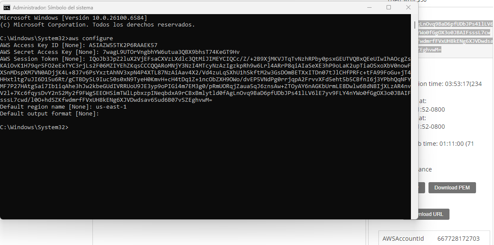


### 1.2 Instalamos Python y Pip

#### Comprobación - Python
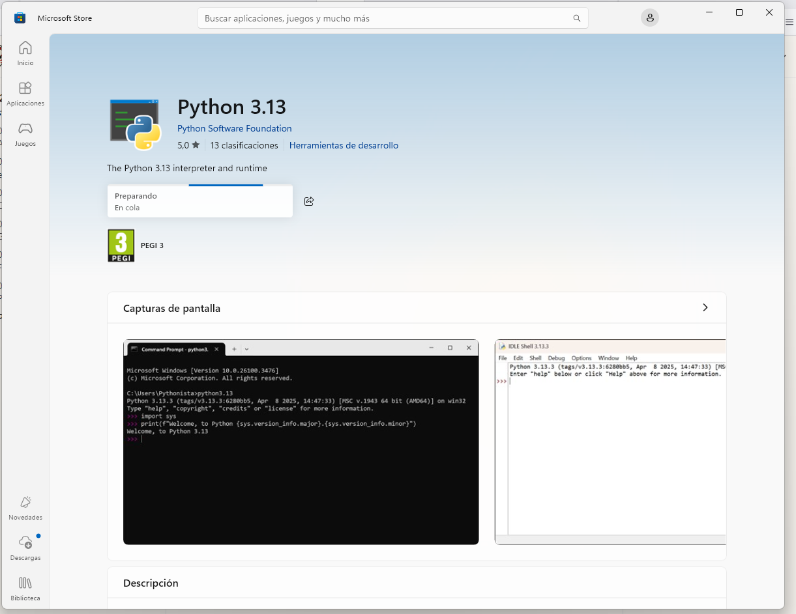


#### Comprobación - Boto3
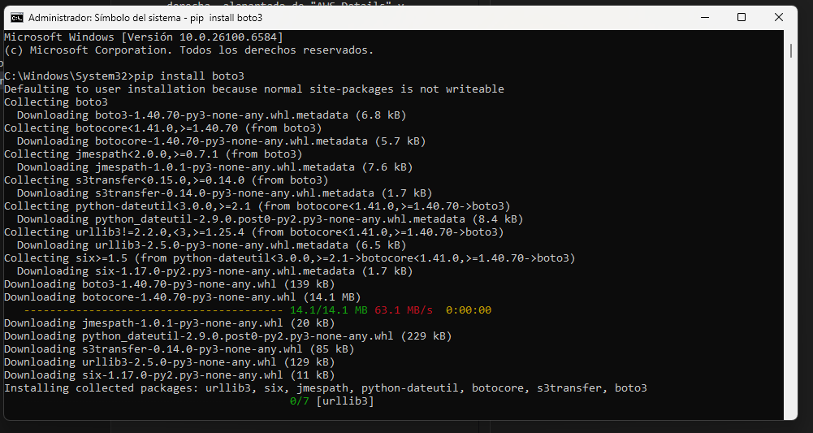


### 1.3. Verificación de las Credenciales

Escribimos en el cmd el siguiente comando: ```aws sts get-caller-identity```

#### Comprobación
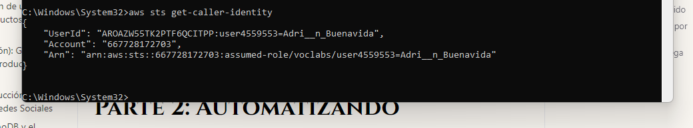


<br>

## 2a PARTE: Automatizando Operaciones con Boto3

### 2.1. Conexión a DynamoDB
Con el siguiente comando, lograremos  establecer la conexión con el servicio y seleccionar nuestra tabla "Orders":

```python
import boto3

dynamodb = boto3.resource('dynamodb', region_name='us-east-1')

table = dynamodb.Table('Orders')

print(f"Conectado a la tabla '{table.name}' en la región '{dynamodb.meta.client.meta.region_name}'.")

```

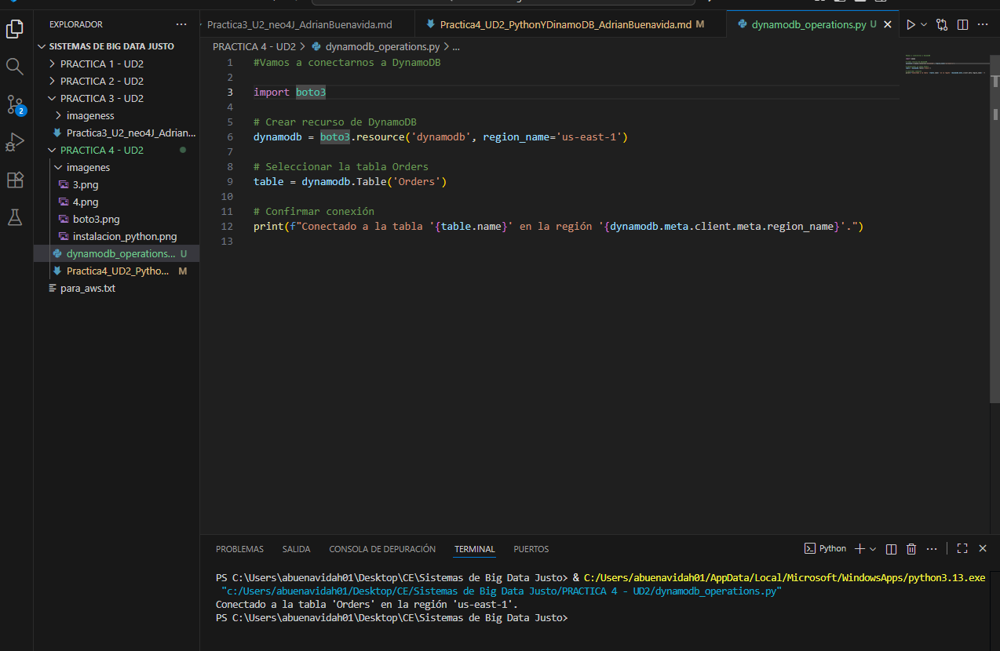


<br>


### Ejercicio 1: Crear un Nuevo Pedido
En principio, como prueba, crearemos un nuevo item en la tabla la cual, hemos establecido conexión anteriormente.

Creamos la función:

```python
def create_order(order_id, customer_name, product, quantity, status):
    '''Crea un nuevo ítem en la tabla Orders.'''
    try:
        response = table.put_item(
           Item={
                'order_id': order_id,
                'customer_name': customer_name,
                'product': product,
                'quantity': quantity,
                'status': status,
                'order_date': '2025-11-10' # Puedes usar una fecha actual
            }
        )
        print(f"Pedido {order_id} creado exitosamente.")
        return response
    except Exception as e:
        print(f"Error al crear el pedido: {e}")
```

Creamos pedido:

```python
create_order('1001', 'Juan Perez', 'Laptop', 1, 'Pending')
```

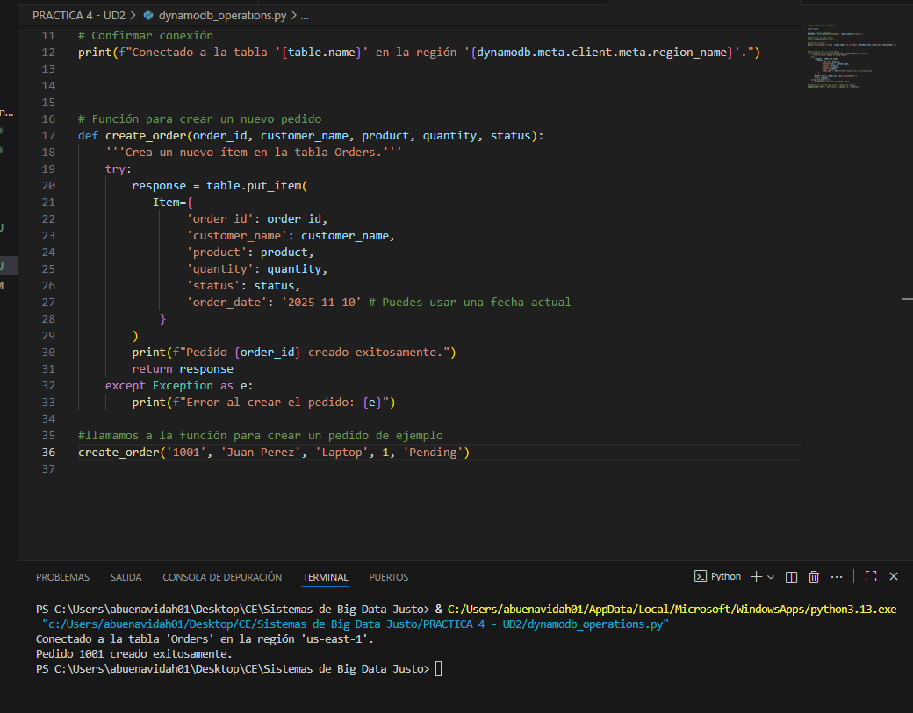


<br>


### Ejercicio 2: Leer un pedido
Ahora, lo que haremos será leer un pedido por su ID. Con lo cual, vamos a "buscar" nuestro pedido creado recientemente.

Creamos la función:

```python
def get_order(order_id):
    '''Obtiene un ítem de la tabla Orders por su ID.'''
    try:
        response = table.get_item(Key={'order_id': order_id})
        item = response.get('Item')
        if item:
            print(f"Datos del pedido {order_id}: {item}")
            return item
        else:
            print(f"No se encontró el pedido con ID {order_id}.")
            return None
    except Exception as e:
        print(f"Error al obtener el pedido: {e}")
```


llamamos a la función para buscar el pedido:

```python
get_order('1001')
```

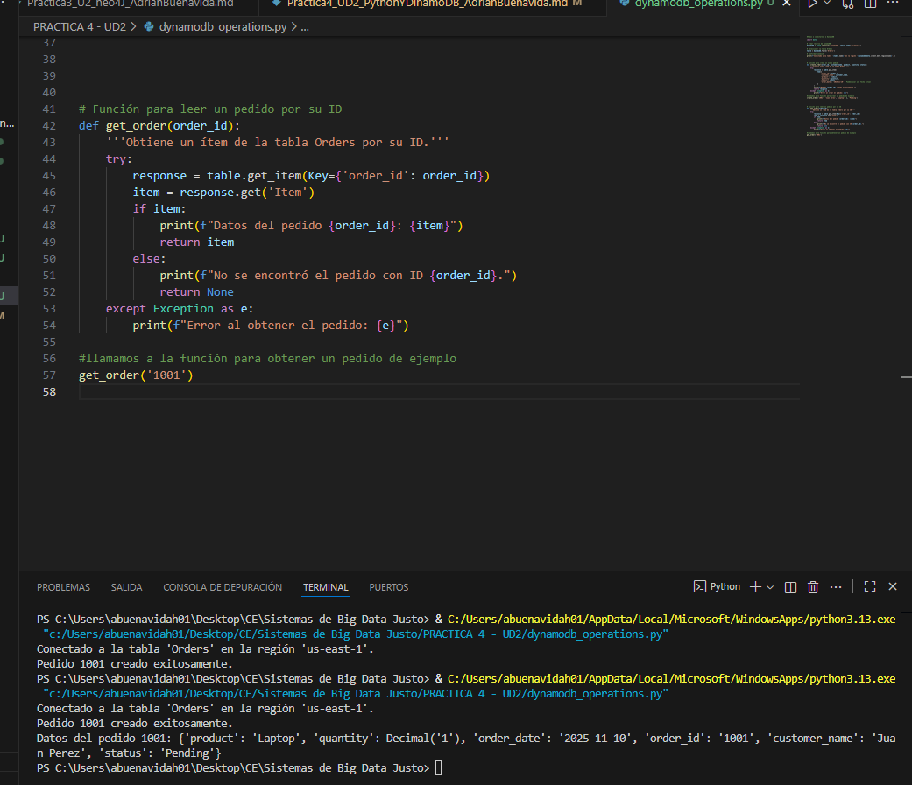


<br>


### Ejercicio 3: Actualizar estado de un pedido
Actualizaremos el estado de nuestro pedido. Por ejemplo, a "shipped", enviado.

Creamos la función:

```python
def update_order_status(order_id, new_status):
    '''Actualiza el atributo 'status' de un pedido.'''
    try:
        response = table.update_item(
            Key={'order_id': order_id},
            UpdateExpression="set #st = :s",
            ExpressionAttributeNames={'#st': 'status'},
            ExpressionAttributeValues={':s': new_status},
            ReturnValues="UPDATED_NEW"
        )
        print(f"Estado del pedido {order_id} actualizado a '{new_status}'.")
        return response
    except Exception as e:
        print(f"Error al actualizar el pedido: {e}")

```


llamamos a la función para actualizar su estado:

```python
update_order_status('1001', 'Shipped')
```

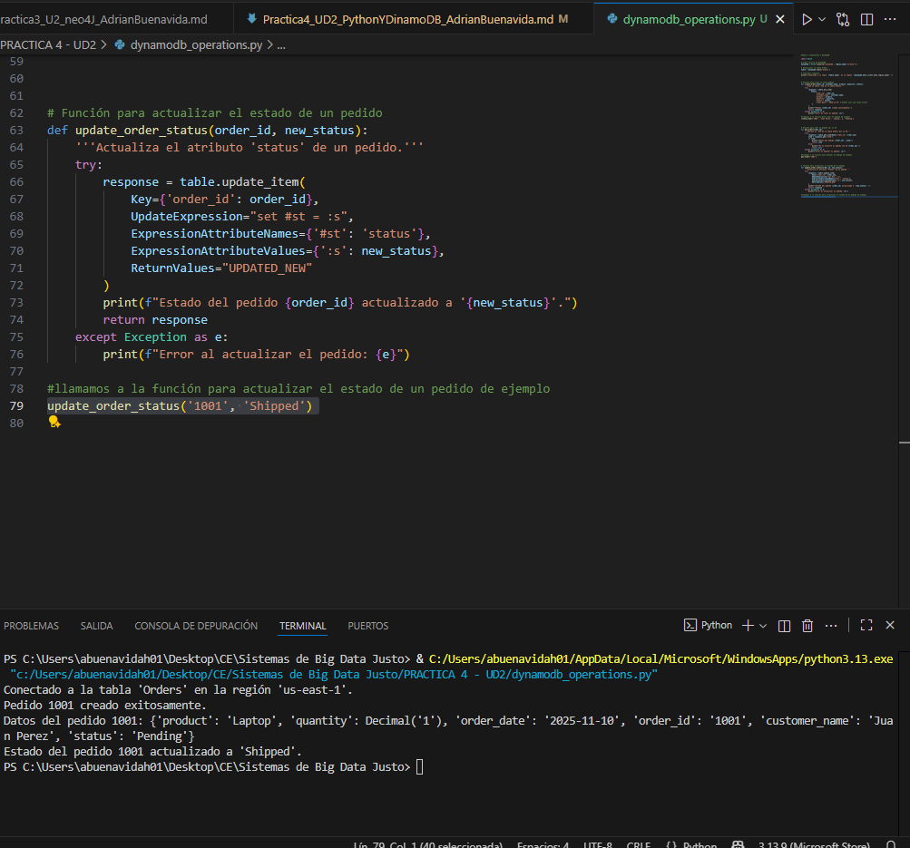


<br>


### Ejercicio 4: Eliminar un pedido

Elimanamos un pedido por su ID, por ejmplo, el 1001

Creamos la función:

```python

def delete_order(order_id):
    '''Elimina un ítem de la tabla Orders.'''
    try:
        response = table.delete_item(Key={'order_id': order_id})
        print(f"Pedido {order_id} eliminado exitosamente.")
        return response
    except Exception as e:
        print(f"Error al eliminar el pedido: {e}")

```


llamamos a la función para elimarlo:

```python
delete_order('1001')
```

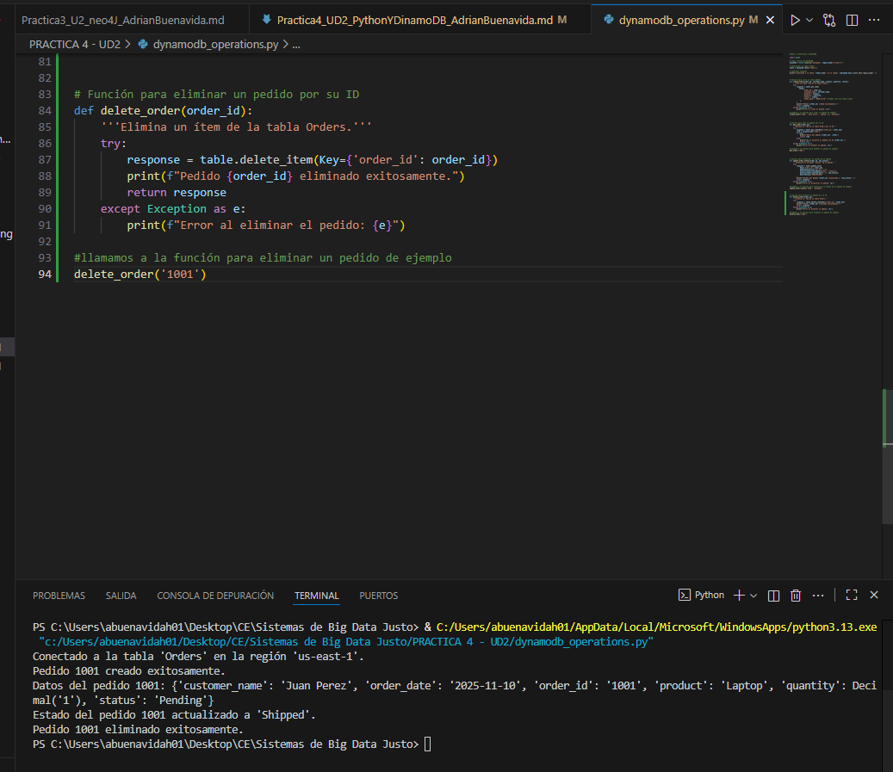


<br>


### Ejercicio 5: Buscar Pedidos por Cliente
En este ejercicio implementamos una función que busca todos los pedidos realizados por un cliente específico, en la tabla Orders


Creamos la función:

```python
from boto3.dynamodb.conditions import Attr

def get_orders_by_customer(customer_name):
    """Devuelve todos los pedidos realizados por un cliente concreto."""
    try:
        response = table.scan(
            FilterExpression=Attr('customer_name').eq(customer_name)
        )
        items = response.get('Items', [])
        
        if items:
            print(f"Pedidos de {customer_name}:")
            for item in items:
                print(item)
        else:
            print(f"No se encontraron pedidos para el cliente {customer_name}.")
        
        return items
    except Exception as e:
        print(f"Error al buscar pedidos por cliente: {e}")
```

llamamos a la función para la búsqeuda:

```python
get_orders_by_customer("Javier Ruiz")
```

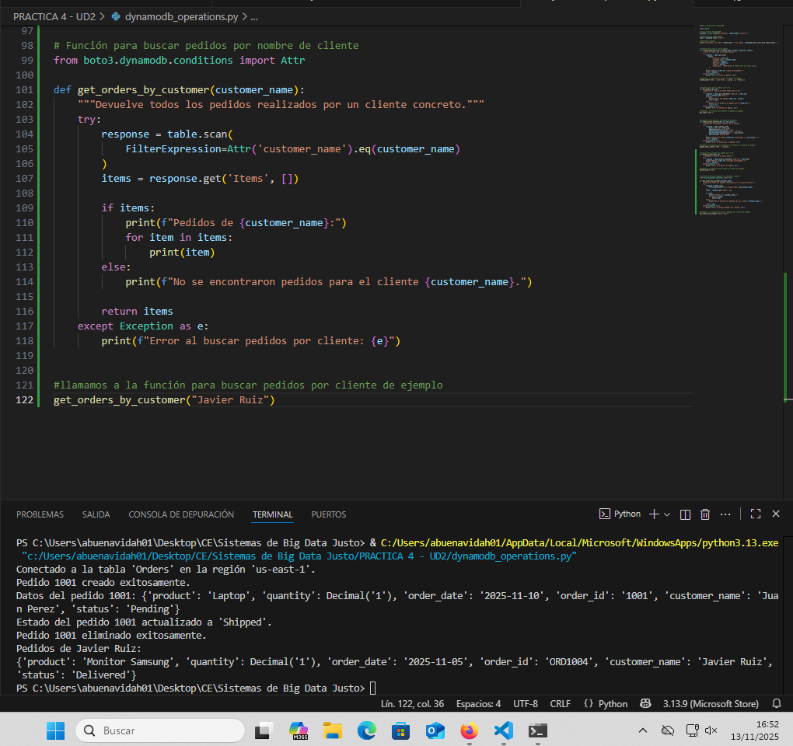

<br>

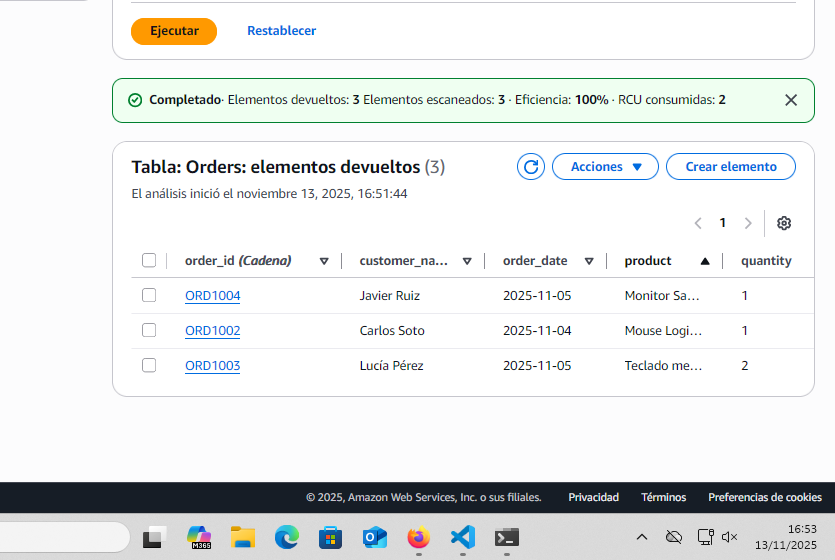


<br>


## 3a PARTE: Demostración y Entrega

En esta práctica hemos desarrollado un script en Python con el automatiza las operaciones decrear, leer, actualizar y eliminar sobre una tabla **Orders** en **AWS**, en la bd de **DynamoDB**, utilizando la librería --> boto3

Entonces, vamos a completar nuestro script con todas las funciones de los ejercicios

Y para ejecutar un flujo de demostración, implementaremos:

```python 
if __name__ == "__main__":
    print("\n Demostración de operaciones con DynamoDB \n")

    # 1.Creamos un nuevo pedido
    create_order("ORD-PY-1001", "Javier Ruiz", "Teclado Mecánico", 1, "Pending")

    # 2.Leemos el pedido recién creado
    get_order("ORD-PY-1001")

    # 3.Actualizamos su estado
    update_order_status("ORD-PY-1001", "Shipped")
    get_order("ORD-PY-1001")  # Verificamos el cambio

    # 4 Buscamos todos los pedidos de un cliente (usa un nombre que exista en tu tabla)
    get_orders_by_customer("Javier Ruiz")
    get_orders_by_customer("Carlos Soto")  # Ejemplo con otro cliente

    # 5.Eliminamos el pedido
    delete_order("ORD-PY-1001")
    get_order("ORD-PY-1001")  # Verificamos que ya no existe

    print("\n Demostración finalizada \n")

```

Entonces, hemos tenido que comentar las llamadas a las funciones anteriores porque con esta útima sentencia del if - main, ya están las llamadas a las funciones explicadas

<br>

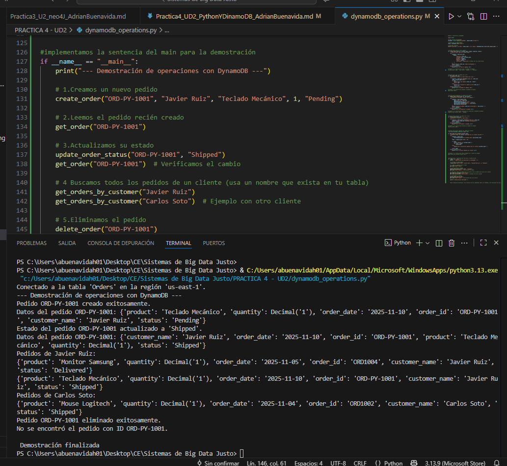


<br>


### Reflexión Final


1. Automatización vs. Consola

Usar un script de Python para gestionar los datos de DynamoDB tiene varias ventajas claras frente a la consola web de AWS. Primero, permite automatizar tareas repetitivas, como crear, actualizar o eliminar pedidos, sin necesidad de hacerlo manualmente

Como desventaja, al principio puede ser más complejo y requiere algunos conocimientos de programación y del SDK, mientras que la consola es más intuitiva y visual para las taread


<br>

2. SDK como Herramienta

Boto3 sirve para mucho más que pedidos. Puedes subir archivos a S3 (como un gran disco duro en la nube de AWS), lanzar máquinas virtuales en EC2 (máquinas virtuales en la nube), mover datos entre servicios... que entrenen modelos y guarden resultados sin que tengas que tocar nada manualmente.


<br>


3. Dificultades y Aprendizajes

Lo más complicado fue pillar cómo funcionan las actualizaciones (UpdateExpression) y los filtros con scan(). 

Para mí, lo mejor ha sido ver cómo todo el flujo CRUD (create, delete...) funciona de forma automática y cómo los datos cambian en la base en tiempo real. Así, queda bstante claro lo útil que es automatizar cosas cuando trabajas con Big Data
