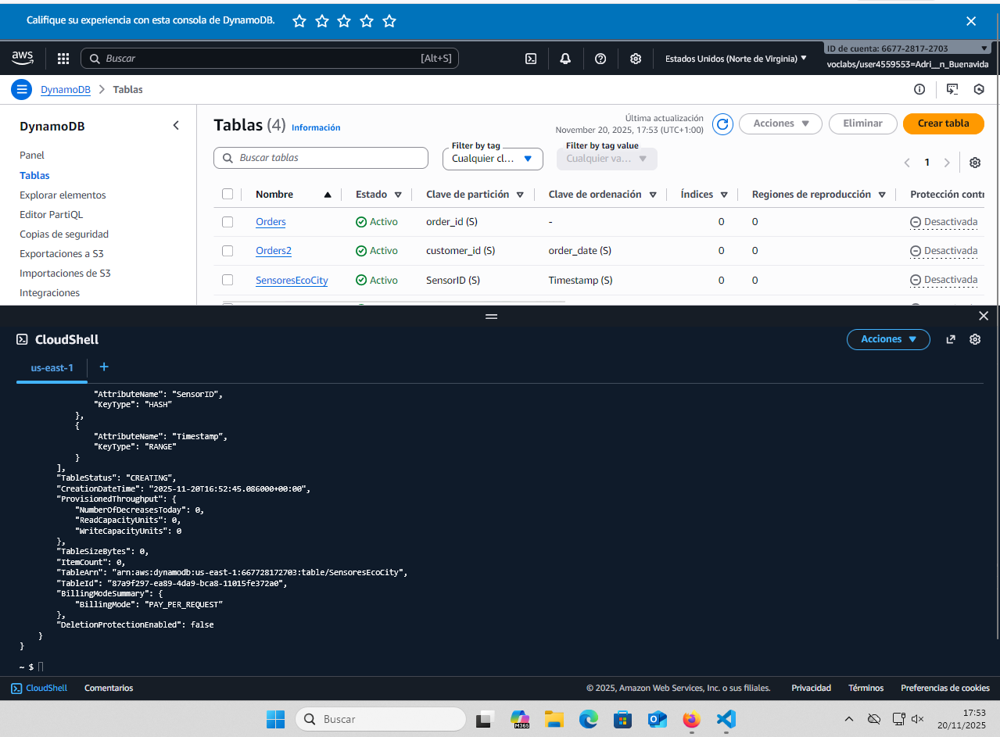
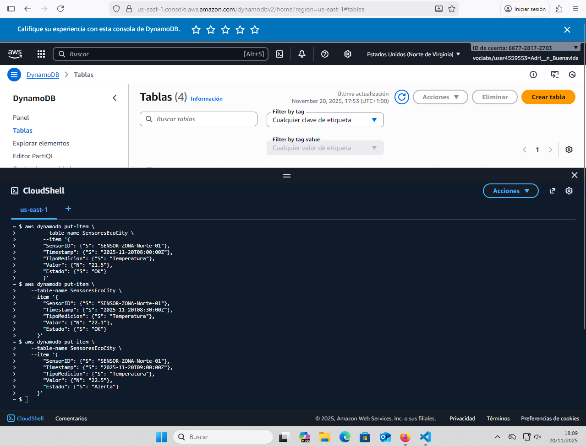
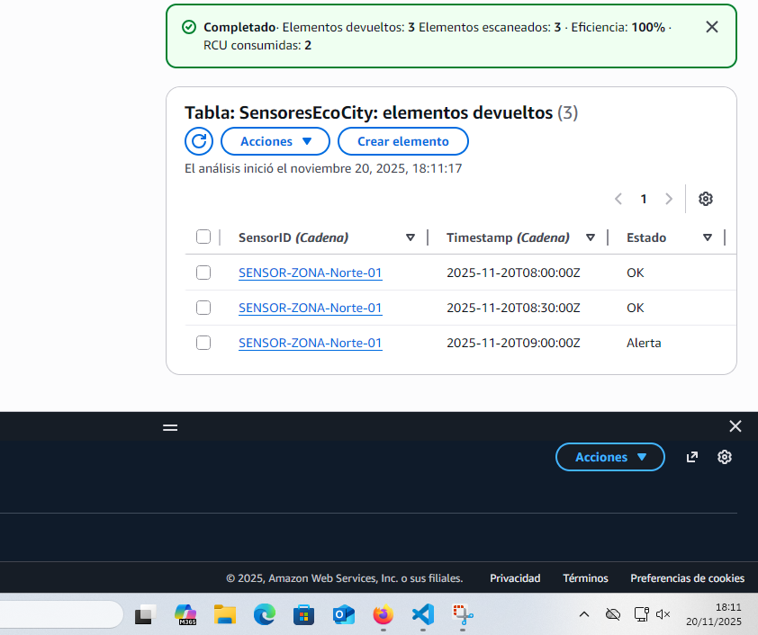
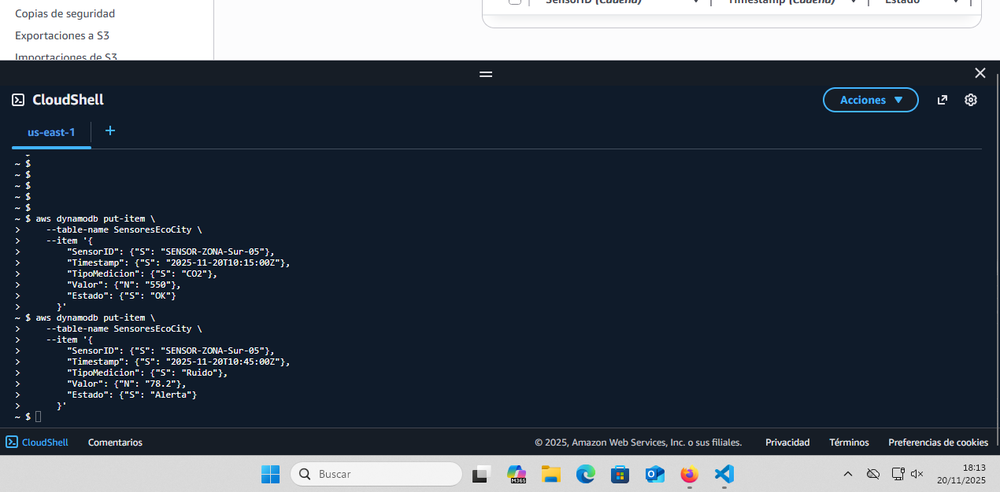
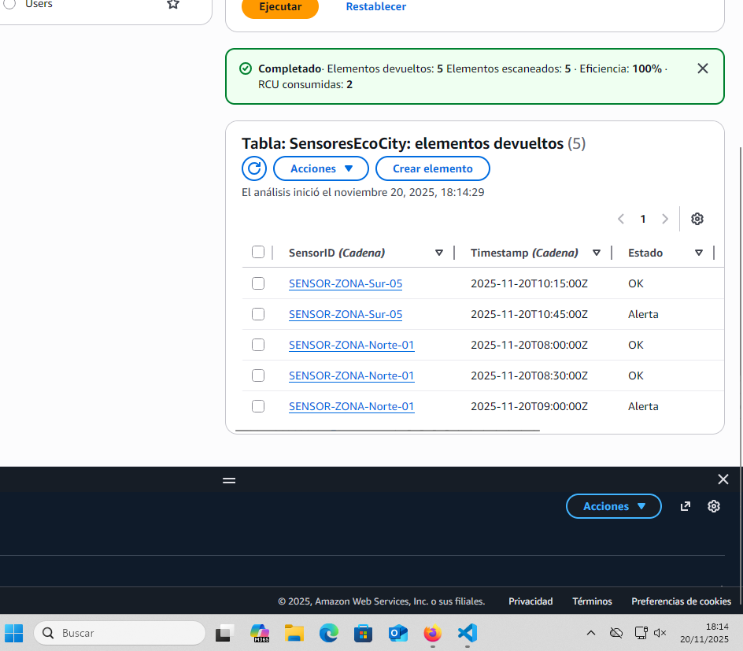

# Práctica 5: Operaciones CRUD en DynamoDB_AdrianBuenavida

<br>


## Ejercicio 1. Diseño y Creación de la Tabla

Para crear la primera tabla "SensoresEcoCity" con los atributos correspondientes, hemos usado el siguiente comando:

```python
aws dynamodb create-table \
    --table-name SensoresEcoCity \
    --attribute-definitions \
        AttributeName=SensorID,AttributeType=S \
        AttributeName=Timestamp,AttributeType=S \
    --key-schema \
        AttributeName=SensorID,KeyType=HASH \
        AttributeName=Timestamp,KeyType=RANGE \
    --billing-mode PAY_PER_REQUEST
```

### Comprobación



<br>


## Ejercicio 2. Ingesta de Datos (Create)

Aquí necesitamos usar el comando put-item para insertar 5 lecturas, simulando 2 sensores distintos, y 3 lecturas para uno de ellos en diferentes momentos.

Por tanto:

### A. Inserción del Sensor 1 (3 Lecturas)
Vamos a crear el sensor "SENSOR-ZONA-Norte-01" con 3 lecturas de temperatura en horas diferentes.

Comandos:

###### A.1. SENSOR-ZONA-Norte-01 ( a las 8:00h por ej)

```python

    aws dynamodb put-item \
        --table-name SensoresEcoCity \
        --item '{
        "SensorID": {"S": "SENSOR-ZONA-Norte-01"},
        "Timestamp": {"S": "2025-11-20T08:00:00Z"},
        "TipoMedicion": {"S": "Temperatura"},
        "Valor": {"N": "21.5"},
        "Estado": {"S": "OK"}
        }'
```


###### A.2 SENSOR-ZONA-Norte-01 (8:30)

```python
aws dynamodb put-item \
    --table-name SensoresEcoCity \
    --item '{
        "SensorID": {"S": "SENSOR-ZONA-Norte-01"},
        "Timestamp": {"S": "2025-11-20T08:30:00Z"},
        "TipoMedicion": {"S": "Temperatura"},
        "Valor": {"N": "22.1"},
        "Estado": {"S": "OK"}
      }'
```

###### A.3 SENSOR-ZONA-Norte-01 (9:00)
```python
aws dynamodb put-item \
    --table-name SensoresEcoCity \
    --item '{
        "SensorID": {"S": "SENSOR-ZONA-Norte-01"},
        "Timestamp": {"S": "2025-11-20T09:00:00Z"},
        "TipoMedicion": {"S": "Temperatura"},
        "Valor": {"N": "22.5"},
        "Estado": {"S": "Alerta"}
      }'
```

<br>

### Comprobación de las tres consultas anteriores



<br>

## B. Inserción del Sensor 2 (2 Lecturas)
Ahora, usamos un sensor diferente , por ej el "SENSOR-ZONA-Sur-05" y un tipo de medición diferente, el CO2 creo que podría servir.

Comandos:

###### B.1 SENSOR-ZONA-Sur-05 (CO2)

```python
aws dynamodb put-item \
    --table-name SensoresEcoCity \
    --item '{
        "SensorID": {"S": "SENSOR-ZONA-Sur-05"},
        "Timestamp": {"S": "2025-11-20T10:15:00Z"},
        "TipoMedicion": {"S": "CO2"},
        "Valor": {"N": "550"},
        "Estado": {"S": "OK"}
      }'

```

Añadimos ahora otro que mida el somnido fuerte o el ruido.

###### B.2 Lectura 5: SENSOR-ZONA-Sur-05 (Sonido fuerte o ruido)

```python
aws dynamodb put-item \
    --table-name SensoresEcoCity \
    --item '{
        "SensorID": {"S": "SENSOR-ZONA-Sur-05"},
        "Timestamp": {"S": "2025-11-20T10:45:00Z"},
        "TipoMedicion": {"S": "Ruido"},
        "Valor": {"N": "78.2"},
        "Estado": {"S": "Alerta"}
      }'
```

### Comprobación de las 2 consultas anteriores




<br>


## Ejercicio 3. Consulta de Datos (Read - Query)

Vasmos a ver la evolución de la temperatura del sensor SENSOR-ZONA-Norte-01

Comando:

```python
aws dynamodb query \
    --table-name SensoresEcoCity \
    --key-condition-expression "SensorID = :sid" \
    --expression-attribute-values '{
        ":sid": {"S": "SENSOR-ZONA-Norte-01"}
      }' \
    --scan-index-forward false

    #Con ell --scan-index-forward false lo que hará DynamoDB es recorrer los datos de Timestamp en orden de lo más reciente a lo más antiguo
```