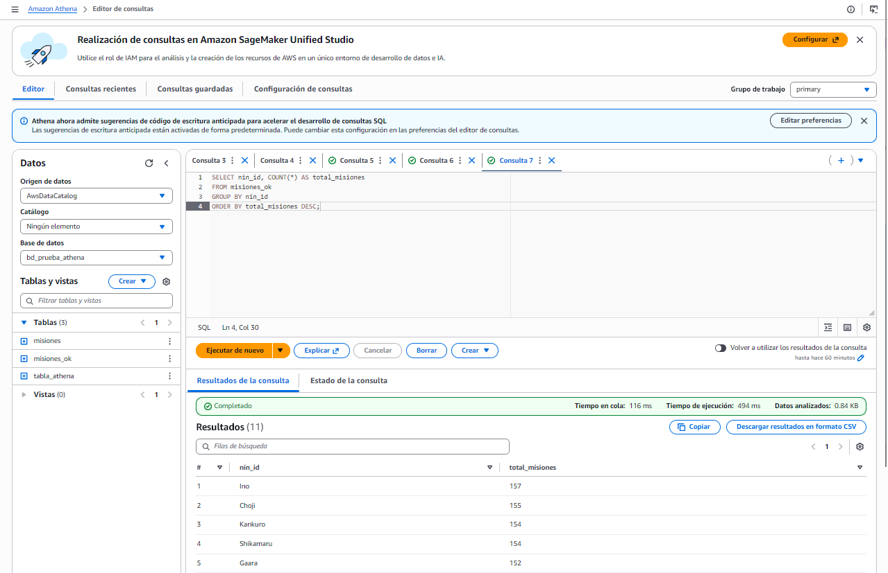
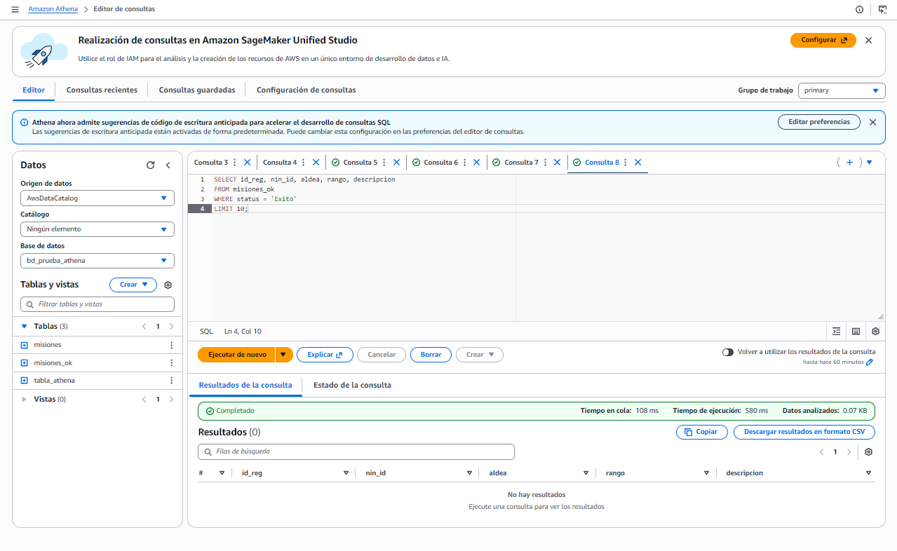
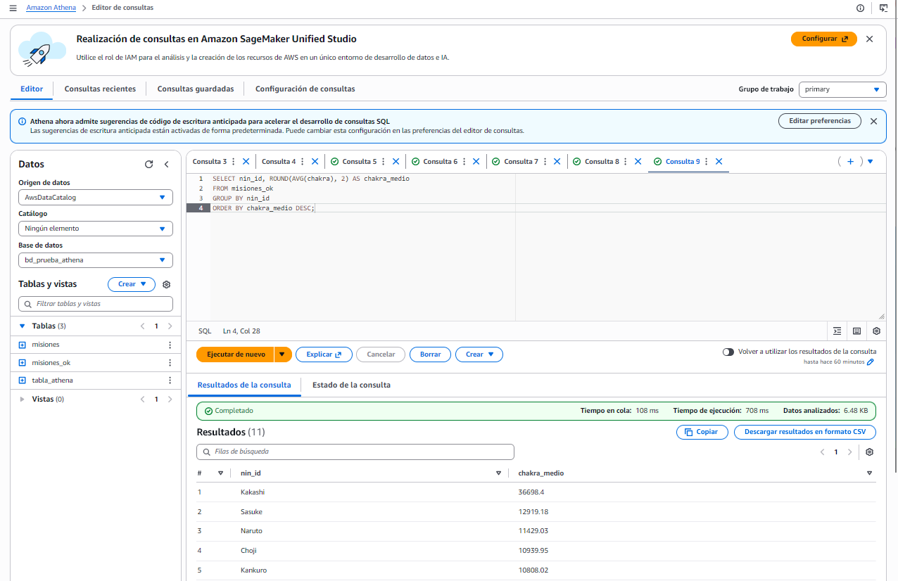
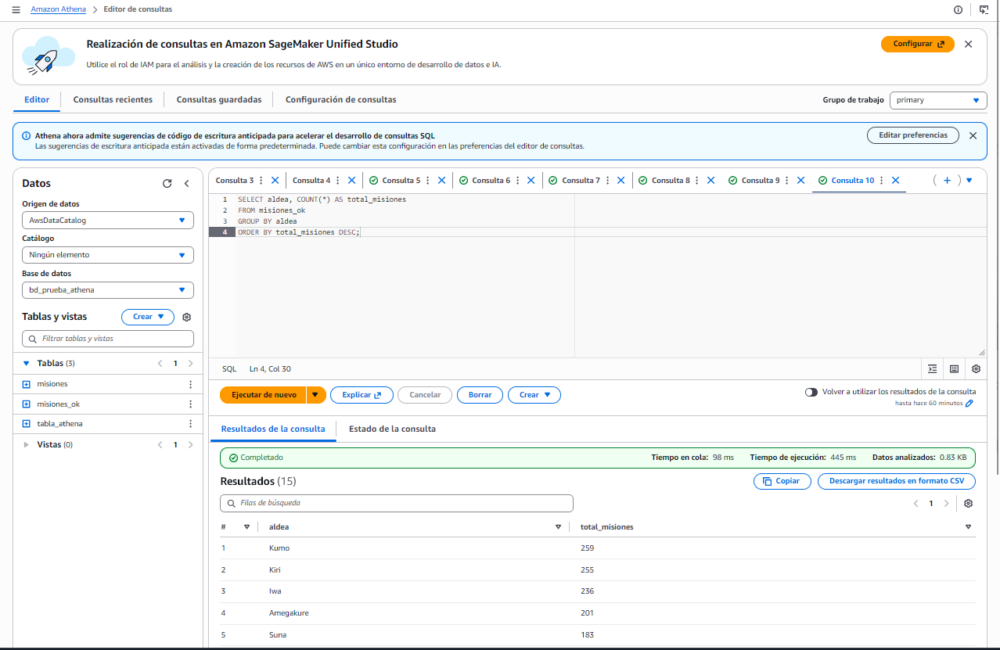
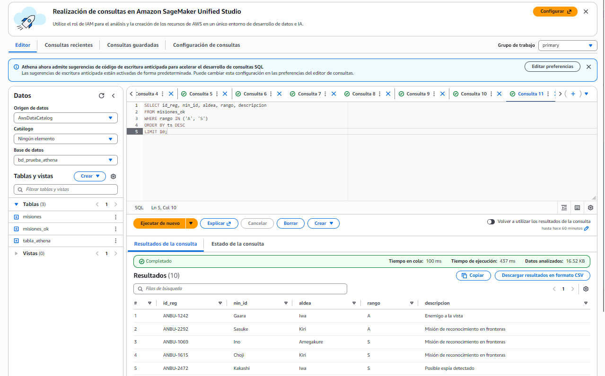
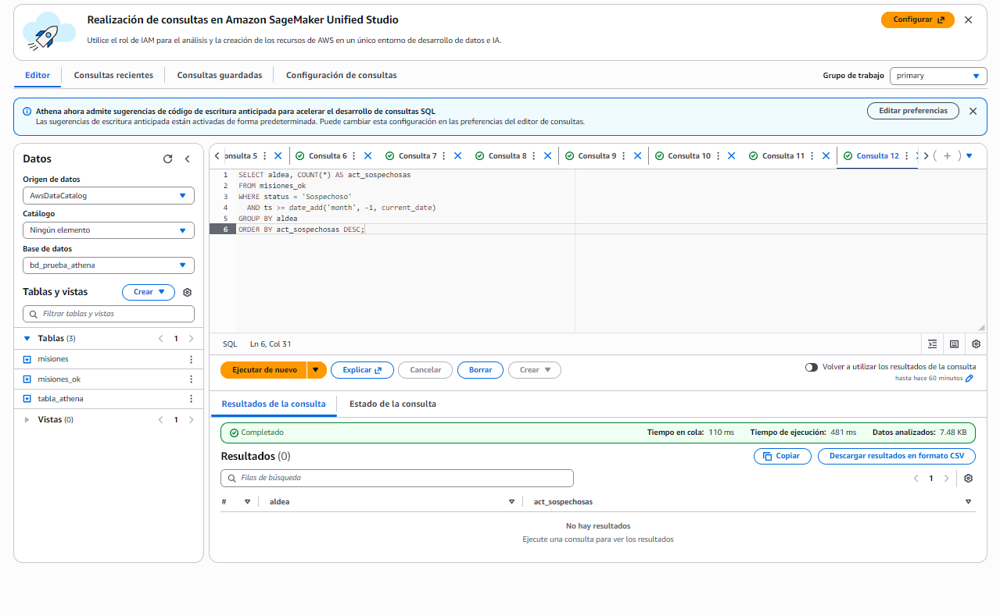

# Práctica 3. UT5. Consultass con Amazon Athena

**Autor:** Adrián Buenavida

## Descripción
En esta nueva práctica, he completado la arquitectura del Data lake creando una **Capa Gold**. Tras meter los archivos en  (`raw`) y transformarlos a Parquet (`silver`) con AWS Glue, he utilizado **Athena** de aws para limpiar y tipar los datos en una nueva tabla (`misiones_ok`). Finalmente, he ejecutado consultas SQL directamente sobre los archivos de S3

---

## Consultas


### 1. Número de misiones realizadas por cada ninja

**Consulta SQL:**
```sql
SELECT nin_id, COUNT(*) AS total_misiones 
FROM misiones_ok 
GROUP BY nin_id 
ORDER BY total_misiones DESC;
```

### captura 



### 2. Misiones completadas con éxito

**Consulta SQL:**
```sql
SELECT id_reg, nin_id, aldea, rango, descripcion 
FROM misiones_ok 
WHERE status = 'Exito' 
LIMIT 10;
```

### captura 



### 3. Chakra medio usado por cada ninja

**Consulta SQL:**
```sql
SELECT nin_id, ROUND(AVG(chakra), 2) AS chakra_medio 
FROM misiones_ok 
GROUP BY nin_id 
ORDER BY chakra_medio DESC;
```
### captura 



### 4. Número de misiones por aldea

**Consulta SQL:**
```sql
SELECT aldea, COUNT(*) AS total_misiones 
FROM misiones_ok 
GROUP BY aldea 
ORDER BY total_misiones DESC;
```
### captura 



### 5. Misiones de rango alto (A o S)

**Consulta SQL:**
```sql
SELECT id_reg, nin_id, aldea, rango, descripcion 
FROM misiones_ok 
WHERE rango IN ('A', 'S')
ORDER BY ts DESC
LIMIT 10;
```
### captura 



### 6. Realiza un GROUP BY para encontrar qué aldea ha realizado más actividades sospechosas en el último mes

**Consulta SQL:**
```sql
SELECT aldea, COUNT(*) AS act_sospechosas 
FROM misiones_ok 
WHERE status = 'Sospechoso' 
  AND ts >= date_add('month', -1, current_date)
GROUP BY aldea 
ORDER BY act_sospechosas DESC;
```
### captura 



## Conclusión 

A través de esta práctica, he consolidado la arquitectura de un **Data Lake** completo. Al utilizar **Amazon Athena** sobre la capa *Gold* (archivos Parquet particionados en S3), he logrado realizar consultas utilizando SQL sin necesidad de usar bases de datos tradicionales

Esta solución nos sirve para optimizar radicalmente los costes y tiempos de respuesta