# Proyecto 1er trimestre: "Gestión de Inventario para Concesionario de Coches"
## Autores: Adrián Buenavida y José Luis Saavedra


---
## 0. Introducción

En este proyecto, hemos optimizado la gestión de inventario y ventas de un concesionario de coches. Nuestro objetivo principal fue diseñar e implementar una arquitectura de datos moderna y escalable, utilizando **Amazon DynamoDB**, dada su velocidad de acceso por clave y escalabilidad horizontal frente a bases de datos relacionales, por ejemlo

Hemos desarrollado una **API REST completa con Python (Flask)** y Boto3 para interactuar con la base de datos, asegurando la funcionalidad **CRUD** y la ejecución de consultas mediante el uso  de **Índices Secundarios Globales (GSI)**. 

Finalmente, desarrolamos una interfaz web que demuestra la lógica implementada

---

## 1. Modelado de un Problema de Negocio Real

### 1.1. Definición del Problema

El proyecto elegido, aborda la **Gestión de inventario y ventas** para un concesionario de coches. 

El problema se centra en garantizar el **acceso rápido** a la información detallada de cada vehículo por su identificador único (**VIN**), y permitir **consultas eficientes por filtros** clave (como obtener todos los coches **disponibles** ordenados por **precio**).

La naturaleza del problema requiere una BD que priorice la **velocidad de lectura por clave** y la **escalabilidad horizontal** frente a la complejidad relacional, haciendo de DynamoDB la elección óptima.


<br>


### 1.2. Modelado de Datos (Esquema y Claves)

Hemos optado por un diseño de **3 tablas** (`CInventory`, `CSales`, `CUsers`) utilizando el modelo de diseño de **"claves compuestas"** y **GSI (Índices Secundarios Globales)** para resolver todos los patrones de acceso con la máxima eficiencia.


<br>

#### Estructura de la 3 tablas `CInventory`, `CSales`, `CUsers`

Hemos usado la web de draw.io para realizar el esquema a modo generald e cómo vamos a estructurar nuestro proyecto

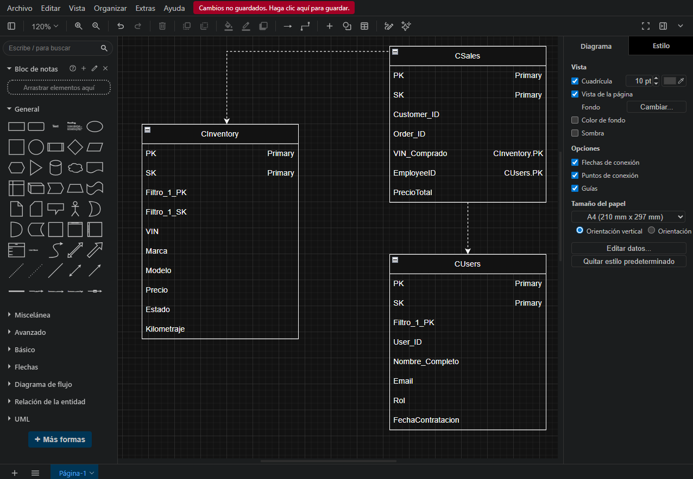


Y ahora, creamos las 3 tablas en AWS:
 

a) `CInventory`

Comando usado: 
```python
aws dynamodb create-table \
    --table-name CInventory \
    --attribute-definitions \
        AttributeName=PK,AttributeType=S \
        AttributeName=SK,AttributeType=S \
        AttributeName=Filtro_1_PK,AttributeType=S \
        AttributeName=Filtro_1_SK,AttributeType=N \
    --key-schema \
        AttributeName=PK,KeyType=HASH \
        AttributeName=SK,KeyType=RANGE \
    --billing-mode PAY_PER_REQUEST \
    --global-secondary-indexes '[{"IndexName":"StatusPriceIndex","KeySchema":[{"AttributeName":"Filtro_1_PK","KeyType":"HASH"},{"AttributeName":"Filtro_1_SK","KeyType":"RANGE"}],"Projection":{"ProjectionType":"ALL"}}]'
```


b)`CSales`

Comando usado: 
```python
aws dynamodb create-table 
    --table-name CSales 
    --attribute-definitions AttributeName=PK,AttributeType=S AttributeName=SK,AttributeType=S 
    --key-schema AttributeName=PK,KeyType=HASH AttributeName=SK,KeyType=RANGE 
    --billing-mode PAY_PER_REQUEST
```


c)`CUsers`

Comando usado: 
```python
aws dynamodb create-table 
    --table-name CUsers 
    --attribute-definitions AttributeName=PK,AttributeType=S AttributeName=SK,AttributeType=S AttributeName=Filtro_1_PK,AttributeType=S 
    --key-schema AttributeName=PK,KeyType=HASH AttributeName=SK,KeyType=RANGE 
    --billing-mode PAY_PER_REQUEST 
    --global-secondary-indexes '[{"IndexName":"RoleIndex","KeySchema":[{"AttributeName":"Filtro_1_PK","KeyType":"HASH"}],"Projection":{"ProjectionType":"ALL"}}]'
```

<br>

##### Comprobación de las tres tablas creadas:

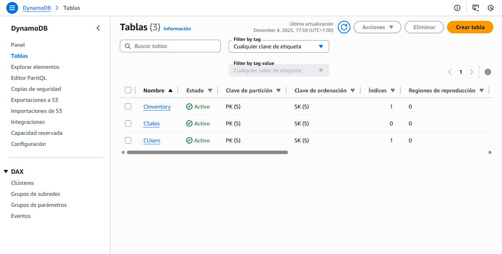


<br>

### 1.3. Volumen de Datos

Vamos a insertar :


- **50 registros** simulados en la tabla `CInventory`,
esta tabla como tiene bastantes registros, lo que hemos hecho desde la Cloudshell , es hacer un **nano inventory_data.json** y hemos creado un archivo .json en que hemos incluido los 55 registros.

Ahora, solo ejecutamos el siguiente comando...

##### Comando usado
```python
aws dynamodb batch-write-item --request-items file://inventory_data.json
```

##### Comprobación:
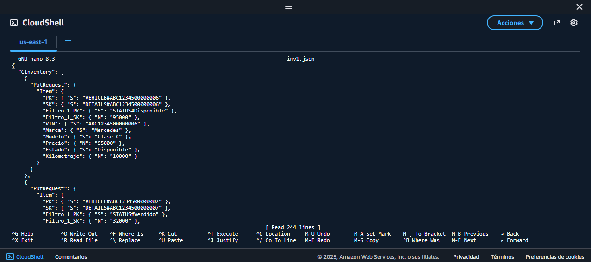


Usamos un count para que nos devuelva cuantos elementos tenemos. El código es:
```python
aws dynamodb scan --table-name CInventory --select COUNT
```

##### Comprobación:
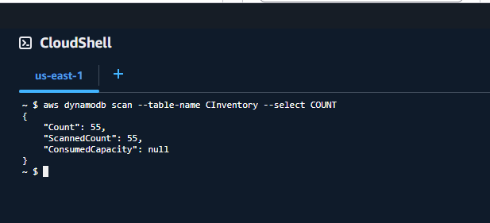


<br>


- **10 elementos** en `CSales`. También hemos creado un archivo .json para poder incluir todos los elementos directamente
##### Comando usado
```python
aws dynamodb batch-write-item --request-items file://sales.json
```

##### Comprobación:
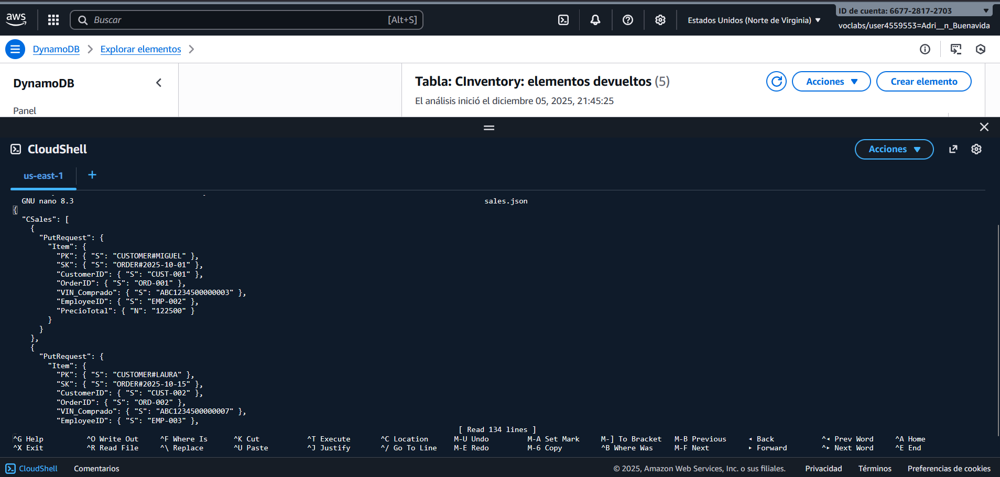


Hacemos el COUNT para la comprobación extra de que se han importado correctamente

##### Comprobación:
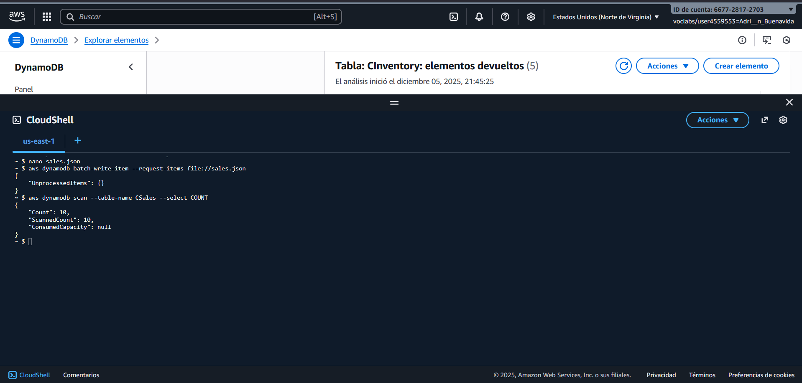


<br>


- **5 elementos** en `CUsers`. Volvemos a crear un nuevo json : users.json para poder incluir todos los elementos.

##### Comando usado
```python
aws dynamodb batch-write-item --request-items file://users.json
```

##### Comprobación:
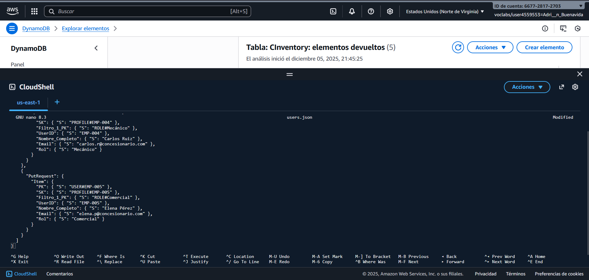

De nuevo, hacemos el COUNT para que nos cuente en total los elementos que hay en la tabla users, en este caso.

##### Comprobación:
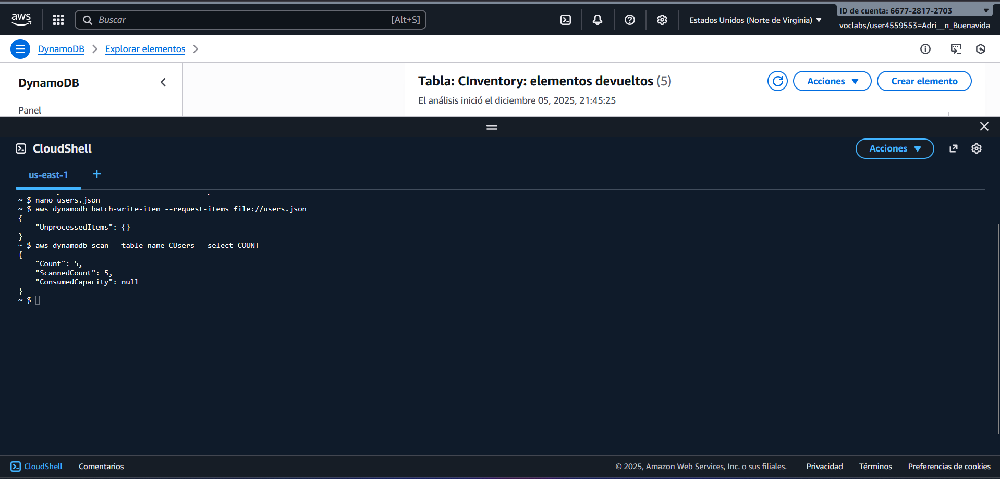


<br>


### Comprobaciones gráficas de la creación de todas las tablas con todos sus elementos:
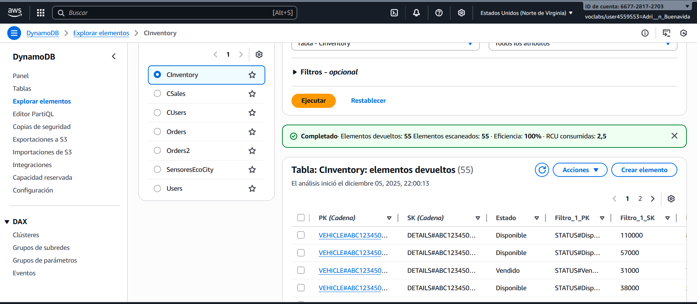

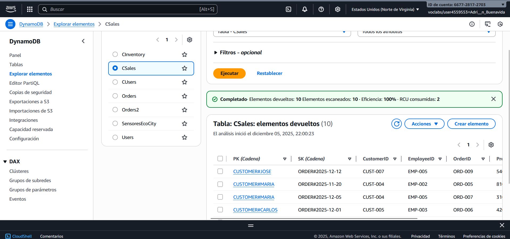

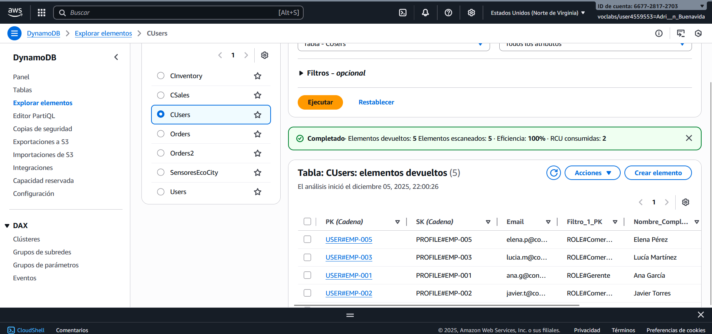


---

## 2. Análisis y Justificación de la Base de Datos

### 2.1. Elección de la Tecnología

* **Base de datos elegida:** **AWS (DynamoDB)**
* **Modelo de Datos:** **Clave-Valor**

### 2.2. Documentación Técnica

* **Modelo de Datos:** DynamoDB es una BD **Clave-Valor sin esquema**. Los datos se almacenan como *Ítems* (sin columnas fijas) identificados por su *Clave Primaria* (compuesta por PK y SK)
<br>

* **Lenguaje de Consulta:** Utiliza una **API** de comandos (ej. `GetItem`, `PutItem`, `Query`).
<br>

* **Características Clave:**
    * **Serverless y Escalabilidad:** AWS gestiona automáticamente el escalado de lectura/escritura (Escalado Horizontal)
    * **GSI (Índices secundarios globales):** Permiten consultas flexibles y eficientes que no usan la clave principal.


### 2.3. Justificación de Superioridad

El modelo de DynamoDB es el más adecuado para el inventario de un concesionario, superando a los otros modelos.... :

1.  **Frente a MongoDB (Documentos):** El inventario de coches tiene atributos estandarizados. DynamoDB, al estar optimizado para el **acceso directo por clave**, ofrece una **velocidad de lectura (Get/Query) superior** que MongoDB.
<br>

2.  **Frente a Neo4j (Grafos):** El problema no requiere analizar **relaciones complejas** (ej. análisis de redes). La tarea principal es **recuperar el ítem por ID (VIN)** y **filtrar listas ordenadas**, para lo cual el modelo Clave-Valor de DynamoDB es **más rápido** que un modelo de Grafos.

---


## 3. Desarrollo de la API para nuestro concesionario

### 3.1. ¿Por qué hemos elegido Python/Flask y Boto3?

Hemos optado por Python (Flask) y la librería Boto3 porque creemos que es la combinación más eficiente para el proyecto:

- **Simplicidad**: Flask nos permite implementar la API REST con el código mínimo necesario.

- **Velocidad**: Python es ideal para el desarrollo rápido.

- **Integración**: Boto3 es el SDK oficial de AWS, lo que garantiza la forma más directa  de conectar la API con nuestra base de datos DynamoDB.

### 3.2 Desarrollo de la API REST
#### 3.2.1 Configuración Inicial del Entorno

Para empezar el desarrollo en Python, debemos configurar el entorno e instalar las dependencias necesarias.

*Pasos a seguir en la CloudShell en **AWS***:

- Crear y Activar el Entorno Virtual. 

##### Comando usado para activar entorno
Hemos usado la consola de comandos de VScode teniendo en cuenta que tiene que ser cmd. Y ejecutamos:
```python
python -m venv venv
```

```python
.\venv\Scripts\activate
```

- Instalar Flask (el framework web minimalista).

- Instalar Boto3 (la librería de AWS para interactuar con DynamoDB)

##### Comando usado para el flask y boto3
```python
pip install flask boto3
```

- Añadimos CORS: Para permitir que la interfaz web local (file:///) se comunique con la API (http://127.0.0.1:5000), instalamos la extensión flask-cors

##### Comando usado para el flask-cors
```python
pip install flask-cors
```

**Importante**: Tuvimos que habilitar la ejecución de scripts de PowerShell temporalmente para la activación: Set-ExecutionPolicy -Scope Process -ExecutionPolicy Bypass

<br>

#### 3.2.2 Arquitectura de Endpoints (Clases y Funcionalidad)

La API que implementamos con Python/Flask utiliza `GetItem`, `PutItem`, `Query` para garantizar un rendimiento óptimo. 
Nos aseguramos de manejar correctamente el tipo numérico utilizando la clase `Decimal` en Python para evitar errores de precisión en los campos clave del GSI.

A continuación, aquí la funcionalidad de los **8 *endpoints*** desarrollados:


| Objetivo | Método | Endpoint | Implementación en DynamoDB |
| :--- | :--- | :--- | :--- |
| **Consulta Obligatoria** | `GET` | `/vehicles/available` | **QUERY sobre GSI (`StatusPriceIndex`)** |
| **Listar Todos** | `GET` | `/vehicles` | `Scan` |
| **Leer Específico** | `GET` | `/vehicles/{vin}` | `GetItem` (Clave Compuesta PK/SK) |
| **Crear Nuevo** | `POST` | `/vehicles` | `PutItem` (Incluye actualización de GSI) |
| **Actualizar** | `PUT` | `/vehicles/{vin}` | `UpdateItem` (Actualiza GSI si cambia Precio/Estado) |
| **Eliminar** | `DELETE` | `/vehicles/{vin}` | `DeleteItem` |
| **Consulta Adicional**| `GET` | `/users/role/{rol}` | **QUERY sobre GSI (`RoleIndex`)** |


**Enlace para ver el código completo de nuestra app.py:** [Ver app.py completo](./app.py)


<br>
---


## 4. Desarrollo de la Web de Consulta (Interfaz Frontend)

Hemos desarrollado una interfaz de gestión web (`index.html`, `styles.css`, `index.js`) para la API REST, con un diseño al estilo profesional de un negocio de coches en Cáceres.


### 4.1. Lógica de Negocio Avanzada (CRUD Integrado)

La **Sección 1** de la web implementa la gestión completa del inventario (CRUD) con lógica de confirmación avanzada:


#### A. Consulta y Confirmación (GET / 404)

Al introducir un VIN que **NO existe** (ej. `MIPRIMERCOCHE1234`), la API nos devuelve un código **404**, lo que activa la lógica JavaScript para preguntar al usuario si desea **crear** el nuevo vehículo.

**Nota:** Como el código de esta consulta era demasiado extenso, podemos verlo correctamente en el archivo app.py y en el index.js


##### Comprobación: 
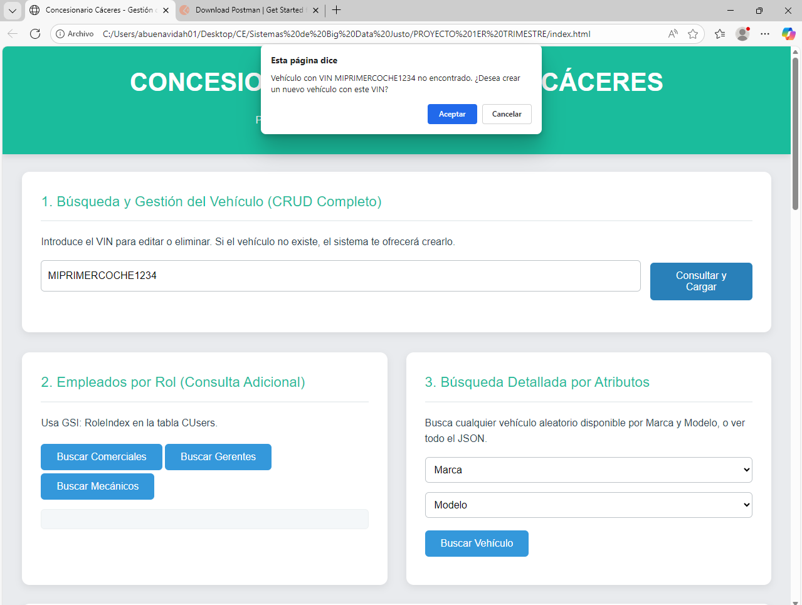

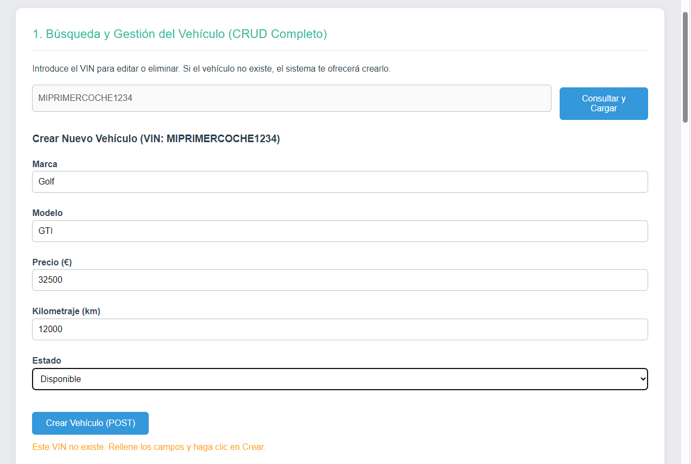

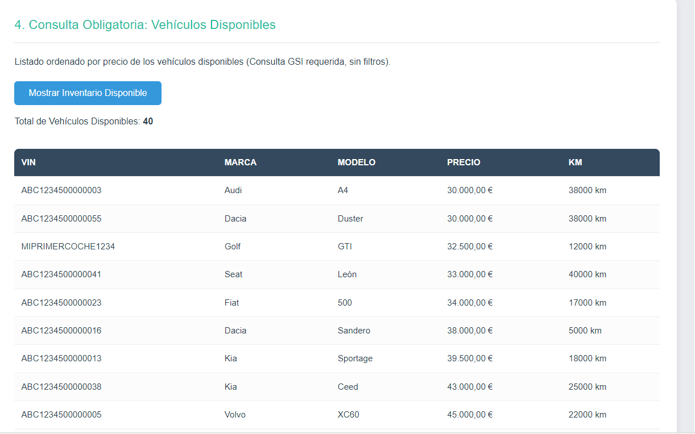


#### B. Operaciones Transaccionales (POST, PUT, DELETE)

El formulario nos permite ejecutar las operaciones `POST`, `PUT` y `DELETE`, demostrando que nuestra API mantiene la integridad de los datos.


### 4.2. Consulta Adicional (Empleados por Rol)

En la **Sección 2**, utilizamos el GSI `RoleIndex` en la tabla `CUsers` para filtrar empleados.

* **Endpoint Llamado:** `GET /users/role/{rol}`.
* **Resultado:** Mostramos la lista de empleados que coinciden con el rol seleccionado (ej. Comercial, Gerente).

Código usado en la API --> app.py
````python
@app.route('/users/role/<string:role_name>', methods=['GET'])
def get_users_by_role(role_name):
    """
    Objetivo: Obtener todos los empleados con un rol específico (ej. Comercial).
    Implementación: Usando QUERY sobre el GSI RoleIndex en la tabla CUsers.
    """
    try:
        partition_key_value = f'ROLE#{role_name}' 
        
        response = USERS_TABLE.query(
            IndexName=ROLE_INDEX_GSI,
            KeyConditionExpression=Key('Filtro_1_PK').eq(partition_key_value)
        )
        
        users = response.get('Items', [])
        
        return jsonify({
            "role": role_name,
            "count": len(users),
            "employees": users
        })

    except Exception as e:
        print(f"Error al obtener usuarios por rol: {e}")
        return jsonify({"error": "Error interno del servidor o de la BD.", "details": str(e)}), 500

````
<br>

##### Comprobación: 

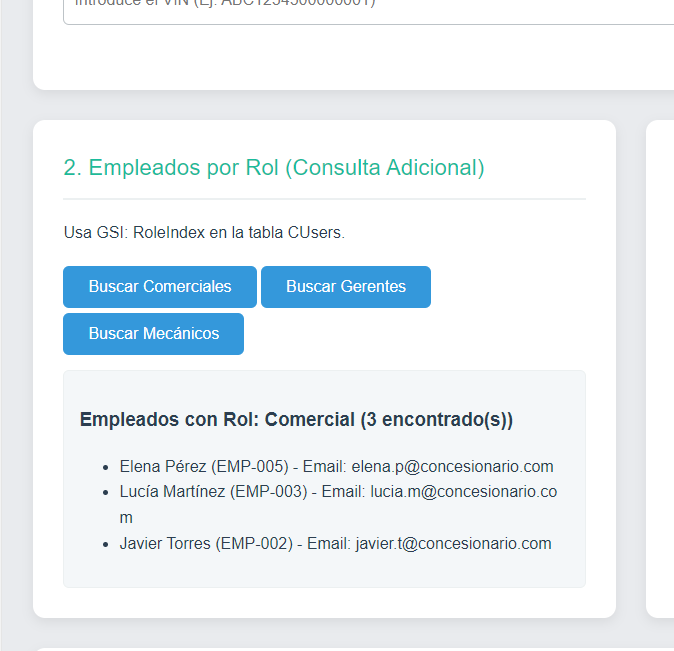

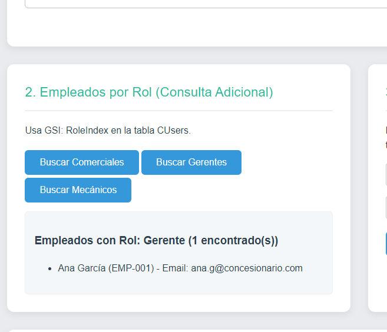

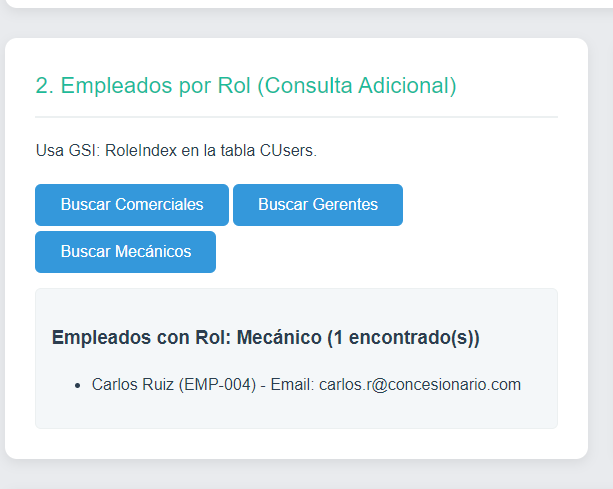


### 4.3. Búsqueda Detallada por Atributos

La **Sección 3**  de la web para obtener el inventario completo y filtrarlo por Marca y Modelo para una búsqueda rápida de un ítem

* **Implementación:** La web hace un `GET /vehicles` al inicio para comprobar los 55 ítems y luego aplica filtros en JavaScript.
* **Resultado:** Mostramos el JSON completo del vehículo que coincida con la selección, lo cual es útil para auditorías, por ejemplo


**Nota:** Como el código de esta consulta era demasiado extenso, podemos verlo correctamente en el archivo app.py y en el index.js


<br>

##### Comprobación: 
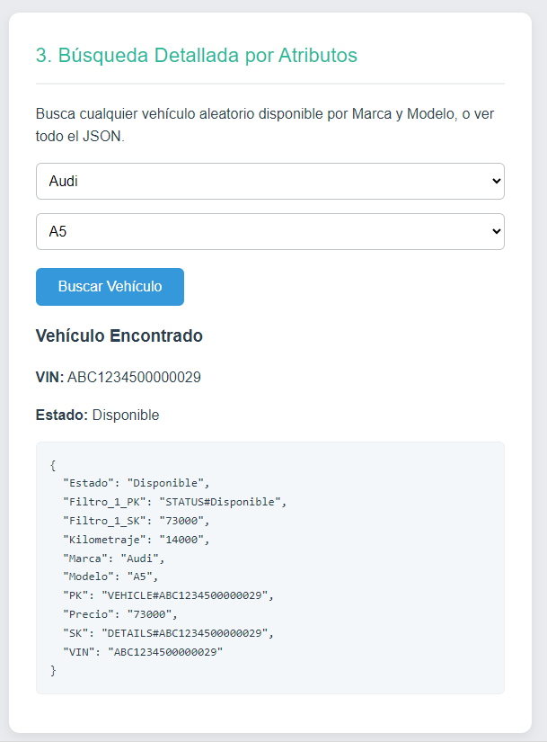


### 4.4. Consulta Obligatoria: Vehículos Disponibles

La **Sección 4** demuestra la consulta clave de nuestro proyecto, verificando que el GSI `StatusPriceIndex` está funcionando correctamente y sin filtros.


* **Endpoint Llamado:** `GET /vehicles/available` (Consulta pura).
* **Resultado:** La tabla se llena con **39** vehículos disponibles, **ordenados de menor a mayor precio**.


Código usado en la API --> app.py:
```python
@app.route('/vehicles/available', methods=['GET'])
def get_available_vehicles():
    """
    Objetivo: Obtener todos los vehículos DISPONIBLES y ordenados por precio (de menor a mayor).
    Implementación: Usando QUERY sobre el GSI StatusPriceIndex.
    """
    try:
        response = INVENTORY_TABLE.query(
            IndexName=STATUS_PRICE_GSI,
            KeyConditionExpression=Key('Filtro_1_PK').eq('STATUS#Disponible')
        )
        
        vehicles = response.get('Items', [])
        
        return jsonify({
            "count": len(vehicles),
            "vehicles": vehicles
        })

    except Exception as e:
        print(f"Error al ejecutar la Consulta Compleja: {e}")
        return jsonify({
            "error": "Error de conexión o configuración del GSI/Tabla.",
            "details": str(e)
            }), 500
```

##### Comprobación: 
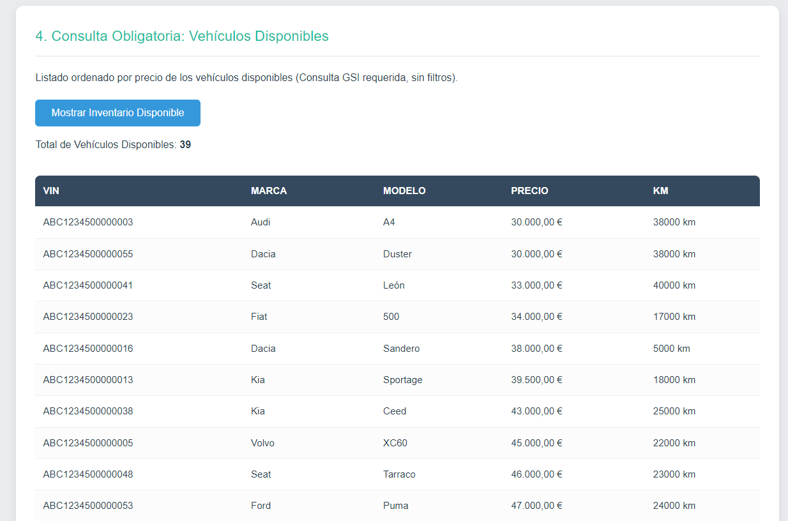


---
## 5. Conclusión

El proyecto concluye con éxito la implementación de soluciones de gestión de nuestro inventario para el concesionario. 

1.  **Validación del Modelo NoSQL:** Demostramos que DynamoDB es óptimo para el acceso de alta velocidad a ítems específicos 

2.  **API REST Funcional:** La API  ejecuta las consultas complejas requeridas perfectamente. La instalación de la librería `Decimal` en el *backend* garantiza la precisión a la hora de gestionar precios y kilometraje

3.  **Lógica de Negocio Avanzada:** La interfaz web  valida la detección de un VIN no existente y la sugerencia de creación de un vehículo al usuario.

