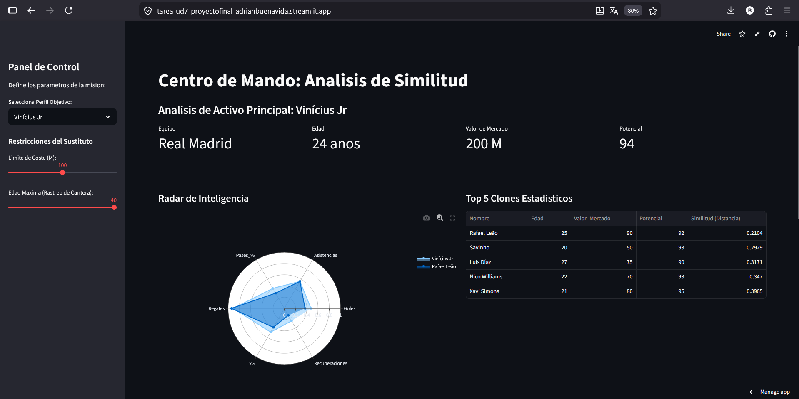

# Práctica Final: El Centro de Inteligencia de la Alianza (Streamlit)
**Autor:** Adrián Buenavida

## Descripción de la práctica
En esta práctica, vamos a desarrollar un centro de mando interactivo utilizando el framework `Streamlit`. 

Aquí entregamos una herramienta web dinámica que permite a la dirección estratégica buscar "clones estadísticos" de nuestros mejores activos. Para ello, hemos centralizado los datos, aplicado algoritmos de similitud matemática y creado visualizaciones interactivas en tiempo real.

URL de la aplicación: [https://tarea-ud7-proyectofinal-adrianbuenavida.streamlit.app/](https://tarea-ud7-proyectofinal-adrianbuenavida.streamlit.app/)

---

## Paso 1: Configuración de la arquitectura de datos y caché
Para que nuestro centro de inteligencia sea rápido y eficiente al cambiar de filtros, hemos tenido que optimizar la carga y preparar los datos

**estrategia:**

1. **Caché de Streamlit:** Hemos utilizado el decorador `@st.cache_data` para que el pergamino de datos se cargue en la memoria RAM solo la primera vez. Así evitamos que la aplicación se detenga cada vez que interactuamos con la web

2. **Normalización (min-max):** Para que el algoritmo de similitud sea justo, hemos escalado todas las metricas de rendimiento para que sus valores esténm entre 0 y 1 utilizando `MinMaxScaler`

**Código utilizado:**
```python
@st.cache_data
def cargar_pergaminos():

#ruta desde la raiz del repositorio de github
    df = pd.read_csv("tarea_ud7_proyectofinal_AdrianBuenavida/players_data.csv")
    return df

#Normalizamos los datos de 0 a 1 para el algoritmo
scaler = MinMaxScaler()
df_norm[metricas_rendimiento] = scaler.fit_transform(df_base[metricas_rendimiento])
```


<br>

## Paso 2: interfaz y filtros (sidebar)
Una vez preparados los datos, hemos diseñar el panel de control lateral (`sidebar`) para que la dirección estratégica pueda interactuar con la herramienta sin tener que tocar el código fuente

**estrategia:**

1. **Selección de objetivo:** Hemos implementado un `selectbox` para que el mando pueda elegir el perfil del jugador principal que desea clonar o sustituir

2. **Restricciones de búsqueda:** Hemos añadido componentes `slider` para limitar el coste máximo del jugador, adaptándonos al presupuesto

3. **rastreo de cantera: ** hemos añadido un filtro de edad máxima. Esto nos permite enfocar la búsqueda en jóvenes promesas con alto potencial de evolución


**Código utilizado:**
```python

#Interfaz del sidebar con widgets interactivos
st.sidebar.title("Panel de Control")
objetivo_nombre = st.sidebar.selectbox("Selecciona Perfil Objetivo:", df_base['Nombre'].unique())
max_valor = st.sidebar.slider("Limite de Coste (M):", 0, int(df_base['Valor_Mercado'].max()), 100)
max_edad = st.sidebar.slider("Edad Maxima (Rastreo de Cantera):", 16, 40, 40)
```


<br>

## Paso 3: Motor de similitud (distancia euclidiana)
Para encontrar a los clones , hemos implementado la lógica que calcula qué tan parecido es un activo a otro basándose en su rendimiento

**estrategia:**

1. **Aislamiento de vectores:** Hemos extraído las estadísticas normalizadas del objetivo seleccionado (vector p) y las de los posibles candidatos (vector q)

2. **Distancia espacial:** Hemos utilizado la función `distance.euclidean` de la librería `scipy` para calcular la distancia  entre ambos vectores en un espacio multidimensionnal

3. **Clasificación:** Guardamos los resultados y ordenamos de menor a mayor distancia, quedándonos  con el top 5 más similar para mostrarlo


**Código utilizado:**
```python

#Calculamos la distancia para cada fila
def calcular_similitud(row):
    vector_candidato = row[metricas_rendimiento].values
    return distance.euclidean(vector_objetivo, vector_candidato)

#Ordenamos de menor a mayor distancia
df_candidatos['Distancia'] = df_candidatos.apply(calcular_similitud, axis=1)
top_5 = df_candidatos.sort_values(by='Distancia').head(5)

```

<br>

## Paso 4: Visualización  y layouts
Finalmente, hemos estructurado el área principal del dashboard organizaando la información para facilitar la toma de decisiones rápidas y precisas

**estrategia:**

1. **Columnas de KPIs:** Hemos utilizado `st.columns` para mostrar edad, equipo, valor de mercado y potencialdel jugador objetivo en la parte superior

2. **Radar de inteligencia:** Usando la librería `Plotly`, hemos creado un gráfico de radar polar que superpone las estadísticas del objetivo con las de su mejor "clon"

3. **mapa de influencia :** Hemos integrado un gráfico de dispersion (`px.scatter`) que cruza las coordenadas X e Y medias del dataset. Así verificamos si los clones se mueven por las mismas zonas tácticas

**Código utilizado:**

```python
#Uso de layouts para organizar los datos
col1, col2, col3, col4 = st.columns(4)
col1.metric("Equipo", info_obj['Equipo'])

#Grafico espacial
fig_mapa = px.scatter(df_mapa, x='Coord_X_Media', y='Coord_Y_Media', color='Tipo', text='Nombre')
st.plotly_chart(fig_mapa, use_container_width=True)

```

<br>

## Verificamos que la WEB es 100% FUNCIONAL !!!!
 